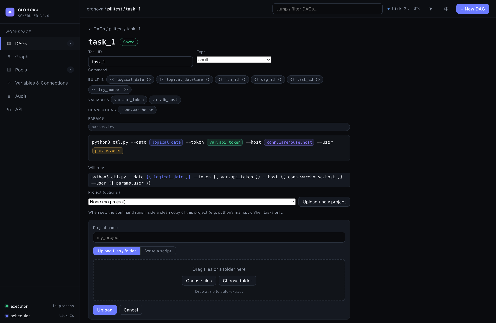
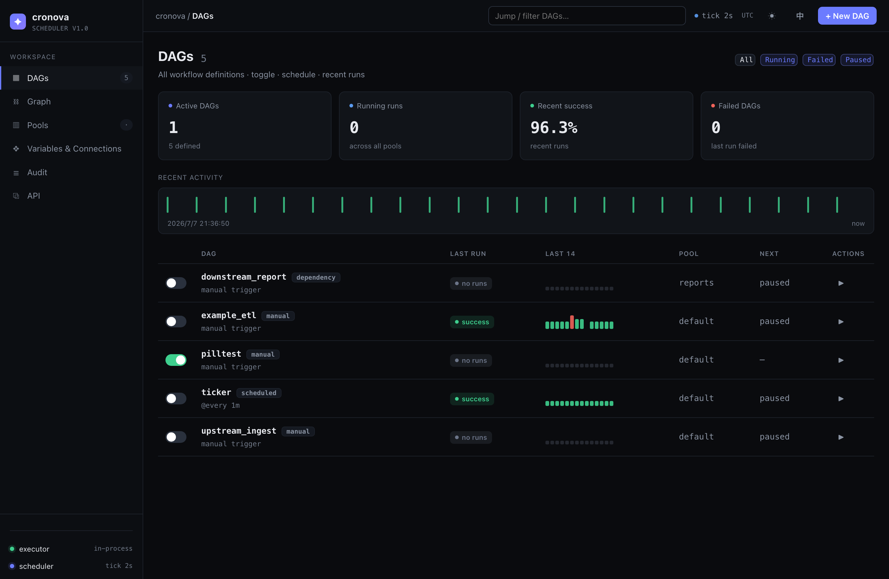

<div align="center">

# cronova

**Lekki, samodzielnie hostowany scheduler workflowów dla Windows — otwartoźródłowa alternatywa dla [Apache Airflow](https://airflow.apache.org/) / Azkabana, rozwijana i kastomizowana jako niezależny projekt.**

[](https://github.com/ako74programmer/poc-cronova-windows)
[](LICENSE)
[](go.mod)
[](docs/DEPLOY.md)

**Polski** · [English](README.md)

<sub>Ten projekt jest niezależnie utrzymywany w repozytorium <b><a href="https://github.com/ako74programmer/poc-cronova-windows">ako74programmer/poc-cronova-windows</a></b>.</sub>

</div>

cronova to **scheduler workflowów i orkiestrator zadań** w duchu Airflow i Azkabana, zbudowany dla zespołów, które chcą planowania opartego na DAG **bez operacyjnego ciężaru**. To niezależnie rozwijany i kastomizowany projekt Windows-only, oparty na pomysłach i kodzie pierwotnego [repozytorium cronova](https://github.com/zoyluoblue/cronova). Dostarcza natywne usługi Go z wbudowaną bazą SQLite oraz samodzielny executor uruchamiający zadania przez Git for Windows Bash.

Pierwotne repozytorium jest źródłem inspiracji i punktem wyjścia. Rozwój, dostosowanie do Windows, pakowanie wydań i utrzymanie odbywają się obecnie w tym repozytorium i nie są wydaniami oryginalnego projektu.

<div align="center">
  
  <br><em>Edytor zadań w konsoli: buduj polecenia za pomocą kliknięcia lub przeciągnięcia pigułek zmiennych (wbudowane, zmienne, połączenia, parametry).</em>
</div>

```bash
# Zainstaluj usługi Windows z rozpakowanego pakietu (PowerShell jako Administrator):
.\deploy\install.ps1
```

## Dlaczego cronova?

- 🟢 **Mała natywna instalacja, zero zależności usługowych.** Scheduler napisany w czystym Go, bez CGO, oraz samodzielny executor z wbudowaną SQLite. Instalator PowerShell rejestruje usługi Windows; nie jest potrzebny stos Airflow ani runtime kontenerowy.
- 🗂️ **DAG-i w stylu Airflow / Azkaban.** Deklaratywne DAG-i YAML z krawędziami zależności, harmonogramami cron / `@every`, wyzwalaczami i oczekiwaniami między DAG-ami (`trigger_after`, `depends_on_dag`), pod-workflowami, catchup / backfill, ponawianiami i limitami czasu na poziomie zadania, pulami zasobów, priorytetami uruchomień i polisami szeregowego wykonania oraz regułami wyzwalania — prymitywy orkiestracyjne, które już znasz.
- 📡 **Skaluj w poziomie, gdy potrzebujesz — workerzy dial-in.** Zdalni workerzy dołączają za pomocą jednorazowego tokena przez mTLS i **nawiązują połączenie wychodzące** (brak portu przychodzącego, brak współdzielonego systemu plików, przyjazne NAT); zadania są kierowane według `worker_group:`, logi strumieniowane są na żywo z powrotem, a restart workera ponownie przyjmuje jego uruchomione zadania zamiast uruchamiać je ponownie. Zero skonfigurowanych workerów = ten sam pojedynczy plik binarny co zawsze.
- 🌐 **Wielojęzyczne zadania + przesyłanie projektów.** Każde zadanie działa jako podproces systemu operacyjnego, więc pisz zadania w **shellu, Pythonie, SQL, JAR lub HTTP** — dowolnym języku dostępnym na hoście. Przeciągnij i upuść skrypt, cały folder projektu lub `.zip` w konsoli, a cronova uruchomi go w izolowanej kopii roboczej.
- 🤖 **Natywna integracja AI.** Wbudowany **[serwer Model Context Protocol (MCP)](https://modelcontextprotocol.io/)** i zdalne JSON CLI pozwalają agentom AI (Claude i dowolnemu klientowi MCP) listować, tworzyć, walidować, uruchamiać i przeglądać DAG-i przez to samo API uwierzytelniane tokenem i chronione rolami.
- 🛡️ **Wykonanie odporne na awarie.** Uruchamiaj zadania w rozdzielonym executorze gRPC, więc restart lub aktualizacja schedulera nigdy nie zabija działających zadań — po odzyskaniu ponownie podłącza się do zadań w locie bez podwójnego wykonania.
- 🖥️ **Konsola webowa z pełnym zestawem funkcji.** Pulpit DAG, historia uruchomień, stany zadań, **podgląd logów na żywo (SSE)**, ręczne wyzwalacze, zmienne i połączenia, ścieżka audytu oraz wizualny edytor poleceń — wszystko obsługiwane w procesie. Dołączone REST API + OpenAPI.

## Czym jest cronova?

**cronova to otwartoźródłowy, samodzielnie hostowany scheduler workflowów** (inaczej scheduler zadań / orkiestrator zadań / scheduler DAG) napisany w Go. Planuje **DAG-i** — skierowane grafy acykliczne zadań — na wyzwalaczach cron lub interwałowych, uruchamia każde zadanie jako podproces Windows przez Git for Windows Bash i dostarcza konsolę webową, REST API, CLI oraz endpoint MCP dla agentów AI. Możesz traktować go jako **zamiennik cron z zależnościami, ponawianiami, backfill i obserwowalnością**, lub **lekką alternatywę dla Airflow** dostarczaną jako kompaktowa para natywnych usług.

## Szybki start

```powershell
# 1. Zbuduj (Go 1.26.5+) — albo użyj pakietu Windows
$env:CGO_ENABLED = "0"
go build -o cronova.exe ./cmd/cronova

# 2. Uruchom scheduler + konsolę webową (executor w procesie)
./cronova.exe serve             # konsola pod http://localhost:8090

# 3. Steruj z CLI (w innym terminalu)
./cronova.exe dags              # lista DAG-ów z ./dags
./cronova.exe trigger example_etl
./cronova.exe runs example_etl
```

Otwórz **http://localhost:8090**, aby przejść do konsoli — lista DAG-ów, historia uruchomień, stany zadań, logi na żywo i ręczne wyzwalacze jednym kliknięciem.

Domyślna konfiguracja deweloperska jest nieuwierzytelniona, ale tylko dla loopback. Bind poza loopback jest odrzucany, chyba że logowanie jest włączone lub ustawiona jest jawna opcja awaryjna `-allow-unauthenticated-remote`. Użyj `cronova init` dla nowej wdrożonej instancji; domyślnie włącza uwierzytelnianie.

<div align="center">
  
</div>

## cronova vs. Airflow vs. Azkaban vs. cron

| | **cronova** | Apache Airflow | Azkaban | zwykły cron |
|---|:---:|:---:|:---:|:---:|
| Instalacja | **pakiet PowerShell / usługi Windows** | stos Python + baza danych + broker | JVM + MySQL | wbudowany |
| Zależności runtime | **brak** (wbudowana SQLite) | Python, Postgres, Redis/Celery | Java, MySQL | brak |
| DAG-i i zależności | ✅ | ✅ | ✅ | ❌ |
| Cron + interwał + wyzwalacze między DAG-ami | ✅ | ✅ | częściowo | tylko cron |
| Catchup / backfill | ✅ | ✅ | ❌ | ❌ |
| Ponawiania, limity czasu, pule | ✅ | ✅ | częściowo | ❌ |
| Odzyskiwanie po awarii (brak podwójnego uruchomienia) | ✅ | ✅ | częściowo | ❌ |
| Wielojęzyczne zadania (shell/Python/SQL/JAR/HTTP) | ✅ | ✅ (operatory) | zorientowany na JVM | dowolny (bez orkiestracji) |
| Konsola webowa + logi na żywo | ✅ | ✅ | ✅ | ❌ |
| REST API + OpenAPI | ✅ | ✅ | częściowo | ❌ |
| Integracja z agentem AI / MCP | ✅ **wbudowane** | ❌ | ❌ | ❌ |
| Ślad (zużycie zasobów) | **dwa małe natywne procesy, dziesiątki MB** | ciężki | ciężki (JVM) | minimalny |

cronova trafia w złoty środek między gołym `crontab` a pełnym wdrożeniem Airflow: **prawdziwa orkiestracja DAG przy prawie zerowym narzucie operacyjnym.**

## Zdefiniuj DAG

Upuść plik YAML w `./dags/` (zobacz [`dags/`](dags/) dla gotowych przykładów):

```yaml
dag_id: daily_etl
schedule: "0 2 * * *"        # cron; lub "@every 30s"; pomiń dla ręcznego DAG-u
start_date: 2026-06-01
catchup: true                # backfill pominiętych okresów
max_active_runs: 1
default_retries: 2
tasks:
  - id: extract
    type: shell
    command: "python extract.py --date {{ logical_date }}"
    pool: default
  - id: transform
    command: "python transform.py --date {{ logical_date }}"
    deps: [extract]
  - id: load
    command: "psql -f load.sql"
    deps: [transform]
    retries: 3
    timeout: 1800
trigger_after:               # opcjonalnie: uruchom po sukcesie innego DAG-u
  - dag_id: upstream_ingest
```

**Zmienne szablonowe** działają w dowolnym poleceniu, URL, nagłówku, treści lub zapytaniu: `{{ logical_date }}`, `{{ logical_datetime }}`, `{{ run_id }}`, `{{ dag_id }}`, `{{ task_id }}`, `{{ try_number }}` (również wstrzykiwane jako zmienne środowiskowe `CRONOVA_*`), a także zarządzane z poziomu UI `{{ var.KEY }}`, `{{ conn.ID.host }}` i `{{ params.KEY }}`. W konsoli nie wpisujesz `{{ }}` — **wizualny edytor renderuje każdą zmienną jako kolorową pigułkę**, a pogrupowana paleta wstawia je **kliknięciem lub przeciągnięciem**.

### Uruchamiaj własne skrypty i projekty

Prześlij pojedynczy skrypt, cały folder projektu lub `.zip` w konsoli (edytor zadań → **Project**), a następnie wskaż go w zadaniu typu shell:

```yaml
tasks:
  - id: run_main
    type: shell
    command: python3 main.py     # uruchamia się z cwd = czysta kopia projektu
    project: my_app
```

Każda próba otrzymuje **świeżą izolowaną kopię** projektu jako swój katalog roboczy (`CRONOVA_PROJECT_DIR` wskazuje na niego), więc ponowne przesłanie zaczyna obowiązywać przy następnym uruchomieniu, a próby nigdy nie zakłócają się nawzajem. Zobacz [docs/GETTING_STARTED.pl.md](docs/GETTING_STARTED.pl.md).

## Agenci AI (MCP + zdalne CLI)

Pozwól AI orkiestrować cronova przez **to samo API uwierzytelniane tokenem i chronione rolami** — jako natywne **narzędzia MCP** lub przez **zdalne JSON CLI**:

```bash
cronova tokens create my-agent -role admin     # wygeneruj token (lokalnie, raz)
cronova mcp                                     # serwer MCP przez stdio (Claude itp.)

export CRONOVA_SERVER=http://localhost:8090 CRONOVA_TOKEN=cnv_pat_…
cronova dags -o json                            # zdalne CLI, wyjście JSON
cronova api POST /api/dags/validate '{"dag_id":"x","tasks":[…]}'   # walidacja dry-run
```

`cronova mcp` udostępnia około 30 narzędzi pochodzących z katalogu (`list_dags`, `create_dag`, `validate_dag`, `trigger_dag`, `get_task_log`, `retry_task`, …); `-read-only` udostępnia tylko operacje odczytu. Przewodnik + konfiguracja MCP: **[docs/AGENTS.md](docs/AGENTS.md)**.

## Wdrażanie na produkcję

cronova to **scheduler, a nie runtime**: uruchamia każde zadanie przy użyciu interpreterów dostępnych na hoście Windows. Zarządzane instalacje uruchamiają scheduler i samodzielny executor jako **usługi Windows**. Zadania są wykonywane przez Git for Windows Bash; Python, Java, Node, klient PostgreSQL i inne narzędzia trzeba zainstalować osobno, jeśli wymagają ich zadania.

```powershell
.\deploy\install.ps1 -Start       # zainstaluj i uruchom obie usługi Windows
cronova.exe start | stop | restart | status
.\deploy\uninstall.ps1            # usuń usługi i binaria, zachowaj dane
.\deploy\uninstall.ps1 -Purge     # usuń usługi, binaria i dane
```

Instalator PowerShell wymaga uruchomienia jako Administrator i obecności Git for Windows Bash. Pełny przewodnik, konfiguracja usług i executora: **[docs/DEPLOY.md](docs/DEPLOY.md)**.

<div align="center">
  
</div>

## Dokumentacja

| Przewodnik | Co w środku |
|---|---|
| [Pierwsze kroki](docs/GETTING_STARTED.pl.md) | Instalacja, pierwszy DAG, projekty, zmienne szablonowe |
| [Przewodnik po konsoli](docs/console/index.md) | Każda strona interfejsu webowego — pulpit, edytor zadań, uruchomienia i logi na żywo, pule, tokeny |
| [Dokumentacja DAG](docs/DAG_REFERENCE.pl.md) | Każde pole DAG/zadania, typy zadań, wyzwalacze, pule |
| [Dokumentacja CLI](docs/CLI.md) | Każde polecenie i flaga `cronova` |
| [Agenci AI (MCP)](docs/AGENTS.md) | Serwer MCP, zdalne CLI, tokeny, bezpieczeństwo |
| [Wdrażanie](docs/DEPLOY.md) | usługi Windows, instalacja PowerShell, aktualizacje, executor odporny na awarie |
| [Architektura](docs/ARCHITECTURE.md) | Uzasadnienie projektu, model wykonania, diagramy |
| [cronova vs Airflow](docs/COMPARISON.md) | Kiedy wybrać cronova, funkcja po funkcji |
| [FAQ](docs/FAQ.pl.md) | Najczęstsze pytania, odpowiedzi |

## FAQ

**Czy cronova jest alternatywą dla Airflow?**
Tak — dla zespołów, które chcą planowania DAG (zależności, ponawiania, catchup, pule, interfejs webowy, REST API) bez uruchamiania stosu Python, osobnej bazy danych i brokera wiadomości. cronova to kompaktowa para natywnych usług z wbudowaną bazą danych. Dla bardzo dużych, silnie opartych na wtyczkach platform danych Airflow pozostaje bogatszym ekosystemem.

**Czy cronova potrzebuje bazy danych, JVM lub Pythona?**
Nie. Scheduler i konsola webowa używają **wbudowanej bazy SQLite**; zarządzana instalacja dodaje mały samodzielny executor, aby restarty schedulera nie zabijały zadań. Python/Java/psql są potrzebne na hoście tylko wtedy, gdy *Twoje zadania* je wywołują.

**W jakich językach można pisać zadania?**
W dowolnych. Zadania to `shell`, `python`, `sql`, `jar` lub `http`; zadanie typu shell może wywołać cokolwiek na hoście (Node, Go, binaria Rust, …). Framework (Go) jest w pełni rozdzielony od języka zadania.

**Czym cronova różni się od cron?**
cron uruchamia izolowane polecenia zgodnie z zegarem. cronova uruchamia **DAG-i**: zadania z zależnościami, ponawianiami, limitami czasu, backfill, pulami współbieżności, wyzwalaczami między DAG-ami, konsolą webową z logami i API — rzeczy, które w końcu ręcznie budujesz wokół cron.

**Czy agenci AI mogą sterować cronova?**
Tak. Dostarcza wbudowany **serwer MCP** (`cronova mcp`) i zdalne JSON CLI, więc agenci AI mogą zarządzać workflowami przez to samo uwierzytelnione, chronione rolami API co ludzie.

**Jakie platformy są obsługiwane?**
Ten projekt jest przeznaczony dla **Windows amd64**. Instalator wymaga PowerShell z uprawnieniami administratora oraz Git for Windows Bash. Linux i macOS należą do projektu oryginalnego i nie są celami tego repozytorium.

**Czy jest gotowe na produkcję / odporne na awarie?**
Zarządzane instalacje używają rozdzielonego executora gRPC, ale Job Objects Windows oraz pełny test instalacji na czystym systemie pozostają elementami roadmapu. Przed wdrożeniem produkcyjnym przeczytaj [ROADMAP.md](ROADMAP.md).

## Rozwój

```bash
go test -race ./...      # pełny zestaw testów

# regeneruj kod gRPC po edycji proto/ (wymaga: buf + protoc-gen-go[-grpc])
buf generate

# UI dev: serwuj zasoby konsoli z dysku (edytuj + odświeżaj, bez przebudowy)
CRONOVA_WEB_DIR=internal/web/static go run ./cmd/cronova serve
```

Wkład mile widziany — zobacz [docs/](docs/) dla notatek architektonicznych i projektowych.

## Licencja

[MIT](LICENSE) © autorzy cronova.

---
