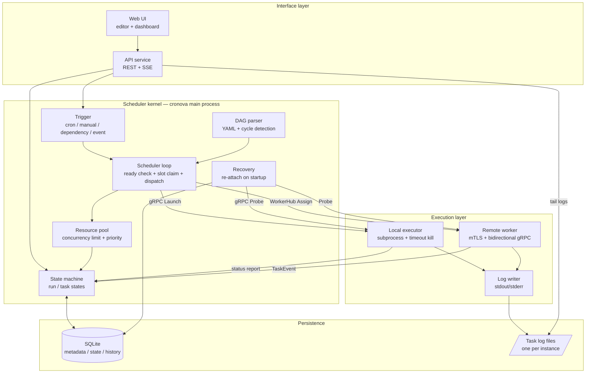
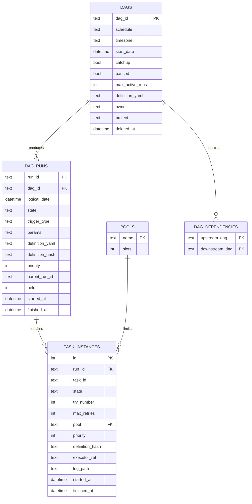
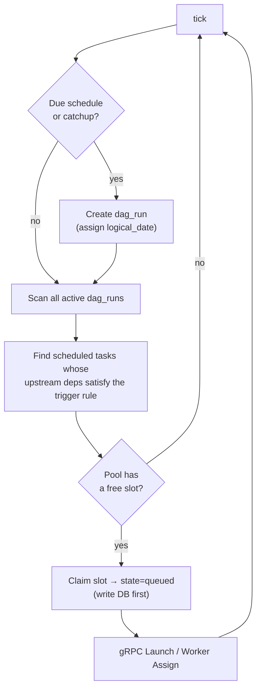
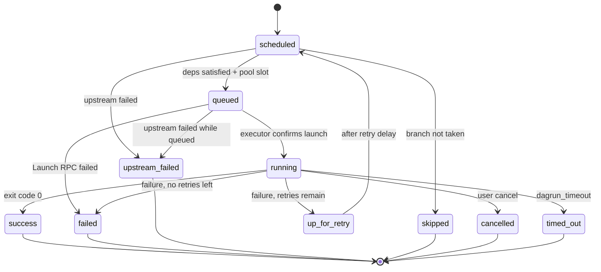
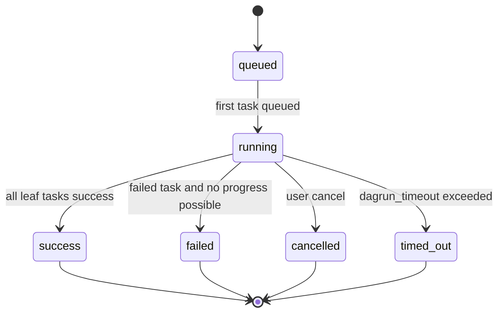
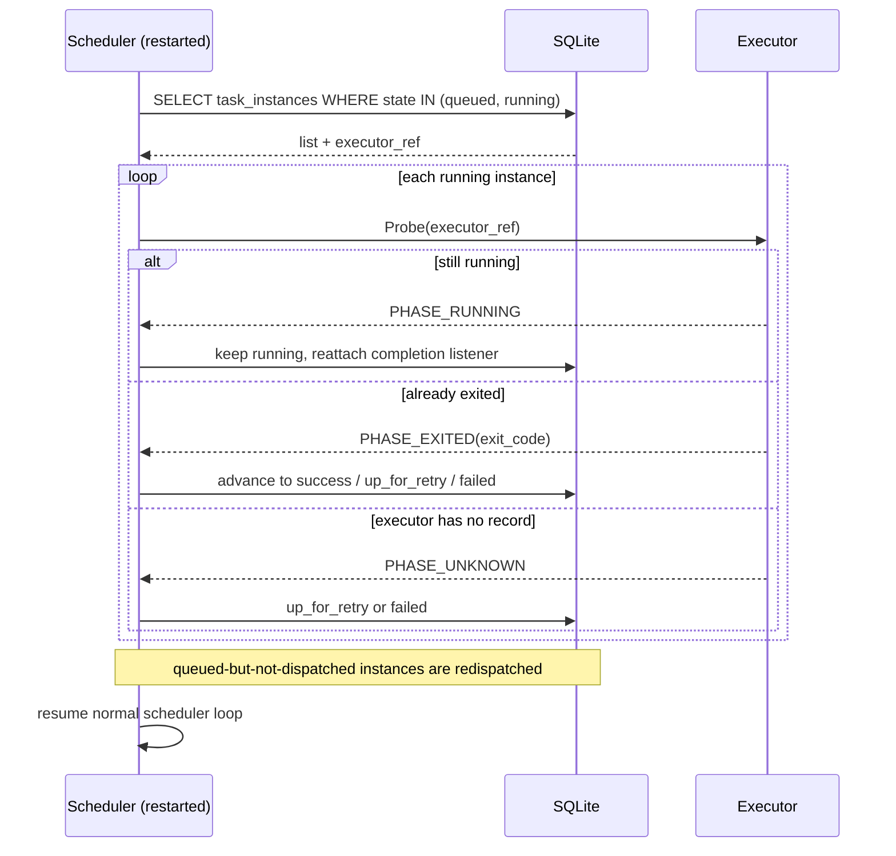
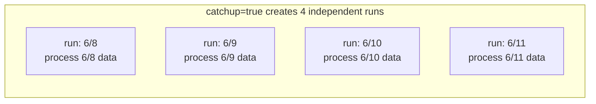
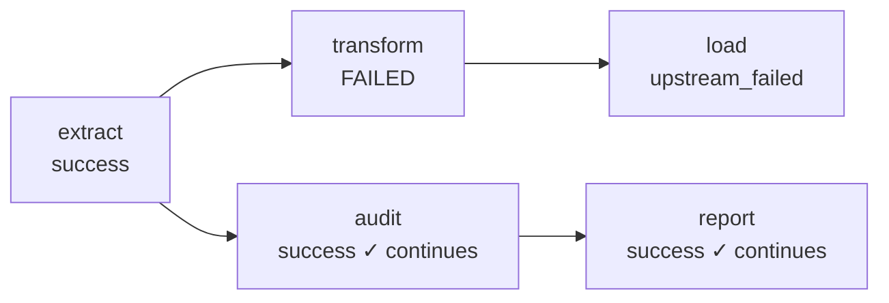
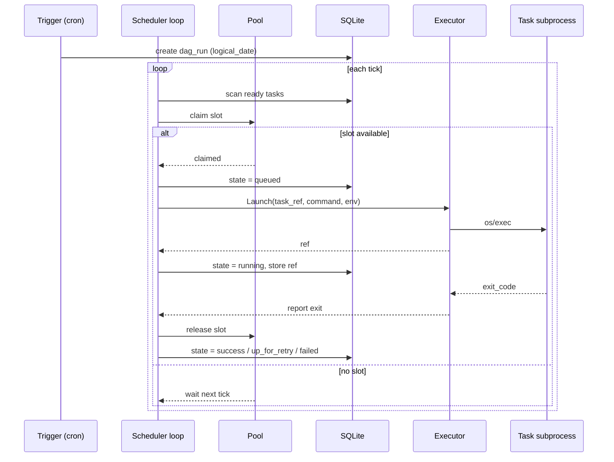
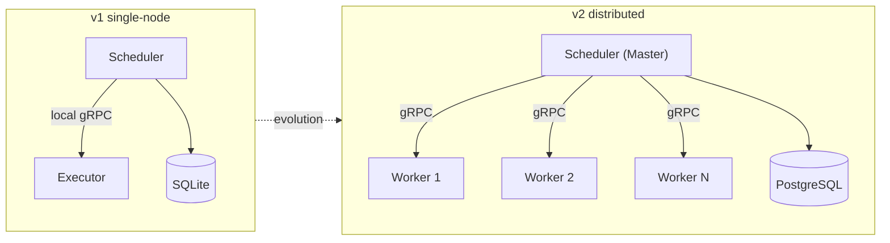

# cronova Architecture

> A workflow scheduler inspired by Airflow / Azkaban.
> Version: v1 (single-node first, distributed evolution prepared)
> Last updated: 2026-09-18

---

## Table of contents

1. [Project positioning](#1-project-positioning)
2. [Architecture decision records](#2-architecture-decision-records)
3. [High-level architecture](#3-high-level-architecture)
4. [Module layout](#4-module-layout)
5. [Core concepts](#5-core-concepts)
6. [Data model](#6-data-model)
7. [Scheduler kernel](#7-scheduler-kernel)
8. [Execution layer](#8-execution-layer)
9. [Crash recovery](#9-crash-recovery)
10. [Catchup and logical time](#10-catchup-and-logical-time)
11. [Resource pools and concurrency control](#11-resource-pools-and-concurrency-control)
12. [Failure propagation and retries](#12-failure-propagation-and-retries)
13. [Trigger flow timeline](#13-trigger-flow-timeline)
14. [YAML DAG specification](#14-yaml-dag-specification)
15. [Executor gRPC protocol](#15-executor-grpc-protocol)
16. [Remote workers](#16-remote-workers)
17. [API and Web UI](#17-api-and-web-ui)
18. [Security model](#18-security-model)
19. [Delivery roadmap](#19-delivery-roadmap)
20. [Evolution: single-node → distributed](#20-evolution-single-node--distributed)
21. [Risks and open questions](#21-risks-and-open-questions)

---

## 1. Project positioning

cronova is a **workflow scheduler** built to be a usable product, not a toy demo. It:

- Describes task dependencies as a **DAG** (Directed Acyclic Graph);
- Triggers workflows by **schedule / manual / upstream dependency / external event**;
- Runs every task as an **independent OS subprocess**, so tasks can be written in any language (Python, SQL, Java, Go, Node, etc.);
- Tracks every **run** and **task instance** state and offers monitoring, logs, backfill, retry and alerting.

**One-sentence summary**: the scheduler is written in Go, but the tasks it runs can be any language, because each task is launched as a child process.

---

## 2. Architecture decision records

| # | Decision | Choice | Rationale |
|---|---|---|---|
| 1 | Implementation language | **Go** | Goroutines/channels fit a scheduler; static binary; `os/exec` for subprocesses; gRPC ecosystem for future distribution |
| 2 | DAG definition | Declarative **YAML** + **Web UI** editor | Verifiable, versionable base; friendly UI on top |
| 3 | Deployment shape | **Single-node first**, Master-Worker prepared | Get the kernel right, then scale horizontally |
| 4 | Task execution | **Subprocess**, multi-language | Framework and task languages are decoupled |
| 5 | Product goal | **Production-grade** | Robustness and operability over feature count |
| 6 | Trigger sources | Schedule + manual + dependency + event | Covers the core scheduler responsibilities |
| 7 | Metadata store | **Embedded SQLite**, `store.Store` interface | Zero ops for single-node; interface isolates future PG/MySQL swap |
| 8 | Crash recovery | **Re-attach + state rebuild** | Scheduler restart must not lose running tasks |
| 9 | Catchup | Configurable **catchup** (Airflow-style) | `logical_date` lets missed periods be replayed one by one |
| 10 | Logs | **One file per task instance** + UI tail | Practical for single-node; avoids bloating the DB |
| 11 | Concurrency control | **Resource pool** | Rate limiting + priority against task floods |
| 12 | Execution decoupling | **Standalone executor process**, local gRPC | Scheduler restart does not kill tasks; executor is the future worker seed |
| 13 | Failure propagation | Default **block downstream branch** (`upstream_failed`) | Unrelated parallel branches continue; `trigger_rule` available for advanced cases |
| 14 | Logical time | **Injected into tasks** (env / `{{ logical_date }}`) | Tasks process data for the logical period, making catchup meaningful |
| 15 | Auth | v1 **opt-in auth**, `owner`/`project` reserved | Solid kernel first, full RBAC later |

---

## 3. High-level architecture

Four layers: **Interface → Scheduler kernel → Execution layer → Persistence**. The scheduler (`cronova` main process) talks to executors through local gRPC — this decoupling is what makes "restart without losing tasks" possible.



**Key edges**

- `STATE <--> DB`: every state change is persisted first, then acted upon. SQLite is the source of truth.
- `LOOP -- gRPC Launch --> EXEC`: the scheduler only dispatches; the actual parent process of a task is the standalone executor.
- `REC -- gRPC Probe --> EXEC`: after restart the scheduler probes every `running` instance to rebuild state.
- `WORKER`: remote workers dial into the scheduler, receive assignments and stream logs back. This is the distributed evolution path.

---

## 4. Module layout

```
cronova/
├── cmd/
│   ├── cronova/              # main process: scheduler + api + web
│   └── cronova-executor/     # standalone executor process (gRPC server)
├── internal/
│   ├── scheduler/
│   │   ├── parser/           # YAML parsing + DAG cycle detection
│   │   ├── scheduler.go      # trigger, loop, state machine, recovery
│   │   └── *_test.go         # extensive scenario tests
│   ├── executor/             # subprocess runner, gRPC client/server, state reporter
│   ├── worker/               # remote worker client (dials WorkerHub)
│   ├── workerhub/            # scheduler-side worker hub (mTLS, assignments, log streaming)
│   ├── store/
│   │   ├── store.go          # Store interface
│   │   └── sqlite/           # SQLite implementation + schema.sql
│   ├── model/                # DAG / DagRun / TaskInstance / Pool domain models + state machine
│   ├── api/                  # REST + SSE handlers
│   ├── auth/                 # login, sessions, API tokens
│   ├── secrets/              # AES-256-GCM for connection passwords
│   ├── certs/                # internal CA for worker mTLS
│   ├── datetmpl/             # {{ logical_date }} and other template resolution
│   ├── projectfs/            # uploaded project staging
│   ├── operator/             # hold/release, mark, retry operators
│   ├── metrics/              # Prometheus metrics
│   ├── mcp/                  # MCP server integration
│   └── aiwiki/               # AI wiki RAG chat
├── proto/
│   └── cronova/
│       ├── executor/v1/executor.proto   # local executor gRPC
│       └── worker/v1/worker.proto       # remote worker gRPC
├── web/                      # embedded static UI
├── dags/                     # user YAML DAG directory (configurable)
└── docs/
    └── ARCHITECTURE.md       # this file
```

**Design notes**

- `store` is an interface; `sqlite` is the only implementation today. Adding a `postgres` implementation later requires no scheduler changes.
- `scheduler` and `executor` have separate `cmd/` entry points. `cronova serve` can run an in-process executor for local use; production installs use the standalone executor or remote workers.
- The worker protocol reuses the same `Runner` as the standalone executor, so a worker restart also does not kill its tasks.

---

## 5. Core concepts

| Concept | Description |
|---|---|
| **DAG** | A workflow definition: a set of tasks + dependency edges, must be acyclic |
| **Task** | A node in a DAG: command, dependencies, retries, pool, priority |
| **DAG Run** | A concrete execution of a DAG, produced by a trigger, carrying a `logical_date` |
| **Task Instance** | A concrete execution of a task within a run; the smallest state-machine unit |
| **logical_date** | The **business period** this run represents, not wall time. Essential for catchup |
| **Pool** | A global slot pool limiting concurrent tasks |
| **Trigger** | Source of a run: schedule / manual / dependency / event / subdag / backfill |
| **executor_ref** | Handle returned by the executor for a launched task, used for Probe/Cancel |
| **Worker group** | Label-based routing group for remote workers |

### Why `logical_date` matters

Consider a daily ETL that processes "yesterday's" data, scheduled at `0 2 * * *`.

- The run triggered at 2 AM on 6/10 has `logical_date = 6/9` and must process **6/9 data**.
- If the scheduler is down from 6/8 to 6/10, catchup creates **three separate runs** for 6/8, 6/9 and 6/10, each with its own `logical_date`.

If the task only knows "now", all catchup runs would process today's data. Therefore `logical_date` is injected into the task environment (see [§10](#10-catchup-and-logical-time)).

---

## 6. Data model

SQLite relational model. Core tables plus extensions for auth, workers, variables, connections, alert groups and AI providers.



### Additional tables

- `events` — durable scheduler events (dependency triggers, external events)
- `audit_log` — operator action trail
- `api_tokens` — machine access tokens (SHA-256 hashed)
- `ai_providers` — OpenAI-compatible LLM configuration
- `users`, `sessions` — console/API accounts and DB-backed sessions
- `variables`, `connections` — shared config and credentials (encrypted at rest when `key_file` is set)
- `alert_groups` — named notification fan-out lists
- `workers`, `worker_join_tokens` — remote worker registry and one-time join tokens
- `scheduler_lease` — single-row lease preventing two schedulers from dispatching against the same DB
- `dag_hooks` — per-DAG inbound webhook secrets

### Concurrency and journal mode

The implementation uses pure-Go `modernc.org/sqlite`. Its WAL shared memory is per-process, so WAL does **not** coordinate across OS processes. The CLI (`cronova trigger`, `cronova runs`, etc.) accesses the same DB as a running `cronova serve`. Therefore the store uses **DELETE rollback journal** (real OS file locks, multi-process safe) with `busy_timeout` and `MaxOpenConns(1)` to serialize access within a process. WAL's concurrent-read advantage is unused here, so DELETE mode loses nothing for v1.

---

## 7. Scheduler kernel

### 7.1 Triggers (four sources)

Every trigger source ultimately creates one `dag_run` (with a `logical_date`) and lets the scheduler loop take over.

| Source | Mechanism | `logical_date` source |
|---|---|---|
| **Cron schedule** | Internal clock computes next fire time | The boundary of that scheduling period |
| **Manual** | UI / API creates a run immediately | Current time (or user-specified) |
| **Dependency / upstream** | Listen on `dag_dependencies`; upstream success triggers downstream | Upstream run's `logical_date` |
| **Event / external** | Webhook or file sensor writes to `events`; trigger consumes | Event time or current time |

Dependency events are committed in the same SQLite transaction as the upstream `success` state, using the upstream `run_id` as an idempotency key. The scheduler tick only consumes the event after all eligible downstream runs have been created (or already exist). If the global queued-run limit is full, the event stays unconsumed and retries on the next tick.

### 7.2 DAG parsing and validation

1. Read YAML from `dags/` or UI submission;
2. Parse into in-memory task list + dependency edges;
3. **Topological sort detects cycles** — cyclic DAGs are rejected;
4. Validate: unique task ids, existing deps, existing pool, valid cron, valid trigger rule.

### 7.3 Scheduler loop

The loop ticks at a fixed interval (default 2 s):



**Key invariant**: `state=queued` is persisted **before** the gRPC dispatch. If the scheduler crashes during dispatch, recovery sees the queued instance and handles it safely.

### 7.4 Task state machine



Terminal states can be reactivated to `scheduled` by a manual retry (clear/mark).

### 7.5 DAG Run state machine



Defensive edges `queued → success/failed` are allowed for runs that resolve before any task runs (all skipped, or aborted while queued).

---

## 8. Execution layer

The execution layer can be:

1. **Standalone local executor** — `cronova-executor` process, gRPC `Executor` service.
2. **In-process executor** — `cronova serve` without `-executor` flag; tasks die on scheduler restart.
3. **Remote worker** — `cronova worker` binary that dials the scheduler's `WorkerHub`.

### Standalone executor responsibilities

1. **Launch**: receive a task, run it with `os/exec` in its own process group;
2. **Timeout**: kill the whole process group when `timeout_seconds` elapses;
3. **Logs**: redirect child stdout/stderr to `log_path` (one file per task instance);
4. **Status report**: after the child exits, report exit code to the scheduler;
5. **Probe**: answer scheduler re-attach probes.

### Why a separate process?

If the scheduler forked tasks directly, a scheduler restart would either kill its children or leave them orphaned. A long-lived executor survives scheduler restarts and can be re-attached. This same executor is the seed of the future distributed worker.

### Multi-language tasks

Because tasks are subprocesses, the `type` field only affects how the command is assembled:

| type | Launch |
|---|---|
| `shell` | Git for Windows `bash.exe -lc "<command>"` |
| `python` | `python <script> <args>` |
| `sql` | via CLI/driver (e.g. `psql -f`) |
| `jar` | `java -jar <jar> <args>` |
| `http` | HTTP request executed by the runner |
| arbitrary | any executable command |

Context such as `logical_date` is injected through environment variables (`CRONOVA_LOGICAL_DATE`, `CRONOVA_RUN_ID`, `CRONOVA_TASK_ID`, `CRONOVA_TRY_NUMBER`, etc.).

---

## 9. Crash recovery

"Re-attach + state rebuild" separates a usable product from a toy. After a scheduler restart:



**Idempotency**: the task ref (`run_id/task_id/try`) is the idempotency key. Re-dispatching an already running task returns the existing handle instead of starting a second process.

---

## 10. Catchup and logical time

### Catchup calculation

When a DAG has `start_date` and `catchup: true`, the scheduler fills missed periods:

```
last existing run logical_date → now
step by schedule boundary
for each missed logical_date:
    if (dag_id, logical_date) not in dag_runs → create
    (UNIQUE constraint prevents duplicates)
```

Example: `schedule: 0 2 * * *`, `start_date: 2026-06-08`, scheduler down 6/8–6/10, restart on 6/11:



With `catchup: false` only the 6/11 run is created.

### Logical time injection

Every task subprocess receives:

```bash
CRONOVA_LOGICAL_DATE=2026-06-09
CRONOVA_RUN_ID=daily_etl__2026-06-09
CRONOVA_TASK_ID=extract
CRONOVA_TRY_NUMBER=1
```

YAML templates are also resolved:

```yaml
command: "python extract.py --date {{ logical_date }}"
# becomes: python extract.py --date 2026-06-09
```

**Tasks must be idempotent**: re-running the same `logical_date` must produce the same result, otherwise catchup and retry corrupt data.

---

## 11. Resource pools and concurrency control

Pools prevent task floods.

- Each **Pool** is a global slot counter (`slots`), shared across all DAGs and runs;
- A task declares its pool in YAML (default `default`, seeded with 16 slots);
- A pool referenced by a DAG but not configured is auto-created with a default slot count;
- Pool slot counts are configured globally via CLI/API: `cronova pools set <name> <slots>`;
- Before a task moves to `queued`, the scheduler must claim a slot (count of task instances with `state IN (queued,running)` in that pool);
- Slots are released when the task reaches a terminal state;
- When multiple tasks compete for a slot, higher `priority` wins; full pools wait for the next tick.

```
default pool (slots=16):  [████████░░░░░░░░]  8 running, 8 free
heavy   pool (slots=2):   [██]                 heavy tasks, max 2 parallel
```

---

## 12. Failure propagation and retries

### Retries

If a task fails and `try_number < max_retries`, it enters `up_for_retry`. After `retry_delay` (with optional exponential backoff) it returns to `scheduled`.

### Failure propagation (default: block downstream branch)

When a task finally fails, only its downstream branch is blocked:



`transform` fails → only `load` becomes `upstream_failed`; the unrelated `audit`/`report` branch continues.

### Trigger rules

Tasks can override the default with `trigger_rule`:

| rule | meaning |
|---|---|
| `all_success` | all deps succeeded (default) |
| `all_done` | all deps finished |
| `one_success` | at least one dep succeeded |
| `one_failed` | at least one dep failed |
| `all_failed` | all deps failed |
| `none_failed` | all deps finished and none failed |

---

## 13. Trigger flow timeline

A complete schedule-trigger → execute → finish flow:



---

## 14. YAML DAG specification

```yaml
# One DAG = one YAML file
dag_id: daily_etl              # globally unique
schedule: "0 2 * * *"          # cron; omit for manual/event only
start_date: 2026-06-01
catchup: true                  # backfill missed periods
max_active_runs: 1             # max concurrent runs of this DAG
default_retries: 2             # default per-task retries
default_retry_delay: 300       # default retry interval (seconds)
dagrun_timeout: 3600           # whole-run timeout (seconds)

notify_on: [failure, success]
notify_group: oncall           # references alert_groups table

tasks:
  - id: extract
    type: shell
    command: "python extract.py --date {{ logical_date }}"
    pool: default
    priority: 10

  - id: transform
    type: shell
    command: "python transform.py --date {{ logical_date }}"
    deps: [extract]

  - id: load
    type: shell
    command: "psql -f load.sql"
    deps: [transform]
    retries: 3
    timeout: 1800
    retry_backoff: exponential

  - id: cleanup
    type: shell
    command: "python cleanup.py"
    deps: [transform]
    trigger_rule: all_done       # run regardless of load outcome

# Cross-DAG dependency (optional)
trigger_after:
  - dag_id: upstream_ingest
```

**Available template variables**: `{{ logical_date }}`, `{{ run_id }}`, `{{ task_id }}`, `{{ try_number }}`, `{{ params.KEY }}`, `{{ var.KEY }}`, `{{ conn.ID.host }}`, `{{ ti.TASK.key }}`.

---

## 15. Executor gRPC protocol

Local executor contract: `proto/cronova/executor/v1/executor.proto`.

```protobuf
syntax = "proto3";
package cronova.executor.v1;

service Executor {
  rpc Launch(LaunchRequest) returns (LaunchResponse);
  rpc Probe(ProbeRequest) returns (ProbeResponse);
  rpc Cancel(CancelRequest) returns (CancelResponse);
}

message LaunchRequest {
  string task_run_id = 1;          // run_id/task_id/try; idempotency key
  string type = 2;                 // shell/python/sql/jar/http
  string command = 3;
  map<string, string> env = 4;
  int64 timeout_seconds = 5;       // 0 = no timeout
  string log_path = 6;
  string dir = 7;                  // working directory
  repeated string redact = 8;      // secret values to mask from logs
}

message LaunchResponse { string ref = 1; }

message ProbeRequest { string ref = 1; }

enum Phase {
  PHASE_UNSPECIFIED = 0;
  PHASE_RUNNING = 1;
  PHASE_EXITED = 2;
  PHASE_UNKNOWN = 3;
}

message ProbeResponse {
  Phase phase = 1;
  int32 exit_code = 2;             // valid when phase = PHASE_EXITED; 124 = timeout kill
}

message CancelRequest { string ref = 1; }
message CancelResponse { bool ok = 1; }
```

**Idempotency**: `Launch` deduplicates on `task_run_id`. If the task is already running, the existing `ref` is returned.

---

## 16. Remote workers

Remote workers are the distributed evolution of the local executor.

- A worker dials into the scheduler's `WorkerHub` over a single long-lived bidirectional gRPC stream;
- Workers authenticate with mTLS certificates issued through a one-time join token (`POST /api/workers/join`);
- The scheduler assigns tasks, sends cancels/probes, and receives task events and log chunks over the same stream;
- Workers need no inbound port and traverse NAT;
- Logs are spooled locally on the worker and streamed back, so the scheduler does not need a shared filesystem.

Protocol: `proto/cronova/worker/v1/worker.proto`.

Key messages:

| message | purpose |
|---|---|
| `Hello` | worker identifies itself and reports currently running refs |
| `Assign` | scheduler gives the worker a task to run |
| `Cancel` / `Probe` | scheduler asks to kill or re-report a task |
| `TaskEvent` | worker reports lifecycle transitions |
| `LogChunk` | worker streams stdout/stderr bytes |

---

## 17. API and Web UI

### REST API (selection)

| Method | Path | Description |
|---|---|---|
| `GET` | `/api/info` | server info |
| `GET` | `/api/dags` | list DAGs |
| `POST` | `/api/dags` | create/update DAG |
| `POST` | `/api/dags/validate` | validate YAML |
| `GET` | `/api/dags/{id}` | get DAG |
| `POST` | `/api/dags/{id}/trigger` | manual trigger |
| `POST` | `/api/dags/{id}/backfill` | backfill runs |
| `POST` | `/api/dags/{id}/pause` | pause/resume schedule |
| `GET` | `/api/dags/{id}/runs` | run history |
| `GET` | `/api/runs/{runID}` | run details |
| `POST` | `/api/runs/{runID}/cancel` | cancel run |
| `POST` | `/api/runs/{runID}/retry` | retry run |
| `POST` | `/api/runs/{runID}/tasks/{taskID}/retry` | retry task |
| `POST` | `/api/runs/{runID}/tasks/{taskID}/mark` | mark task state |
| `GET` | `/api/tasks/{tiID}/log` | task log |
| `GET` | `/api/tasks/{tiID}/log/stream` | SSE log stream |
| `GET/POST/DELETE` | `/api/pools/{name}` | pool management |
| `GET/POST/DELETE` | `/api/variables/{key}` | variables |
| `GET/POST/DELETE` | `/api/connections/{id}` | connections |
| `GET/POST/DELETE` | `/api/alert-groups/{name}` | alert groups |
| `GET/POST/DELETE` | `/api/ai-providers/{id}` | AI providers |
| `GET/POST/DELETE` | `/api/projects/{name}` | uploaded projects |
| `GET/POST` | `/api/workers`, `/api/worker-tokens` | worker management |
| `POST` | `/api/events` | external event |
| `POST` | `/api/hooks/{dag}/{secret}` | webhook trigger |
| `POST` | `/api/ask` | AI wiki chat |
| `GET` | `/metrics` | Prometheus metrics |
| `GET` | `/openapi.json` | OpenAPI spec |

### Web UI modules

- DAG list with pause toggle, last run status, next schedule;
- DAG detail / graph view with colored task states;
- Run history by `logical_date` with manual trigger/backfill;
- Task log viewer with live tail;
- YAML editor with online validation (cycle detection, field checks);
- AI wiki chat panel.

---

## 18. Security model

Authentication is **opt-in** (`auth.enabled` or `-auth=true`). When disabled, the console is safe only on loopback.

When enabled:

- Console users log in with username/password; passwords are PBKDF2-HMAC-SHA256 hashed;
- DB-backed sessions survive restart and can be revoked on logout;
- API tokens use `Authorization: Bearer <token>`; only the SHA-256 hash is stored;
- Roles: `admin` (full) and `viewer` (read-only);
- Connection passwords are encrypted at rest with AES-256-GCM when `key_file` is configured;
- Worker communication uses mTLS with an internal CA.

Future evolution: project isolation → full RBAC (users/roles/permissions).

---

## 19. Delivery roadmap

| Milestone | Content | Acceptance |
|---|---|---|
| **M0** | Skeleton + SQLite schema + store interface + models | Compiles; tables created; store CRUD tests pass |
| **M1** | Scheduler MVP: YAML parse + cycle detection + loop + state machine + in-process executor + file logs + cron/manual trigger | Linear DAG runs end-to-end with correct states |
| **M2** | Executor decoupling (gRPC) + crash recovery re-attach | Kill scheduler mid-run, restart, task survives and state is correct |
| **M3** | Dependency triggers + pools + retries/timeouts + trigger rules | Multi-DAG coordination; pool limits enforced; failures propagate correctly |
| **M4** | Catchup + logical_date injection | After downtime, correct number of historical runs created; tasks receive correct logical_date |
| **M5** | Web UI: dashboard + log tail + manual trigger/backfill + YAML editor | Full workflow operable in browser |
| **M6** | External events (webhooks) + alert groups + remote workers | External signals drive DAGs; notifications fan out |

Most of M1–M6 is implemented. Remaining gaps are mainly polish and advanced event sensors.

---

## 20. Evolution: single-node → distributed

The current decoupling already paves the way:



Migration steps:

1. **Executor → worker**: the local executor becomes a deployable remote worker; gRPC concepts stay the same;
2. **SQLite → PostgreSQL**: swap the `store` implementation; scheduler logic unchanged;
3. **Scheduler leader election**: with multiple schedulers, introduce leader election (DB row lock, etcd or raft) to avoid double dispatch;
4. **Task routing**: master routes tasks to workers by load and labels.

---

## 21. Risks and open questions

| Risk / question | Description | Mitigation / open |
|---|---|---|
| SQLite write concurrency | Scheduler loop + API/CLI write concurrently | DELETE journal + `MaxOpenConns(1)` + `busy_timeout`; move to PG if writes become a bottleneck |
| Log file growth | One file per task instance accumulates over time | Add retention policy and periodic cleanup/archive |
| Non-idempotent tasks | Catchup/retry corrupts data | Document strongly; provide `logical_date` to encourage idempotent design |
| Executor single point | Single-node has one executor | Acceptable for v1; distributed workers solve it |
| Time zones / DST | Cron and logical_date timezone handling | Store UTC, convert in UI |
| Catchup storm | Hundreds of runs created after long downtime | `max_active_runs` + configurable catchup limit |
| Advanced sensors | File sensors, message-queue triggers | Webhooks and events cover many cases; file sensors future work |

---

*This document is updated as the design evolves. Implementation details always win over documentation.*
