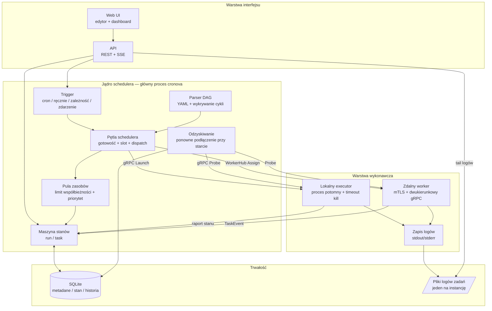
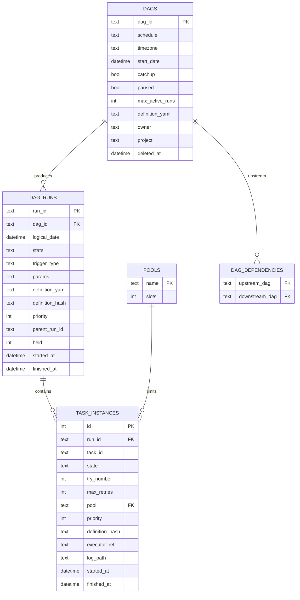
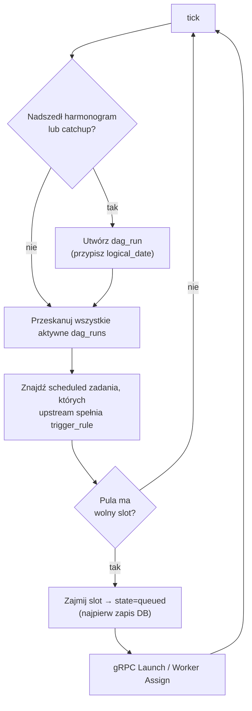
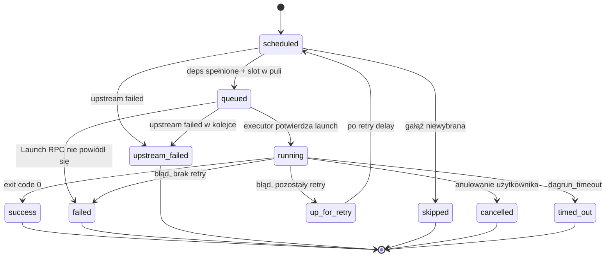
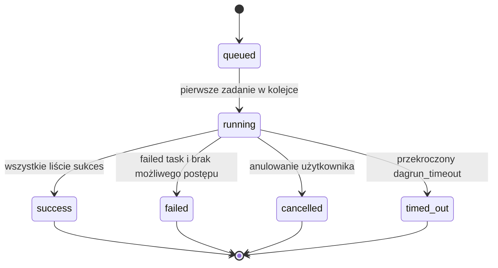
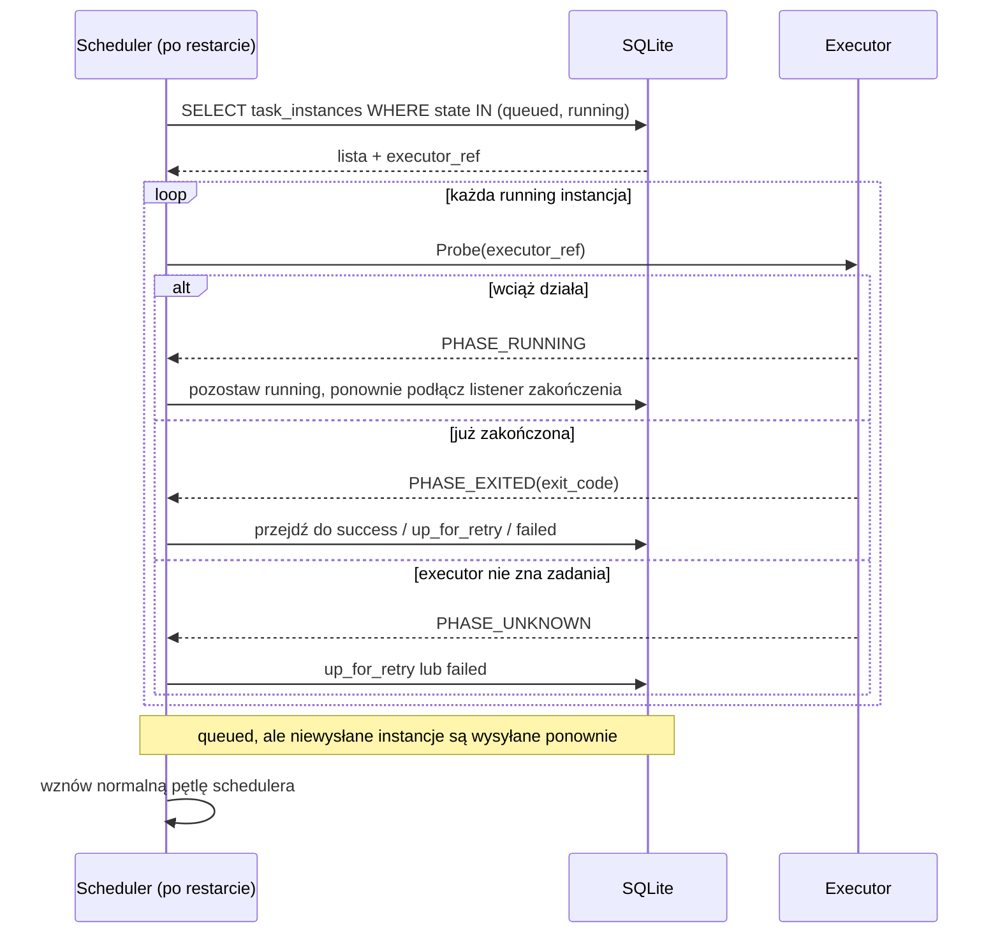
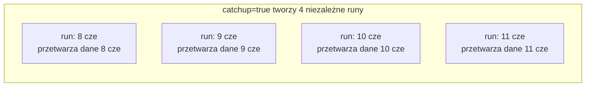
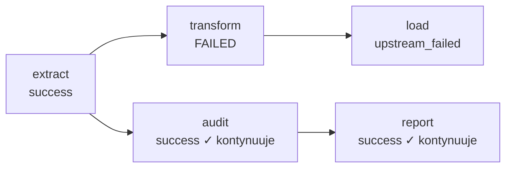
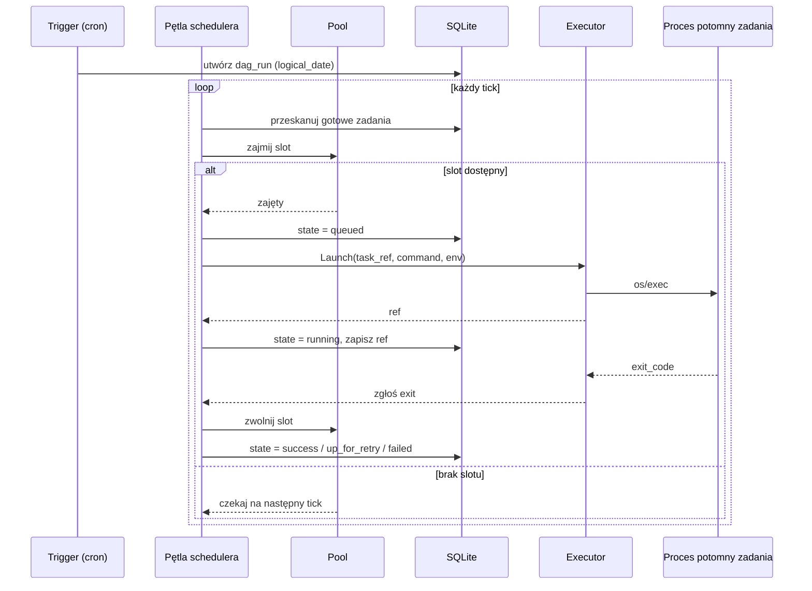
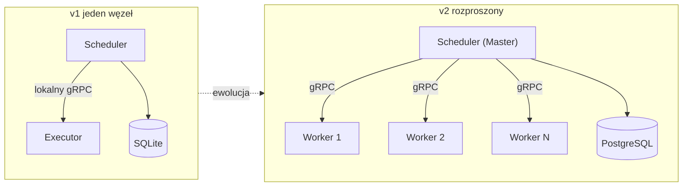

# Architektura cronova

> Scheduler workflow inspirowany Airflow / Azkaban.
> Wersja: v1 (najpierw jeden węzeł, przygotowane do rozproszenia)
> Ostatnia aktualizacja: 2026-09-18

---

## Spis treści

1. [Pozycjonowanie projektu](#1-pozycjonowanie-projektu)
2. [Decyzje architektoniczne](#2-decyzje-architektoniczne)
3. [Architektura ogólna](#3-architektura-ogólna)
4. [Układ modułów](#4-układ-modułów)
5. [Podstawowe pojęcia](#5-podstawowe-pojęcia)
6. [Model danych](#6-model-danych)
7. [Jądro schedulera](#7-jądro-schedulera)
8. [Warstwa wykonawcza](#8-warstwa-wykonawcza)
9. [Odzyskiwanie po awarii](#9-odzyskiwanie-po-awarii)
10. [Catchup i czas logiczny](#10-catchup-i-czas-logiczny)
11. [Pule zasobów i kontrola współbieżności](#11-pule-zasobów-i-kontrola-współbieżności)
12. [Propagacja błędów i retry](#12-propagacja-błędów-i-retry)
13. [Oś czasu triggera](#13-oś-czasu-triggera)
14. [Specyfikacja YAML DAG](#14-specyfikacja-yaml-dag)
15. [Protokół gRPC executora](#15-protokół-grpc-executora)
16. [Zdalni workerzy](#16-zdalni-workerzy)
17. [API i Web UI](#17-api-i-web-ui)
18. [Model bezpieczeństwa](#18-model-bezpieczeństwa)
19. [Plan dostarczania](#19-plan-dostarczania)
20. [Ewolucja: jeden węzeł → rozproszony](#20-ewolucja-jeden-węzeł--rozproszony)
21. [Ryzyka i otwarte pytania](#21-ryzyka-i-otwarte-pytania)

---

## 1. Pozycjonowanie projektu

cronova to **scheduler workflow** zbudowany jako użyteczny produkt, nie zabawka. Odpowiada za:

- Opisywanie zależności między zadaniami jako **DAG** (skierowany graf acykliczny);
- Uruchamianie workflowów przez **harmonogram / ręcznie / zależność upstream / zdarzenie zewnętrzne**;
- Uruchamianie każdego zadania jako **niezależny proces OS**, więc zadania mogą być w dowolnym języku (Python, SQL, Java, Go, Node itp.);
- Śledzenie stanu każdego **runu** i **instancji zadania** oraz oferowanie monitoringu, logów, backfillu, retry i alertów.

**Podsumowanie w jednym zdaniu**: scheduler jest napisany w Go, ale zadania mogą być w dowolnym języku, bo każde zadanie jest uruchamiane jako proces potomny.

---

## 2. Decyzje architektoniczne

| # | Decyzja | Wybór | Uzasadnienie |
|---|---|---|---|
| 1 | Język implementacji | **Go** | Goroutines/kanały pasują do schedulera; statyczny binarny; `os/exec` do procesów potomnych; ekosystem gRPC do przyszłego rozproszenia |
| 2 | Definicja DAG | Deklaratywny **YAML** + edytor **Web UI** | Weryfikowalna, wersjonowalna baza; przyjazne UI na wierzchu |
| 3 | Forma wdrożenia | **Najpierw jeden węzeł**, przygotowane Master-Worker | Najpierw poprawne jądro, potem skalowanie poziome |
| 4 | Wykonywanie zadań | **Proces potomny**, wielojęzyczność | Framework i język zadania są rozdzielone |
| 5 | Cel produktowy | **Produkcyjna jakość** | Niezawodność i możliwość utrzymania ponad liczbę funkcji |
| 6 | Źródła triggerów | Harmonogram + ręcznie + zależność + zdarzenie | Pokrywa podstawowe obowiązki schedulera |
| 7 | Magazyn metadanych | **Wbudowany SQLite**, interfejs `store.Store` | Zero utrzymania dla jednego węzła; interfejs izoluje przyszłą zamianę na PG/MySQL |
| 8 | Odzyskiwanie po awarii | **Ponowne podłączenie + odbudowa stanu** | Restart schedulera nie może stracić działających zadań |
| 9 | Catchup | Konfigurowalny **catchup** (jak Airflow) | `logical_date` pozwala odtwarzać przegapione okresy jeden po drugim |
| 10 | Logi | **Jeden plik na instancję zadania** + tail w UI | Praktyczne dla jednego węzła; nie puchnie baza |
| 11 | Kontrola współbieżności | **Pula zasobów** | Ograniczenie + priorytet przeciwko zalewom zadań |
| 12 | Rozdzielenie wykonania | **Samodzielny proces executor**, lokalny gRPC | Restart schedulera nie zabija zadań; executor to zalążek przyszłego workera |
| 13 | Propagacja błędów | Domyślnie **blokuj gałąź downstream** (`upstream_failed`) | Niezależne gałęzie równoległe kontynuują; `trigger_rule` dla zaawansowanych przypadków |
| 14 | Czas logiczny | **Wstrzyknięty do zadań** (env / `{{ logical_date }}`) | Zadania przetwarzają dane dla okresu logicznego, dzięki czemu catchup ma sens |
| 15 | Autoryzacja | v1 **opcjonalna autoryzacja**, zarezerwowane `owner`/`project` | Najpierw solidne jądro, pełne RBAC później |

---

## 3. Architektura ogólna

Cztery warstwy: **Interfejs → Jądro schedulera → Warstwa wykonawcza → Trwałość**. Scheduler (główny proces `cronova`) komunikuje się z executorami przez lokalny gRPC — to rozdzielenie umożliwia „restart bez utraty zadań”.



**Kluczowe połączenia**

- `STATE <--> DB`: każda zmiana stanu jest najpierw utrwalana, potem wykonywana. SQLite jest źródłem prawdy.
- `LOOP -- gRPC Launch --> EXEC`: scheduler tylko wysyła; rzeczywistym procesem rodzicem zadania jest samodzielny executor.
- `REC -- gRPC Probe --> EXEC`: po restarcie scheduler sonduje każdą `running` instancję, żeby odbudować stan.
- `WORKER`: zdalni workerzy dzwonią do schedulera, otrzymują zadania i strumieniują logi. To ścieżka ewolucji do rozproszenia.

---

## 4. Układ modułów

```
cronova/
├── cmd/
│   ├── cronova/              # główny proces: scheduler + api + web
│   └── cronova-executor/     # samodzielny proces executor (serwer gRPC)
├── internal/
│   ├── scheduler/
│   │   ├── parser/           # parsowanie YAML + wykrywanie cykli DAG
│   │   ├── scheduler.go      # trigger, pętla, maszyna stanów, recovery
│   │   └── *_test.go         # obszerne testy scenariuszowe
│   ├── executor/             # runner procesów, klient/serwer gRPC, reporter stanu
│   ├── worker/               # klient zdalnego workera (łączy się z WorkerHub)
│   ├── workerhub/            # scheduler-side worker hub (mTLS, przydziały, strumienie logów)
│   ├── store/
│   │   ├── store.go          # interfejs Store
│   │   └── sqlite/           # implementacja SQLite + schema.sql
│   ├── model/                # modele domenowe DAG / DagRun / TaskInstance / Pool + maszyna stanów
│   ├── api/                  # handlery REST + SSE
│   ├── auth/                 # logowanie, sesje, tokeny API
│   ├── secrets/              # AES-256-GCM dla haseł połączeń
│   ├── certs/                # wewnętrzne CA dla mTLS workerów
│   ├── datetmpl/             # rozwiązywanie szablonów {{ logical_date }} i innych
│   ├── projectfs/            # staging wgrywanych projektów
│   ├── operator/             # hold/release, mark, retry operatorów
│   ├── metrics/              # metryki Prometheus
│   ├── mcp/                  # integracja serwera MCP
│   └── aiwiki/               # chat RAG AI wiki
├── proto/
│   └── cronova/
│       ├── executor/v1/executor.proto   # lokalny executor gRPC
│       └── worker/v1/worker.proto       # zdalny worker gRPC
├── web/                      # osadzone statyczne UI
├── dags/                     # katalog z YAML-ami użytkownika (konfigurowalny)
└── docs/
    └── ARCHITECTURE.md       # ten plik
```

**Uwagi projektowe**

- `store` to interfejs; `sqlite` to jedyna implementacja dzisiaj. Dodanie implementacji `postgres` później nie wymaga zmian w schedulerze.
- `scheduler` i `executor` mają osobne punkty wejścia w `cmd/`. `cronova serve` może uruchamiać executor w procesie dla lokalnego użycia; produkcyjne wdrożenia używają samodzielnego executor lub zdalnych workerów.
- Protokół workera używa tego samego `Runner` co samodzielny executor, więc restart workera również nie zabija jego zadań.

---

## 5. Podstawowe pojęcia

| Pojęcie | Opis |
|---|---|
| **DAG** | Definicja workflow: zbiór zadań + krawędzie zależności, musi być acykliczna |
| **Task** | Węzeł w DAG: polecenie, zależności, retry, pool, priorytet |
| **DAG Run** | Konkretne wykonanie DAG, wyprodukowane przez trigger, niosące `logical_date` |
| **Task Instance** | Konkretne wykonanie zadania w ramach runu; najmniejsza jednostka maszyny stanów |
| **logical_date** | **Okres biznesowy**, który reprezentuje ten run, nie czas ścienny. Kluczowe dla catchup |
| **Pool** | Globalna pula slotów ograniczająca współbieżne zadania |
| **Trigger** | Źródło runu: schedule / manual / dependency / event / subdag / backfill |
| **executor_ref** | Uchwyt zwracany przez executor dla uruchomionego zadania, używany do Probe/Cancel |
| **Worker group** | Grupa routingu oparta na etykietach dla zdalnych workerów |

### Dlaczego `logical_date` jest ważne

Rozważmy dzienny ETL przetwarzający „wczorajsze” dane, zaplanowany na `0 2 * * *`.

- Run uruchomiony 10 czerwca o 2:00 ma `logical_date = 9 czerwca` i musi przetworzyć **dane z 9 czerwca**.
- Jeśli scheduler był wyłączony od 8 do 10 czerwca, catchup tworzy **trzy osobne runy** dla 8, 9 i 10 czerwca, każdy ze swoim `logical_date`.

Jeśli zadanie zna tylko „teraz”, wszystkie runy catchup przetworząłyby dane z dzisiaj. Dlatego `logical_date` jest wstrzykiwany do środowiska zadania (zob. [§10](#10-catchup-i-czas-logiczny)).

---

## 6. Model danych

Relacyjny model SQLite. Tabele podstawowe plus rozszerzenia dla auth, workerów, zmiennych, połączeń, grup alertów i AI providerów.



### Dodatkowe tabele

- `events` — trwałe zdarzenia schedulera (dependency triggers, zdarzenia zewnętrzne)
- `audit_log` — ślad działań operatora
- `api_tokens` — tokeny dostępu maszynowego (hashowane SHA-256)
- `ai_providers` — konfiguracja LLM zgodnego z OpenAI
- `users`, `sessions` — konta konsoli/API i sesje w bazie
- `variables`, `connections` — wspólna konfiguracja i poświadczenia (szyfrowane w spoczynku przy `key_file`)
- `alert_groups` — nazwane listy fan-out powiadomień
- `workers`, `worker_join_tokens` — rejestr zdalnych workerów i jednorazowe tokeny dołączenia
- `scheduler_lease` — jeden wiersz zapobiegający podwójnemu dispatchowaniu przez dwa schedulery
- `dag_hooks` — sekrety webhooków przychodzących per DAG

### Współbieżność i tryb dziennika

Implementacja używa czysto-goowego `modernc.org/sqlite`. Jego pamięć współdzielona WAL jest per-proces, więc WAL **nie** koordynuje między procesami OS. CLI (`cronova trigger`, `cronova runs` itp.) dostępuje do tej samej bazy co działający `cronova serve`. Dlatego store używa **DELETE rollback journal** (prawdziwe blokady plików OS, bezpieczne międzyprocesowo) z `busy_timeout` i `MaxOpenConns(1)` do serializacji dostępu wewnątrz procesu. Zaleta współbieżnego odczytu WAL jest tutaj nieużywana, więc tryb DELETE nic nie traci dla v1.

---

## 7. Jądro schedulera

### 7.1 Triggery (cztery źródła)

Każde źródło triggera ostatecznie tworzy jeden `dag_run` (z `logical_date`) i przekazuje sterowanie pętli schedulera.

| Źródło | Mechanizm | Źródło `logical_date` |
|---|---|---|
| **Harmonogram cron** | Wewnętrzny zegar oblicza następny moment | Granica tego okresu harmonogramu |
| **Ręczny** | UI/API tworzy run natychmiast | Aktualny czas (lub podany przez użytkownika) |
| **Zależność / upstream** | Nasłuchiwanie `dag_dependencies`; sukces upstream triggeruje downstream | `logical_date` runu upstream |
| **Zdarzenie / zewnętrzne** | Webhook lub sensor pliku zapisuje do `events`; trigger konsumuje | Czas zdarzenia lub aktualny czas |

Zdarzenia zależności są zatwierdzane w tej samej transakcji SQLite co stan sukcesu upstream, używając `run_id` upstream jako klucza idempotencji. Tick schedulera konsumuje zdarzenie dopiero po utworzeniu (lub istnieniu) wszystkich kwalifikujących się runów downstream. Jeśli globalny limit runów w kolejce jest pełny, zdarzenie pozostaje niekonsumowane i ponawia w następnym ticku.

### 7.2 Parsowanie i walidacja DAG

1. Odczyt YAML z `dags/` lub zgłoszenia UI;
2. Parsowanie do listy zadań + krawędzi zależności;
3. **Sortowanie topologiczne wykrywa cykle** — cykliczne DAG są odrzucane;
4. Walidacja: unikalne id zadań, istniejące zależności, istniejący pool, poprawny cron, poprawna reguła triggera.

### 7.3 Pętla schedulera

Pętla tickuje w stałym interwale (domyślnie 2 s):



**Kluczowa niezmiennik**: `state=queued` jest utrwalane **przed** wysłaniem gRPC. Jeśli scheduler zawiesi się podczas dispatchu, recovery widzi queued instancję i obsługuje ją bezpiecznie.

### 7.4 Maszyna stanów zadania



Stany terminalne mogą być reaktywowane do `scheduled` przez ręczny retry (clear/mark).

### 7.5 Maszyna stanów DAG Run



Dozwolone są obronne przejścia `queued → success/failed` dla runów rozwiązujących się przed uruchomieniem jakiegokolwiek zadania (wszystkie skipped lub abort w kolejce).

---

## 8. Warstwa wykonawcza

Warstwa wykonawcza może być:

1. **Samodzielny lokalny executor** — proces `cronova-executor`, usługa gRPC `Executor`.
2. **Executor w procesie** — `cronova serve` bez flagi `-executor`; zadania giną przy restarcie schedulera.
3. **Zdalny worker** — binarka `cronova worker`, która dzwoni do `WorkerHub` schedulera.

### Obowiązki samodzielnego executor

1. **Launch**: odbierz zadanie, uruchom je przez `os/exec` we własnej grupie procesów;
2. **Timeout**: zabij całą grupę procesów po upływie `timeout_seconds`;
3. **Logi**: przekieruj stdout/stderr potomka do pliku `log_path` (jeden na instancję zadania);
4. **Raport stanu**: po zakończeniu potomka zgłoś exit code schedulerowi;
5. **Probe**: odpowiadaj na sondy ponownego podłączenia schedulera.

### Dlaczego osobny proces?

Gdyby scheduler forkował zadania bezpośrednio, restart schedulera zabiłby jego dzieci lub zostawił je jako sieroty. Długo żyjący executor przetrwa restarty schedulera i może być ponownie podłączony. Ten sam executor jest zalążkiem przyszłego rozproszonego workera.

### Zadania wielojęzyczne

Ponieważ zadania to procesy potomne, pole `type` wpływa tylko na sposób złożenia polecenia:

| type | Uruchomienie |
|---|---|
| `shell` | Git for Windows `bash.exe -lc "<command>"` |
| `python` | `python <script> <args>` |
| `sql` | przez CLI/sterownik (np. `psql -f`) |
| `jar` | `java -jar <jar> <args>` |
| `http` | żądanie HTTP wykonywane przez runner |
| dowolny | dowolne wykonywalne polecenie |

Kontekst taki jak `logical_date` jest wstrzykiwany przez zmienne środowiskowe (`CRONOVA_LOGICAL_DATE`, `CRONOVA_RUN_ID`, `CRONOVA_TASK_ID`, `CRONOVA_TRY_NUMBER` itp.).

---

## 9. Odzyskiwanie po awarii

„Ponowne podłączenie + odbudowa stanu” oddziela użyteczny produkt od zabawki. Po restarcie schedulera:



**Idempotencja**: ref zadania (`run_id/task_id/try`) to klucz idempotencji. Ponowne wysłanie już działającego zadania zwraca istniejący uchwyt zamiast uruchamiać drugi proces.

---

## 10. Catchup i czas logiczny

### Obliczanie catchup

Gdy DAG ma `start_date` i `catchup: true`, scheduler uzupełnia przegapione okresy:

```
ostatni istniejący run logical_date → teraz
krok po granicy harmonogramu
dla każdego przegapionego logical_date:
    jeśli (dag_id, logical_date) nie ma w dag_runs → utwórz
    (ograniczenie UNIQUE zapobiega duplikatom)
```

Przykład: `schedule: 0 2 * * *`, `start_date: 2026-06-08`, scheduler wyłączony 8–10 czerwca, restart 11 czerwca:



Przy `catchup: false` utworzony zostaje tylko run 11 czerwca.

### Wstrzykiwanie czasu logicznego

Każdy proces potomny zadania otrzymuje:

```bash
CRONOVA_LOGICAL_DATE=2026-06-09
CRONOVA_RUN_ID=daily_etl__2026-06-09
CRONOVA_TASK_ID=extract
CRONOVA_TRY_NUMBER=1
```

Szablony YAML są również rozwijane:

```yaml
command: "python extract.py --date {{ logical_date }}"
# staje się: python extract.py --date 2026-06-09
```

**Zadania muszą być idempotentne**: ponowne uruchomienie tego samego `logical_date` musi dać ten sam wynik, inaczej catchup i retry zanieczyszczą dane.

---

## 11. Pule zasobów i kontrola współbieżności

Pule zapobiegają zalewom zadań.

- Każda **Pool** to globalny licznik slotów (`slots`), współdzielony przez wszystkie DAGi i runy;
- Zadanie deklaruje pulę w YAML (domyślnie `default`, zasiana 16 slotami);
- Pula wskazana przez DAG, ale nie skonfigurowana, jest tworzona automatycznie z domyślną liczbą slotów;
- Liczba slotów puli jest konfigurowana globalnie przez CLI/API: `cronova pools set <name> <slots>`;
- Zanim zadanie przejdzie do `queued`, scheduler musi zająć slot (liczba instancji zadań ze stanem `state IN (queued,running)` w tej puli);
- Sloty są zwalniane, gdy zadanie osiąga stan terminalny;
- Gdy wiele zadań konkuruję o slot, wygrywa wyższy `priority`; pełne pule czekają na następny tick.

```
default pool (slots=16):  [████████░░░░░░░░]  8 działa, 8 wolnych
heavy   pool (slots=2):   [██]                 ciężkie zadania, max 2 równolegle
```

---

## 12. Propagacja błędów i retry

### Retry

Jeśli zadanie nie powiedzie się i `try_number < max_retries`, przechodzi w `up_for_retry`. Po `retry_delay` (opcjonalnie z exponential backoff) wraca do `scheduled`.

### Propagacja błędów (domyślnie: blokuj gałąź downstream)

Gdy zadanie ostatecznie nie powiedzie się, blokowana jest tylko jego gałąź downstream:



`transform` nie powiodło się → tylko `load` staje się `upstream_failed`; niezależna gałąź `audit`/`report` kontynuuje.

### Reguły triggera

Zadania mogą nadpisać domyślną regułę przez `trigger_rule`:

| reguła | znaczenie |
|---|---|
| `all_success` | wszystkie deps sukces (domyślnie) |
| `all_done` | wszystkie deps zakończone |
| `one_success` | co najmniej jeden dep sukces |
| `one_failed` | co najmniej jeden dep failed |
| `all_failed` | wszystkie deps failed |
| `none_failed` | wszystkie deps zakończone i żaden nie failed |

---

## 13. Oś czasu triggera

Pełny przepływ trigger-cron → wykonanie → zakończenie:



---

## 14. Specyfikacja YAML DAG

```yaml
# Jeden DAG = jeden plik YAML
dag_id: daily_etl              # globalnie unikalne
schedule: "0 2 * * *"          # cron; pominąć tylko manual/event
start_date: 2026-06-01
catchup: true                  # uzupełniaj przegapione okresy
max_active_runs: 1             # max równoległych runów tego DAG
default_retries: 2             # domyślna liczba retry per task
default_retry_delay: 300       # domyślny interval retry (sekundy)
dagrun_timeout: 3600           # timeout całego runu (sekundy)

notify_on: [failure, success]
notify_group: oncall           # odniesienie do tabeli alert_groups

tasks:
  - id: extract
    type: shell
    command: "python extract.py --date {{ logical_date }}"
    pool: default
    priority: 10

  - id: transform
    type: shell
    command: "python transform.py --date {{ logical_date }}"
    deps: [extract]

  - id: load
    type: shell
    command: "psql -f load.sql"
    deps: [transform]
    retries: 3
    timeout: 1800
    retry_backoff: exponential

  - id: cleanup
    type: shell
    command: "python cleanup.py"
    deps: [transform]
    trigger_rule: all_done       # uruchom niezależnie od wyniku load

# Zależność między DAG-ami (opcjonalnie)
trigger_after:
  - dag_id: upstream_ingest
```

**Dostępne zmienne szablonowe**: `{{ logical_date }}`, `{{ run_id }}`, `{{ task_id }}`, `{{ try_number }}`, `{{ params.KEY }}`, `{{ var.KEY }}`, `{{ conn.ID.host }}`, `{{ ti.TASK.key }}`.

---

## 15. Protokół gRPC executora

Lokalny kontrakt executor: `proto/cronova/executor/v1/executor.proto`.

```protobuf
syntax = "proto3";
package cronova.executor.v1;

service Executor {
  rpc Launch(LaunchRequest) returns (LaunchResponse);
  rpc Probe(ProbeRequest) returns (ProbeResponse);
  rpc Cancel(CancelRequest) returns (CancelResponse);
}

message LaunchRequest {
  string task_run_id = 1;          // run_id/task_id/try; klucz idempotencji
  string type = 2;                 // shell/python/sql/jar/http
  string command = 3;
  map<string, string> env = 4;
  int64 timeout_seconds = 5;       // 0 = brak timeout
  string log_path = 6;
  string dir = 7;                  // katalog roboczy
  repeated string redact = 8;      // wartości tajne do zamaskowania w logach
}

message LaunchResponse { string ref = 1; }

message ProbeRequest { string ref = 1; }

enum Phase {
  PHASE_UNSPECIFIED = 0;
  PHASE_RUNNING = 1;
  PHASE_EXITED = 2;
  PHASE_UNKNOWN = 3;
}

message ProbeResponse {
  Phase phase = 1;
  int32 exit_code = 2;             // ważne gdy phase = PHASE_EXITED; 124 = timeout kill
}

message CancelRequest { string ref = 1; }
message CancelResponse { bool ok = 1; }
```

**Idempotencja**: `Launch` deduplikuje po `task_run_id`. Jeśli zadanie już działa, zwracany jest istniejący `ref`.

---

## 16. Zdalni workerzy

Zdalni workerzy to rozproszona ewolucja lokalnego executor.

- Worker dzwoni do `WorkerHub` schedulera przez jeden długo żyjący dwukierunkowy strumień gRPC;
- Workerzy uwierzytelniają się certyfikatami mTLS wydanymi przez jednorazowy token dołączenia (`POST /api/workers/join`);
- Scheduler przydziela zadania, wysyła cancel/probe i odbiera zdarzenia zadań oraz fragmenty logów przez ten sam strumień;
- Worker nie potrzebuje przychodzącego portu i przechodzi przez NAT;
- Logi są buforowane lokalnie na workerze i strumieniowane z powrotem, więc scheduler nie potrzebuje współdzielonego filesystemu.

Protokół: `proto/cronova/worker/v1/worker.proto`.

Kluczowe komunikaty:

| komunikat | cel |
|---|---|
| `Hello` | worker identyfikuje się i zgłasza aktualnie działające refy |
| `Assign` | scheduler daje workerowi zadanie do uruchomienia |
| `Cancel` / `Probe` | scheduler prosi o zabicie lub ponowny raport zadania |
| `TaskEvent` | worker raportuje przejścia cyklu życia |
| `LogChunk` | worker strumieniuje bajty stdout/stderr |

---

## 17. API i Web UI

### REST API (wybór)

| Metoda | Ścieżka | Opis |
|---|---|---|
| `GET` | `/api/info` | informacje o serwerze |
| `GET` | `/api/dags` | lista DAG |
| `POST` | `/api/dags` | utwórz/aktualizuj DAG |
| `POST` | `/api/dags/validate` | waliduj YAML |
| `GET` | `/api/dags/{id}` | pobierz DAG |
| `POST` | `/api/dags/{id}/trigger` | trigger ręczny |
| `POST` | `/api/dags/{id}/backfill` | backfill runów |
| `POST` | `/api/dags/{id}/pause` | pauza/wznów harmonogram |
| `GET` | `/api/dags/{id}/runs` | historia runów |
| `GET` | `/api/runs/{runID}` | szczegóły runu |
| `POST` | `/api/runs/{runID}/cancel` | anuluj run |
| `POST` | `/api/runs/{runID}/retry` | retry runu |
| `POST` | `/api/runs/{runID}/tasks/{taskID}/retry` | retry zadania |
| `POST` | `/api/runs/{runID}/tasks/{taskID}/mark` | oznacz stan zadania |
| `GET` | `/api/tasks/{tiID}/log` | log zadania |
| `GET` | `/api/tasks/{tiID}/log/stream` | strumień logów SSE |
| `GET/POST/DELETE` | `/api/pools/{name}` | zarządzanie pulami |
| `GET/POST/DELETE` | `/api/variables/{key}` | zmienne |
| `GET/POST/DELETE` | `/api/connections/{id}` | połączenia |
| `GET/POST/DELETE` | `/api/alert-groups/{name}` | grupy alertów |
| `GET/POST/DELETE` | `/api/ai-providers/{id}` | AI providerzy |
| `GET/POST/DELETE` | `/api/projects/{name}` | wgrane projekty |
| `GET/POST` | `/api/workers`, `/api/worker-tokens` | zarządzanie workerami |
| `POST` | `/api/events` | zdarzenie zewnętrzne |
| `POST` | `/api/hooks/{dag}/{secret}` | trigger webhook |
| `POST` | `/api/ask` | chat AI wiki |
| `GET` | `/metrics` | metryki Prometheus |
| `GET` | `/openapi.json` | specyfikacja OpenAPI |

### Moduły Web UI

- Lista DAG z przełącznikiem pauzy, stanem ostatniego runu, następnym harmonogramem;
- Szczegóły DAG / widok grafu z kolorowaniem stanów zadań;
- Historia runów według `logical_date` z ręcznym trigger/backfill;
- Podgląd logów zadania z live tail;
- Edytor YAML z online walidacją (wykrywanie cykli, sprawdzanie pól);
- Panel chatu AI wiki.

---

## 18. Model bezpieczeństwa

Autoryzacja jest **opcjonalna** (`auth.enabled` lub `-auth=true`). Gdy wyłączona, konsola jest bezpieczna tylko na loopback.

Gdy włączona:

- Użytkownicy konsoli logują się loginem/hasłem; hasła są hashowane PBKDF2-HMAC-SHA256;
- Sesje w bazie przetrwają restart i można je unieważnić przy wylogowaniu;
- Tokeny API używają `Authorization: Bearer <token>`; przechowywany jest tylko hash SHA-256;
- Role: `admin` (pełny) i `viewer` (tylko do odczytu);
- Hasła połączeń są szyfrowane w spoczynku AES-256-GCM, gdy skonfigurowano `key_file`;
- Komunikacja workerów używa mTLS z wewnętrznym CA.

Przyszła ewolucja: izolacja projektów → pełne RBAC (użytkownicy/role/uprawnienia).

---

## 19. Plan dostarczania

| Kamień | Treść | Akceptacja |
|---|---|---|
| **M0** | Szkielet + schema SQLite + interfejs store + modele | Kompiluje się; tabele tworzone; testy CRUD store przechodzą |
| **M1** | MVP schedulera: parse YAML + wykrywanie cykli + pętla + maszyna stanów + executor w procesie + logi plikowe + trigger cron/manual | Liniowy DAG przebiega end-to-end ze poprawnymi stanami |
| **M2** | Rozdzielenie executor (gRPC) + odzyskiwanie po awarii | Zabij scheduler w trakcie runu, zrestartuj, zadanie przetrwa i stan będzie poprawny |
| **M3** | Triggery zależności + pule + retry/timeout + trigger rules | Koordynacja wielu DAG; limity pul działają; błędy propagują się poprawnie |
| **M4** | Catchup + wstrzykiwanie logical_date | Po przestoju powstaje poprawna liczba historycznych runów; zadania otrzymują poprawny logical_date |
| **M5** | Web UI: dashboard + tail logów + trigger manual/backfill + edytor YAML | Pełny workflow obsługiwany w przeglądarce |
| **M6** | Zdarzenia zewnętrzne (webhook) + grupy alertów + zdalni workerzy | Zewnętrzne sygnały uruchamiają DAGi; powiadomienia fan-out |

Większość M1–M6 jest zaimplementowana. Pozostałe luki to głównie dopracowanie i zaawansowane sensory plikowe.

---

## 20. Ewolucja: jeden węzeł → rozproszony

Obecne rozdzielenie już przygotowuje grunt pod rozproszenie:



Kroki migracji:

1. **Executor → worker**: lokalny executor staje się wdrażalnym zdalnym workerem; koncepcje gRPC pozostają te same;
2. **SQLite → PostgreSQL**: zamiana implementacji `store`; logika schedulera bez zmian;
3. **Wybór lidera schedulera**: przy wielu schedulerach wprowadzić wyborów lidera (blokada wiersza DB, etcd lub raft), żeby uniknąć podwójnego dispatchu;
4. **Routowanie zadań**: master przydziela zadania workerom według obciążenia i etykiet.

---

## 21. Ryzyka i otwarte pytania

| Ryzyko / pytanie | Opis | Ograniczenie / otwarte |
|---|---|---|
| Współbieżność zapisu SQLite | Pętla schedulera + API/CLI zapisują równolegle | DELETE journal + `MaxOpenConns(1)` + `busy_timeout`; przejście na PG, jeśli zapisy staną się wąskim gardłem |
| Rozrost plików logów | Jeden plik na instancję zadania kumuluje się w czasie | Dodać politykę retencji i okresowe czyszczenie/archiwizację |
| Nieidempotentne zadania | Catchup/retry zanieczyszcza dane | Mocno udokumentować; dostarczyć `logical_date`, żeby zachęcać do idempotentności |
| Single point executor | Jeden węzeł ma jeden executor | Akceptowalne dla v1; rozproszeni workerzy to rozwiązują |
| Strefy czasowe / DST | Obsługa czasu w cron i logical_date | Przechowywać UTC, konwertować w UI |
| Catchup storm | Po długim przestoju powstają setki runów | `max_active_runs` + konfigurowalny limit catchup |
| Zaawansowane sensory | Sensory plików, triggery z kolejek | Webhooki i zdarzenia pokrywają wiele przypadków; sensory plików to przyszła praca |

---

*Niniejszy dokument jest aktualizowany wraz z ewolucją projektu. Szczegóły implementacji zawsze mają pierwszeństwo przed dokumentacją.*
