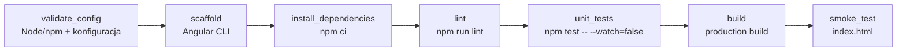

# Techniczny opis DAG-a `sdlc_angular`

## Zakres i status analizy

Dokument opisuje definicję [`dags/sdlc_angular.yaml`](../dags/sdlc_angular.yaml), konfigurację [`configs/sdlc-angular.yaml`](../configs/sdlc-angular.yaml), skrypty Angular oraz wspólny bootstrap używany przez taski.

Analiza została wykonana na branchu `feature/windows-cmd-runtime-sdlc-2026-09-26`. Jest to **analiza statyczna kodu**, a nie raport uruchomienia na Windowsie. Test runtime'u Windows i pełny run DAG-a zostaną wykonane przez agenta Windows na commicie wskazanym po publikacji.

## 1. Cel przepływu

`sdlc_angular` jest deterministycznym przepływem jakości i produkcyjnego buildu aplikacji Angular. Jego zadaniem jest:

1. sprawdzić konfigurację projektu oraz dostępność Node.js i npm;
2. wygenerować szkielet aplikacji Angular przez Angular CLI;
3. zainstalować zależności z `package-lock.json` przez `npm ci`;
4. uruchomić lint;
5. uruchomić testy jednostkowe w trybie bez obserwowania plików;
6. zbudować aplikację w konfiguracji production;
7. skopiować wynik buildu do artefaktów i wykonać smoke test `index.html`.

DAG nie używa AI, Javy, Mavena ani `internal/scripts/`. Wykorzystuje skrypty z rodziny `scripts/sdlc/angular/`, wspólny bootstrap `scripts/sdlc/common/bootstrap.sh` oraz prosty odczyt wartości YAML przez `scripts/sdlc/common/config-value.sh`.

## 2. Definicja DAG-a i parametry wykonania

Plik źródłowy:

```text
dags/sdlc_angular.yaml
```

| Pole | Wartość | Znaczenie |
|---|---:|---|
| `dag_id` | `sdlc_angular` | Identyfikator DAG-a w Cronova |
| `schedule` | pusty | Tylko uruchomienie ręczne, bez harmonogramu |
| `start_date` | `2026-09-01` | Początkowa data logiczna |
| `catchup` | `false` | Brak nadrabiania okresów |
| `max_active_runs` | `1` | Najwyżej jeden aktywny run tego DAG-a |
| `default_retries` | `1` | Jeden domyślny retry taska, jeśli task nie ustawia własnej wartości |

Wszystkie taski mają `type: shell`. Cronova uruchamia je przez skonfigurowany runtime shell; na Windowsie oczekiwany jest Git Bash wskazany przez `CRONOVA_BASH_PATH`.

## 3. Graf zależności



Kolejność wykonania:

```text
validate_config
  -> scaffold
  -> install_dependencies
  -> lint
  -> unit_tests
  -> build
  -> smoke_test
```

Timeouty tasków:

| Task | Timeout | Rola |
|---|---:|---|
| `validate_config` | 120 s | Walidacja konfiguracji i Node/npm |
| `scaffold` | 600 s | Utworzenie aplikacji przez Angular CLI |
| `install_dependencies` | 900 s | `npm ci` |
| `lint` | 600 s | Lint aplikacji |
| `unit_tests` | 900 s | Testy jednostkowe |
| `build` | 900 s | Production build i publikacja artefaktu |
| `smoke_test` | 300 s | Kontrola obecności i podstawowej poprawności HTML |

Jeżeli task zakończy się błędem, zależne taski nie powinny wystartować. Ponieważ `default_retries` wynosi `1`, Cronova może ponowić task, jeśli task nie nadpisuje tej wartości.

## 4. Konfiguracja projektu

Plik:

```text
configs/sdlc-angular.yaml
```

Najważniejsze sekcje:

```yaml
project:
  id: item-portal
  kind: angular
  directory: frontend
  artifact_directory: dist/item-portal/browser

runtime:
  node_version: "22"
  angular_cli_version: "20"
  package_manager: npm
  install_command: npm ci

angular:
  app_name: item-portal
  build_configuration: production
  output_path: dist/item-portal/browser
```

Konfiguracja wskazuje wersje wymagane przez projekt, ale same skrypty nie instalują Node.js ani nie wymuszają wersji przez manager typu nvm. Agent Windows musi potwierdzić, że rzeczywiście używany Node/npm jest zgodny z oczekiwaniami środowiska.

Sekcja `quality` deklaruje:

```yaml
lint: true
unit_tests: true
production_build: true
```

Sekcja `server` opisuje host/port aplikacji, ale ten DAG nie uruchamia serwera HTTP. `smoke_test` sprawdza plik artefaktu, nie wykonuje żądania do aplikacji pod portem `4300`.

## 5. Przepływ krok po kroku

### 5.1. `validate_config` — walidacja konfiguracji i runtime'u

Wywołanie:

```bash
bash scripts/sdlc/angular/validate.sh \
  --config configs/sdlc-angular.yaml \
  --workspace .workspaces/angular \
  --artifacts artifacts/angular
```

Używane skrypty:

```text
scripts/sdlc/angular/validate.sh
scripts/sdlc/common/bootstrap.sh
scripts/sdlc/common/config-value.sh
internal/scripts/common_toolchain.sh
```

Działanie:

1. ładuje wspólny bootstrap;
2. parsuje `--config`, `--workspace` i `--artifacts`;
3. normalizuje ścieżki względem repozytorium, w tym ścieżki Windows przez `cygpath`;
4. tworzy `artifacts/angular/logs`, `reports` i `metadata`;
5. zapisuje runtime do `artifacts/angular/metadata/runtime.txt`;
6. wymaga dostępności `node` i `npm`;
7. odrzuca konfigurację zawierającą nieprzenośne ścieżki Unix/prywatne, takie jak `/home/`, `/tmp/`, `/var/`, `systemd`, `launchd` lub `/c/Users/`;
8. sprawdza sekcję `project:` i marker `kind: angular`;
9. zapisuje wersje Node i npm do:

```text
artifacts/angular/metadata/node-version.txt
artifacts/angular/metadata/npm-version.txt
```

Nie jest to pełny parser ani schema validator YAML. `config-value.sh` obsługuje tylko proste wartości skalarne w dwupoziomowych sekcjach. Główna walidacja struktury DAG-a należy do Cronova, a skrypt sprawdza tylko wymagane markery i runtime.

### 5.2. `scaffold` — utworzenie aplikacji Angular

Wywołanie:

```bash
bash scripts/sdlc/angular/scaffold.sh \
  --config configs/sdlc-angular.yaml \
  --workspace .workspaces/angular \
  --artifacts artifacts/angular
```

Używany skrypt:

```text
scripts/sdlc/angular/scaffold.sh
```

Działanie:

1. ładuje bootstrap i parser wartości YAML;
2. wymaga `npx`;
3. jeśli `.workspaces/angular/package.json` już istnieje, kończy się sukcesem bez ponownego scaffoldingu;
4. odczytuje `angular.app_name` oraz `runtime.angular_cli_version`;
5. tworzy workspace;
6. wykonuje:

```text
npx --yes "@angular/cli@20" new item-portal \
  --directory .workspaces/angular \
  --routing \
  --style=scss \
  --standalone \
  --skip-git \
  --package-manager=npm \
  --skip-install
```

`--skip-install` oznacza, że instalacja zależności jest celowo odłożona do następnego taska. `--skip-git` zapobiega utworzeniu zagnieżdżonego repozytorium Git w workspace.

Skrypt korzysta z sieci npm, jeśli Angular CLI nie jest dostępne w cache npx. Nie ma opcji czyszczenia workspace’u. Przy istniejącym `package.json` task traktuje projekt jako już utworzony i go nie odtwarza.

### 5.3. `install_dependencies` — instalacja npm

Wywołanie:

```bash
bash scripts/sdlc/angular/install.sh \
  --config configs/sdlc-angular.yaml \
  --workspace .workspaces/angular \
  --artifacts artifacts/angular
```

Używany skrypt:

```text
scripts/sdlc/angular/install.sh
```

Działanie:

1. ładuje bootstrap;
2. wymaga `npm`;
3. wymaga `package.json`;
4. wymaga `package-lock.json`;
5. przechodzi do workspace’u;
6. wykonuje:

```text
npm ci
```

Log zapisuje do:

```text
artifacts/angular/logs/angular-npm-ci.log
```

`npm ci` korzysta z lockfile i jest przeznaczone do powtarzalnej instalacji. Brak `package-lock.json` jest błędem i task kończy się kodem `30`.

### 5.4. `lint` — kontrola jakości kodu

Wywołanie:

```bash
bash scripts/sdlc/angular/lint.sh \
  --config configs/sdlc-angular.yaml \
  --workspace .workspaces/angular \
  --artifacts artifacts/angular
```

Używany skrypt:

```text
scripts/sdlc/angular/lint.sh
```

Skrypt wymaga npm, przechodzi do workspace’u i uruchamia komendę z `package.json`:

```text
npm run lint
```

Log zapisuje do:

```text
artifacts/angular/logs/angular-lint.log
```

DAG nie definiuje własnych reguł lintowania. Konkretne narzędzie i konfiguracja pochodzą z wygenerowanego projektu Angular.

### 5.5. `unit_tests` — testy jednostkowe

Wywołanie:

```bash
bash scripts/sdlc/angular/test.sh \
  --config configs/sdlc-angular.yaml \
  --workspace .workspaces/angular \
  --artifacts artifacts/angular
```

Używany skrypt:

```text
scripts/sdlc/angular/test.sh
```

Skrypt wykonuje:

```text
npm test -- --watch=false
```

Log zapisuje do:

```text
artifacts/angular/logs/angular-unit-tests.log
```

Komentarz w skrypcie wyraźnie pozostawia wybór runnera projektowi: może to być Vitest, Karma lub inny runner skonfigurowany w `package.json`. Flaga `--watch=false` ma zapewnić zakończenie procesu bez trybu obserwowania.

### 5.6. `build` — production build i publikacja artefaktów

Wywołanie:

```bash
bash scripts/sdlc/angular/build.sh \
  --config configs/sdlc-angular.yaml \
  --workspace .workspaces/angular \
  --artifacts artifacts/angular
```

Używany skrypt:

```text
scripts/sdlc/angular/build.sh
```

Działanie:

1. ładuje bootstrap i parser konfiguracji;
2. wymaga npm;
3. wykonuje:

```text
npm run build -- --configuration production
```

4. zapisuje log do `artifacts/angular/logs/angular-build.log`;
5. odczytuje `angular.output_path`;
6. oczekuje katalogu:

```text
.workspaces/angular/dist/item-portal/browser
```

7. sprawdza, czy w katalogu znajduje się `index.html`;
8. kopiuje katalog buildu do:

```text
artifacts/angular/dist/browser
```

9. zapisuje SHA-256 pliku `index.html` do:

```text
artifacts/angular/metadata/frontend-index.sha256
```

10. tworzy manifest:

```text
artifacts/angular/frontend-manifest.json
```

Manifest ma między innymi pola:

```json
{
  "component": "angular",
  "project": "...",
  "artifact_directory": ".../artifacts/angular/dist/browser",
  "openapi": "contracts/openapi.yaml",
  "result": "success"
}
```

Jeżeli skonfigurowany output path nie istnieje, skrypt ma fallback do `dist/item-portal/browser`, a następnie do katalogu `dist`. Jeżeli nie znajdzie `index.html`, kończy się kodem `60`.

### 5.7. `smoke_test` — kontrola artefaktu

Wywołanie:

```bash
bash scripts/sdlc/angular/smoke.sh \
  --config configs/sdlc-angular.yaml \
  --workspace .workspaces/angular \
  --artifacts artifacts/angular
```

Używany skrypt:

```text
scripts/sdlc/angular/smoke.sh
```

Skrypt sprawdza:

1. istnienie `artifacts/angular/dist/browser/index.html`;
2. obecność tekstu dopasowanego przez `grep -qi '<html'`;
3. kod zakończenia `0`.

Nie uruchamia serwera Angular, nie wykonuje requestu HTTP i nie sprawdza endpointów API. Jest to smoke test struktury opublikowanego artefaktu, nie test przeglądarkowy ani E2E.

## 6. Wspólne elementy infrastruktury

### `scripts/sdlc/common/bootstrap.sh`

Bootstrap stanowi wspólną warstwę dla wszystkich skryptów Angular. Odpowiada za:

- wyznaczenie `REPO_ROOT` na podstawie lokalizacji skryptu;
- obsługę wspólnych argumentów `--config`, `--workspace`, `--artifacts`;
- normalizację ścieżek Unix/Windows przez `cygpath`;
- utworzenie katalogów artefaktów;
- sprawdzenie istnienia konfiguracji;
- załadowanie `internal/scripts/common_toolchain.sh`;
- przygotowanie runtime path dla Python/Node/npm;
- funkcję `require_command`;
- zapis diagnostyki runtime i toolchainu.

### `scripts/sdlc/common/config-value.sh`

`config_value` odczytuje prostą wartość skalarną z układu:

```yaml
section:
  key: value
```

Nie jest pełnym parserem YAML. W tym DAG-u używany jest do odczytu:

- `angular.app_name`;
- `runtime.angular_cli_version`;
- `angular.output_path`.

### `internal/scripts/common_toolchain.sh`

W DAG-u Angular helper jest używany pośrednio przez bootstrap. Jego główne funkcje dotyczą runtime’u Node/npm:

- `setup_windows_path` przywraca Windows `PATH` z `CRONOVA_WINDOWS_PATH`;
- `setup_runtime_tools` dodaje katalogi wskazane przez `CRONOVA_PYTHON`, `CRONOVA_NODE` i `CRONOVA_NPM`;
- normalizacja ścieżek Windows odbywa się przez `cygpath`.

Skrypty Angular nie wywołują `setup_java_maven`, bo nie potrzebują Javy ani Mavena. `validate.sh` wymaga Node i npm bezpośrednio.

## 7. Workspace, artefakty i efekty uboczne

| Lokalizacja | Zawartość | Rola |
|---|---|---|
| `.workspaces/angular` | wygenerowana aplikacja Angular | workspace projektu, ignorowany przez Git |
| `.workspaces/angular/package.json` | skrypty npm i zależności | kontrakt dla install/lint/test/build |
| `.workspaces/angular/package-lock.json` | zablokowane wersje zależności | wejście dla `npm ci` |
| `.workspaces/angular/dist/item-portal/browser` | wynik production build | wejście do publikacji artefaktu |
| `artifacts/angular/logs/` | logi siedmiu operacji | diagnostyka |
| `artifacts/angular/metadata/runtime.txt` | ścieżki runtime’u | diagnostyka |
| `artifacts/angular/metadata/node-version.txt` | wersja Node | diagnostyka |
| `artifacts/angular/metadata/npm-version.txt` | wersja npm | diagnostyka |
| `artifacts/angular/metadata/frontend-index.sha256` | suma pliku HTML | integralność artefaktu |
| `artifacts/angular/dist/browser` | skopiowany frontend | artefakt publikowany dalej |
| `artifacts/angular/frontend-manifest.json` | manifest komponentu | opis wyniku buildu |

`scaffold.sh` nie czyści workspace’u. Jeśli `package.json` już istnieje, pomija generowanie i pozwala kolejnym taskom pracować na istniejącym projekcie. Z tego powodu test na zanieczyszczonym workspace może nie potwierdzić faktycznego działania Angular CLI.

## 8. Ocena reużywalności — model „klocków LEGO”

### Werdykt

**Tak, przepływ jest zbudowany z reużywalnych klocków, przede wszystkim w obrębie rodziny Angular/npm.** DAG składa osobne operacje: walidację, scaffolding, instalację, lint, test, build i smoke test. Parametry projektu oraz ścieżki są w YAML, a logika wykonawcza jest w skryptach.

Podział odpowiedzialności:

```text
DAG          = kolejność, zależności, timeouty i retry
config       = stack, nazwa aplikacji, output path i jakość
bootstrap    = wspólny kontrakt ścieżek/runtime'u
skrypt       = jedna operacja npm/Angular
workspace    = kod projektu i package-lock
artifacts    = logi, build, manifest i checksum
```

### Macierz klocków

| Klocek | Odpowiedzialność | Reużywalność | Granica |
|---|---|---|---|
| `validate.sh` | Walidacja konfiguracji i Node/npm | Średnia/wysoka dla projektów Angular | Sprawdza tylko proste markery YAML |
| `scaffold.sh` | Generowanie aplikacji Angular przez CLI | Średnia/wysoka dla Angular | Zakłada Angular CLI, npx i parametry `app_name`/wersję |
| `install.sh` | Powtarzalna instalacja zależności | Wysoka dla npm z lockfile | Wymaga `package-lock.json` |
| `lint.sh` | Uruchomienie projektu `npm run lint` | Wysoka dla projektów z kontraktem npm | Nie definiuje lint runnera |
| `test.sh` | Uruchomienie `npm test` bez watch | Wysoka dla projektów z kontraktem npm | Nie definiuje test runnera |
| `build.sh` | Production build, kopiowanie, checksum, manifest | Średnia/wysoka dla Angular | Zakłada `index.html` i strukturę `dist` |
| `smoke.sh` | Minimalna kontrola artefaktu HTML | Wysoka dla statycznych frontendów | Nie testuje HTTP, DOM ani API |
| `bootstrap.sh` | Wspólne ścieżki, artefakty i runtime | Wysoka w rodzinie SDLC | Parser konfiguracji jest prosty |
| `config-value.sh` | Odczyt prostych wartości YAML | Średnia | Nie jest parserem YAML |
| `configs/sdlc-angular.yaml` | Parametry projektu | Reużywalna jako kontrakt konfiguracyjny | Wymaga zgodnych nazw sekcji/kluczy |

### Kompozycja

Ten przepływ może być rekonfigurowany przez zmianę pliku DAG i YAML bez duplikowania implementacji:

```text
Angular app:
  validate -> scaffold -> npm ci -> lint -> test -> production build -> smoke
```

Wspólny bootstrap jest wykorzystywany także przez skrypty Spring Boot/integration. Same taski Angular nie korzystają jednak z `internal/scripts/` używanych przez przepływy Maven i Spring Boot. To są dwie rodziny skryptów z podobnym kontraktem wejściowym, ale innymi wymaganiami toolchainu.

### Ograniczenia i ryzyka

1. `scaffold.sh` przy istniejącym `package.json` pomija generowanie, więc nie jest destrukcyjnie powtarzalny i może testować stary workspace.
2. `validate.sh` sprawdza tylko markery `project:` i `kind: angular`, a nie pełny schemat konfiguracji.
3. `config-value.sh` obsługuje tylko prosty dwupoziomowy YAML.
4. Wersje Node `22` i Angular CLI `20` są opisane w konfiguracji, ale skrypt nie wymusza ich instalacji ani nie zatrzymuje się z powodu niezgodnej wersji.
5. `npm ci`, npx Angular CLI i build zależą od sieci npm, jeżeli cache jest pusty.
6. `test.sh` zakłada, że projektowa komenda `npm test` przyjmie `--watch=false`; zgodność zależy od generatora i test runnera.
7. `build.sh` zakłada obecność `index.html` i określony układ `dist`; fallback może ukryć rozbieżność konfiguracji.
8. `smoke.sh` sprawdza tylko prosty marker `<html`; nie jest testem uruchomionej aplikacji ani integracji z backendem.
9. `artifacts/angular` i `.workspaces/angular` są współdzielone przez kolejne runy, a `max_active_runs: 1` chroni tylko ten DAG.
10. W konfiguracji istnieje `api_client_mode: openapi-generated`, ale ten DAG nie generuje klienta OpenAPI i nie wykonuje walidacji `contracts/openapi.yaml`.

## 9. Wniosek końcowy

`sdlc_angular` spełnia założenie reużywalnych klocków:

- DAG pozostaje deklaratywnym grafem;
- każdy task wywołuje osobny skrypt o jasnej odpowiedzialności;
- wspólny bootstrap izoluje logikę ścieżek, artefaktów i runtime’u;
- konfiguracja projektu nie jest zaszyta w komendach poza parametrami DAG-a;
- ten sam schemat może obsłużyć kolejne aplikacje Angular zgodne z kontraktem npm.

Ocena nie oznacza pełnej niezależności od stosu. Klocki są uniwersalne głównie dla Angular/npm i wymagają zgodności projektu z konwencjami `package.json`, `package-lock.json`, `npm run lint`, `npm test` i `npm run build`.

Przed uznaniem przepływu za zweryfikowany agent Windows powinien potwierdzić:

- użycie wskazanego Git Bash, Node i npm;
- widoczność DAG-a i poprawną kolejność siedmiu tasków;
- działanie Angular CLI przez `npx`;
- powtarzalne `npm ci`;
- wynik lint i testów;
- production build z `index.html`;
- obecność checksum, manifestu i skopiowanego artefaktu;
- przejście smoke testu;
- brak zmian źródłowych, commitów i pushy po stronie agenta.
