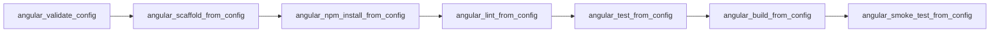

# Techniczny opis DAG-a `sdlc_angular`

## Zakres

Dokument opisuje definicję [`dags/sdlc_angular.yaml`](../dags/sdlc_angular.yaml), konfigurację [`configs/sdlc-angular.yaml`](../configs/sdlc-angular.yaml), skrypty PowerShell `internal/scripts/angular-*.ps1` oraz wspólny helper [`scripts/sdlc/common/AngularConfig.ps1`](../scripts/sdlc/common/AngularConfig.ps1).

Jest to **analiza statyczna kodu**, a nie raport uruchomienia.

## 1. Cel przepływu

`sdlc_angular` jest deterministycznym przepływem jakości i produkcyjnego buildu aplikacji Angular. Jego zadaniem jest:

1. sprawdzić konfigurację projektu oraz dostępność Node.js i npm;
2. wygenerować szkielet aplikacji Angular przez Angular CLI (opcjonalnie z kodem wygenerowanym z kontraktu OpenAPI);
3. zainstalować zależności z `package-lock.json` przez `npm ci`;
4. uruchomić lint;
5. uruchomić testy jednostkowe w trybie bez obserwowania plików;
6. zbudować aplikację w skonfigurowanej konfiguracji (domyślnie `production`);
7. skopiować wynik buildu do artefaktów i wykonać smoke test `index.html`.

DAG nie używa AI, Javy ani Mavena.

## 2. Definicja DAG-a i parametry wykonania

| Pole | Wartość | Znaczenie |
|---|---:|---|
| `dag_id` | `sdlc_angular` | Identyfikator DAG-a w Cronova |
| `schedule` | brak | Tylko uruchomienie ręczne |
| `start_date` | `2026-09-01` | Początkowa data logiczna |
| `catchup` | `false` | Brak nadrabiania okresów |
| `max_active_runs` | `1` | Najwyżej jeden aktywny run |
| `default_retries` | `1` | Jeden domyślny retry taska |

Wszystkie taski mają `type: powershell` i nie ustawiają własnych timeoutów. Każdy task wywołuje osobny skrypt z tymi samymi parametrami:

```powershell
& .\internal\scripts\angular-<krok>.ps1 -Config configs\sdlc-angular.yaml -Workspace .workspaces\angular -Artifacts artifacts\angular
```

`-Workspace` i `-Artifacts` są opcjonalne; bez nich skrypty biorą `workspace.directory` i `artifacts.directory` z konfiguracji.

## 3. Graf zależności


```mermaid
flowchart LR
  A[angular_validate_config] --> B[angular_scaffold_from_config]
  B --> C[angular_npm_install_from_config]
  C --> D[angular_lint_from_config]
  D --> E[angular_test_from_config]
  E --> F[angular_build_from_config]
  F --> G[angular_smoke_test_from_config]
```

| Task | Skrypt |
|---|---|
| `angular_validate_config` | [`angular-validate-config.ps1`](../internal/scripts/angular-validate-config.ps1) |
| `angular_scaffold_from_config` | [`angular-scaffold-from-config.ps1`](../internal/scripts/angular-scaffold-from-config.ps1) |
| `angular_npm_install_from_config` | [`angular-npm-install-from-config.ps1`](../internal/scripts/angular-npm-install-from-config.ps1) |
| `angular_lint_from_config` | [`angular-lint-from-config.ps1`](../internal/scripts/angular-lint-from-config.ps1) |
| `angular_test_from_config` | [`angular-test-from-config.ps1`](../internal/scripts/angular-test-from-config.ps1) |
| `angular_build_from_config` | [`angular-build-from-config.ps1`](../internal/scripts/angular-build-from-config.ps1) |
| `angular_smoke_test_from_config` | [`angular-smoke-test-from-config.ps1`](../internal/scripts/angular-smoke-test-from-config.ps1) |

## 4. Konfiguracja projektu

Plik `configs/sdlc-angular.yaml` (fragment):

```yaml
workspace:
  directory: .workspaces/angular

project:
  id: item-portal
  kind: angular

runtime:
  node_version: "22"
  angular_cli_version: "20"

angular:
  app_name: item-portal
  build_configuration: production
  output_path: dist/item-portal/browser
  api_client_mode: openapi-generated

api:
  openapi_file: contracts/openapi.yaml
  base_url: http://127.0.0.1:18080/api

server:
  host: 127.0.0.1
  port: 4300

artifacts:
  directory: artifacts/angular
  manifest: frontend-manifest.json
```

Wartości odczytuje `Get-AngularSdlcConfig` z `AngularConfig.ps1` przy pomocy `Get-SdlcConfigValue` — prostego parsera wartości skalarnych w dwupoziomowych sekcjach (`section:` / `  key: value`). Nie jest to pełny parser YAML. Skrypty nie wymuszają wersji Node (`node_version`).

## 5. Przepływ krok po kroku

Wszystkie skrypty: ładują `internal/scripts/common/toolchain.ps1` i `AngularConfig.ps1`, rozwiązują ścieżki względem repozytorium, a natywne programy uruchamiają przez `Start-Process` z przekierowaniem stdout/stderr do pliku logu (UTF-8 bez BOM). Niezerowy kod wyjścia kończy się wyjątkiem.

### 5.1. `angular_validate_config`

1. tworzy workspace oraz `artifacts/angular/{logs,reports,metadata}`;
2. odrzuca konfigurację zawierającą `/c/Users/`, `/home/`, `/tmp/`, `/var/`, `systemd` lub `launchd`;
3. wymaga `project.id` i `project.kind: angular`;
4. zapisuje `metadata/runtime.txt` (workspace, artifacts, config);
5. wymaga `node` i `npm`, zapisuje `metadata/node-version.txt` i `metadata/npm-version.txt`.

### 5.2. `angular_scaffold_from_config`

Wymaga `npx`, `node`, `py` (Python launcher) i `npm`.

- Jeśli `package.json` już istnieje: nie generuje projektu ponownie, ale uruchamia generator kontraktu (patrz niżej), dodaje lint i Puppeteer, jeśli brakuje, oraz generuje brakujący `package-lock.json`.
- W przeciwnym razie wykonuje:

```powershell
npx --yes "@angular/cli@20" new item-portal --directory .workspaces\angular --routing --style=scss --standalone --skip-git --package-manager=npm --skip-install
```

Następnie:

1. **generator kontraktu** — gdy `angular.api_client_mode` to `contract` lub `openapi-generated`, uruchamia [`scripts/sdlc/integration/generate_contract_app.py`](../scripts/sdlc/integration/generate_contract_app.py) z `--contract`, `--backend-workspace .workspaces\springboot`, `--frontend-workspace`, `--backend-package com.example.items`, `--api-base-url` i `--frontend-origin http://<server.host>:<server.port>`. Wymaga istniejącego katalogu `.workspaces\springboot`;
2. jeśli `package.json` nie ma skryptu `lint` — `npx @angular/cli@<wersja> add @angular-eslint/schematics@<wersja> --skip-confirmation`;
3. jeśli brak zależności `puppeteer` — `npm install --save-dev --package-lock-only puppeteer@24`;
4. `npm install --package-lock-only --ignore-scripts`.

Gdy `runtime.angular_cli_version` jest puste, używane jest `latest`; gdy `app_name` jest puste — `item-portal`.

### 5.3. `angular_npm_install_from_config`

Wymaga `package.json` i `package-lock.json`, wykonuje `npm ci`, log: `artifacts/angular/logs/angular-npm-ci.log`.

### 5.4. `angular_lint_from_config`

Wykonuje `npm run lint`, log: `logs/angular-lint.log`.

### 5.5. `angular_test_from_config`

Jeśli `CHROME_BIN` nie jest ustawione, a w workspace dostępny jest `puppeteer`, ustawia `CHROME_BIN` na `require("puppeteer").executablePath()`. Następnie wykonuje `npm test -- --watch=false`, log: `logs/angular-unit-tests.log`.

### 5.6. `angular_build_from_config`

1. `npm run build -- --configuration <build_configuration>` (domyślnie `production`), log: `logs/angular-build.log`;
2. szuka katalogu wynikowego: `angular.output_path` → `dist\item-portal\browser` → pierwszy katalog z `index.html` pod `dist`;
3. brak `index.html` → błąd `Angular build did not produce index.html`;
4. kopiuje wynik do `artifacts/angular/dist/browser`;
5. zapisuje SHA-256 `index.html` do `metadata/frontend-index.sha256`;
6. zapisuje manifest (`artifacts.manifest`, domyślnie `frontend-manifest.json`) z polami `component`, `project`, `artifact_directory`, `openapi`, `result`.

### 5.7. `angular_smoke_test_from_config`

Sprawdza istnienie `artifacts/angular/dist/browser/index.html` i dopasowanie `(?i)<html`. Nie uruchamia serwera ani nie wykonuje żądań HTTP.

## 6. Wspólne elementy

- [`internal/scripts/common/toolchain.ps1`](../internal/scripts/common/toolchain.ps1) — `Get-RepoRoot`, `Invoke-Native`, `ConvertTo-NativeArgumentString`, rozwiązywanie narzędzi (`CRONOVA_PYTHON`, `CRONOVA_JAVA_HOME`, `CRONOVA_MAVEN_HOME`).
- [`scripts/sdlc/common/AngularConfig.ps1`](../scripts/sdlc/common/AngularConfig.ps1) — `Get-SdlcRepoRoot`, `Resolve-SdlcRepoPath`, `Get-SdlcConfigValue`, `Get-AngularSdlcConfig`.

Skrypty Angular same wyszukują `node`/`npm`/`npx`/`py` przez `Get-Command` (`*.cmd`/`*.exe` lub bez rozszerzenia) na `PATH`.

## 7. Workspace, artefakty i efekty uboczne

| Lokalizacja | Zawartość |
|---|---|
| `.workspaces/angular` | wygenerowana aplikacja Angular |
| `artifacts/angular/logs/` | `angular-npm-ci.log`, `angular-lint.log`, `angular-unit-tests.log`, `angular-build.log` |
| `artifacts/angular/metadata/` | `runtime.txt`, `node-version.txt`, `npm-version.txt`, `frontend-index.sha256` |
| `artifacts/angular/dist/browser` | skopiowany frontend |
| `artifacts/angular/frontend-manifest.json` | manifest komponentu |

Scaffold nie czyści workspace’u; przy istniejącym `package.json` nie odtwarza aplikacji.

## 8. Ocena reużywalności — model „klocków LEGO”

**Tak, przepływ jest zbudowany z reużywalnych klocków w obrębie Angular/npm.** Każdy task wywołuje osobny skrypt `.ps1` o jednym zadaniu, z tym samym kontraktem parametrów (`-Config`, `-Workspace`, `-Artifacts`).

| Klocek | Odpowiedzialność | Granica |
|---|---|---|
| `angular-validate-config.ps1` | Walidacja konfiguracji i Node/npm | Sprawdza tylko `project.id`, `kind` i zakazane ścieżki |
| `angular-scaffold-from-config.ps1` | Angular CLI + generator kontraktu + lint/Puppeteer | Ścieżka `.workspaces\springboot` i pakiet `com.example.items` są zaszyte w skrypcie |
| `angular-npm-install-from-config.ps1` | `npm ci` | Wymaga lockfile |
| `angular-lint-from-config.ps1` | `npm run lint` | Runner z projektu |
| `angular-test-from-config.ps1` | `npm test -- --watch=false` | Runner z projektu |
| `angular-build-from-config.ps1` | Build, kopia, checksum, manifest | Zakłada `index.html` w `dist` |
| `angular-smoke-test-from-config.ps1` | Kontrola artefaktu HTML | Nie testuje HTTP |

### Ograniczenia i ryzyka

1. Przy `api_client_mode: openapi-generated` scaffold wymaga istniejącego workspace’u Spring Boot (`.workspaces\springboot`); samodzielny run `sdlc_angular` na czystym repozytorium zakończy się błędem, jeśli backend nie został wcześniej wygenerowany.
2. `Get-SdlcConfigValue` obsługuje tylko prosty dwupoziomowy YAML.
3. Wersja Node z konfiguracji nie jest egzekwowana.
4. `npx`, `npm ci` i Angular CLI wymagają dostępu do rejestru npm przy pustym cache.
5. Fallback katalogu `dist` może ukryć błędną wartość `output_path`.
6. Smoke test sprawdza tylko marker `<html`.

## 9. Wniosek

`sdlc_angular` jest deklaratywnym grafem siedmiu tasków PowerShell, z których każdy wywołuje osobny, parametryzowany skrypt. Klocki są uniwersalne dla projektów Angular zgodnych z konwencjami `package.json`/`package-lock.json`, `npm run lint`, `npm test` i `npm run build`.
