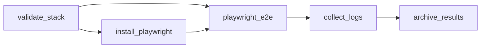

# Techniczny opis DAG-a `sdlc_fullstack`

## Zakres

Dokument opisuje [`dags/sdlc_fullstack.yaml`](../dags/sdlc_fullstack.yaml), konfigurację [`configs/sdlc-fullstack.yaml`](../configs/sdlc-fullstack.yaml), wywoływane skrypty `internal/scripts/fullstack-*.ps1` oraz reużywalność przepływu. Jest to analiza statyczna kodu. Pozostałe DAG-i opisuje [indeks SDLC](SDLC_DAGS.md).

## 1. Cel i granice przepływu

`sdlc_fullstack` jest **przepływem integracyjnym**. Nie buduje komponentów — zakłada, że artefakty Angular i Spring Boot zostały już wytworzone przez DAG-i [`sdlc_angular`](SDLC_ANGULAR_TECHNICAL.md) i [`sdlc_springboot_rest`](SDLC_SPRINGBOOT_REST_TECHNICAL.md). Jego zadaniem jest:

1. zwalidować konfigurację stosu i kontrakt OpenAPI;
2. zainstalować zależności i przeglądarkę Playwright;
3. w jednym tasku uruchomić backend i frontend, poczekać na gotowość, wykonać testy Playwright i zatrzymać usługi;
4. zebrać logi usług i zapisać manifest plików wynikowych.

## 2. Parametry DAG-a

| Pole | Wartość | Znaczenie |
|---|---|---|
| `dag_id` | `sdlc_fullstack` | Identyfikator w Cronova |
| `schedule` | brak | Brak harmonogramu czasowego |
| `start_date` | `2026-09-01` | Początkowa data logiczna |
| `catchup` | `false` | Brak nadrabiania |
| `max_active_runs` | `1` | Jeden aktywny run |
| `default_retries` | `1` | Domyślnie jeden retry taska |
| `trigger_after` | `sdlc_angular`, `sdlc_springboot_rest` | Uruchamiany po zakończeniu obu DAG-ów komponentowych |
| liczba tasków | `5` | Wszystkie `type: powershell` |

> **Ręczne uruchomienie całego łańcucha:** `trigger_after` wymaga sukcesu obu DAG-ów komponentowych dla tej samej daty logicznej. Dwa osobne ręczne uruchomienia mają różne daty, więc trzeba je powiązać tym samym `dependency_sync_key`:
>
> ```powershell
> $body = @{ params = @{ dependency_sync_key = 'release-42' } } | ConvertTo-Json
> foreach ($dag in 'sdlc_springboot_rest', 'sdlc_angular') {
>     Invoke-RestMethod "http://127.0.0.1:8090/api/dags/$dag/trigger" -Method Post -Body $body -ContentType application/json -WebSession $session
> }
> ```
>
> `sdlc_fullstack` startuje automatycznie, gdy oba zakończą się sukcesem. Sam `sdlc_fullstack` można też uruchomić bezpośrednio, jeśli artefakty obu komponentów już istnieją.

Wszystkie taski wywołują skrypty z parametrami `-Config configs\sdlc-fullstack.yaml -Artifacts artifacts\fullstack`. Taski nie ustawiają własnych timeoutów ani reguł wyzwalania.

## 3. Graf zależności



| Task | Skrypt | Rola |
|---|---|---|
| `validate_stack` | [`fullstack-validate-config.ps1`](../internal/scripts/fullstack-validate-config.ps1) | Sprawdza istnienie konfiguracji Angular, Spring Boot i OpenAPI; uruchamia `generate_contract_app.py --contract` (walidacja kontraktu) |
| `install_playwright` | [`fullstack-install-playwright.ps1`](../internal/scripts/fullstack-install-playwright.ps1) | `npm ci` i `npx playwright install <browser>` w `e2e/playwright` |
| `playwright_e2e` | [`fullstack-run-stack-e2e.ps1`](../internal/scripts/fullstack-run-stack-e2e.ps1) | Kompozyt: start backendu, start frontendu, oczekiwanie, Playwright, zatrzymanie usług |
| `collect_logs` | [`fullstack-collect-logs.ps1`](../internal/scripts/fullstack-collect-logs.ps1) | Kopiuje `runtime/{frontend,backend}.log` do `logs/` |
| `archive_results` | [`fullstack-archive-results.ps1`](../internal/scripts/fullstack-archive-results.ps1) | Zapisuje `manifest.json` z listą plików artefaktów |

## 4. Konfiguracja

`configs/sdlc-fullstack.yaml` deklaruje:

- `stack`: `angular_config`, `springboot_config`, `openapi_file` (`contracts/openapi.yaml`);
- `artifacts`: `directory: artifacts/fullstack`, `frontend_dist: artifacts/angular/dist/browser`, `backend_jar: artifacts/springboot/package/item-service.jar` (oraz ścieżki manifestów komponentów, których skrypty nie odczytują);
- `services`: backend `127.0.0.1:18080`, health `http://127.0.0.1:18080/actuator/health`, profil `e2e`, frontend `127.0.0.1:4300`, `startup_timeout_seconds: 90`;
- `playwright`: `directory: e2e/playwright`, `browser`, `base_url`, `api_url`, `workers`, `retries`, `trace`, `screenshot`, `video`. `fullstack-run-playwright-e2e.ps1` przekazuje je do `playwright.config.ts` jako `PW_BROWSER`, `PW_WORKERS`, `PW_RETRIES`, `PW_TRACE`, `PW_SCREENSHOT`, `PW_VIDEO`; brakujący klucz = domyślna wartość z `playwright.config.ts`. Raport (`junit.xml`, `html/`) trafia do `artifacts/fullstack/playwright/` (`PW_REPORT_DIR`).

Wartości odczytuje `Get-FullstackSdlcConfig` z [`scripts/sdlc/common/FullstackConfig.ps1`](../scripts/sdlc/common/FullstackConfig.ps1) (prosty parser dwupoziomowy).

## 5. Szczegóły skryptów

### Walidacja (`fullstack-validate-config.ps1`)

Tworzy `artifacts/fullstack/{logs,reports,metadata}`, wymaga Pythona (`Get-ConfiguredCommand 'python'`, czyli `CRONOVA_PYTHON` lub `python` z `PATH`), sprawdza istnienie trzech plików ze `stack` i uruchamia walidator kontraktu Item API. Log: `logs/contract-validation.log`. Walidator sprawdza oczekiwane ścieżki, metody i schematy Item API; nie jest ogólnym walidatorem OpenAPI.

### Playwright (`fullstack-install-playwright.ps1`, `fullstack-run-playwright-e2e.ps1`)

Instalacja wymaga `package.json` i `package-lock.json` w `e2e/playwright`; log `logs/playwright-install.log`. Uruchomienie testów ustawia na czas procesu `FRONTEND_URL`, `PLAYWRIGHT_BASE_URL` (z `playwright.base_url`) i `API_URL` (z `playwright.api_url`), wykonuje `npx playwright test` i zapisuje `logs/playwright.log`. Testy: `e2e/playwright/health.spec.ts` i `items.spec.ts`.

### Cykl życia usług (`fullstack-run-stack-e2e.ps1`)

```powershell
try {
    & .\internal\scripts\fullstack-start-backend.ps1 -Config $Config -Artifacts $Artifacts
    & .\internal\scripts\fullstack-start-frontend.ps1 -Config $Config -Artifacts $Artifacts
    & .\internal\scripts\fullstack-wait-services.ps1 -Config $Config -Artifacts $Artifacts
    & .\internal\scripts\fullstack-run-playwright-e2e.ps1 -Config $Config -Artifacts $Artifacts
} finally {
    & .\internal\scripts\fullstack-stop-services.ps1 -Config $Config -Artifacts $Artifacts
}
```

- [`fullstack-start-backend.ps1`](../internal/scripts/fullstack-start-backend.ps1) — wymaga `backend_jar`, uruchamia `java -jar <jar> --server.address --server.port [--spring.profiles.active]` przez `Start-Process`, log `runtime/backend.log` (+ `.err`), PID w `runtime/backend.pid`.
- [`fullstack-start-frontend.ps1`](../internal/scripts/fullstack-start-frontend.ps1) — wymaga katalogu `frontend_dist`, uruchamia `npx --yes http-server <dist> -a <host> -p <port>`, log `runtime/frontend.log`, PID w `runtime/frontend.pid`.
- [`fullstack-wait-services.ps1`](../internal/scripts/fullstack-wait-services.ps1) — `Invoke-WebRequest` co 2 s na health URL backendu, potem na URL frontendu; po `startup_timeout_seconds` (domyślnie 90) zgłasza `Timeout waiting for <url>`.
- [`fullstack-stop-services.ps1`](../internal/scripts/fullstack-stop-services.ps1) — odczytuje pliki PID, `Stop-Process -Id <pid> -Force`, usuwa pliki PID.

Usługi muszą działać w jednym tasku, ponieważ Cronova przypisuje proces taska do Windows Job Object z `JOB_OBJECT_LIMIT_KILL_ON_JOB_CLOSE`; po zakończeniu taska procesy potomne są kończone. Blok `finally` zatrzymuje usługi zarówno po sukcesie, jak i po błędzie; przy twardym timeout procesy kończy zamknięcie Job Object.

### Logi i manifest

`fullstack-collect-logs.ps1` kopiuje istniejące logi runtime do `logs/` (brak logu nie jest błędem). `fullstack-archive-results.ps1` zapisuje `manifest.json` z polami `config`, `artifacts` i posortowaną listą ścieżek względnych (pomija `manifest.json`); nie tworzy archiwum ZIP.

### Dispatcher `scripts/sdlc/Invoke-Sdlc.ps1`

Repozytorium zawiera też [`scripts/sdlc/Invoke-Sdlc.ps1`](../scripts/sdlc/Invoke-Sdlc.ps1) z krokami `-Step` (m.in. `validate-stack`, `scaffold-frontend`, `scaffold-backend`, `generate-contract`, `run-stack-e2e`, `archive`). Żaden z DAG-ów w `dags/` go nie wywołuje — przepływ korzysta z modułowych skryptów `internal/scripts/fullstack-*.ps1`.

## 6. Artefakty i efekty uboczne

| Ścieżka | Zawartość |
|---|---|
| `artifacts/angular/dist/browser` | wejście: frontend z `sdlc_angular` |
| `artifacts/springboot/package/item-service.jar` | wejście: JAR z `sdlc_springboot_rest` |
| `artifacts/fullstack/logs/contract-validation.log` | walidacja kontraktu |
| `artifacts/fullstack/logs/playwright-install.log`, `playwright.log` | instalacja i testy Playwright |
| `artifacts/fullstack/runtime/*.log`, `*.pid` | logi i PID-y usług |
| `artifacts/fullstack/logs/backend.log`, `frontend.log` | kopie logów usług |
| `artifacts/fullstack/manifest.json` | indeks plików wynikowych |

## 7. Ocena reużywalności — „klocki LEGO”

**Tak — DAG jest kompozycją małych, parametryzowanych skryptów PowerShell**, a `fullstack-run-stack-e2e.ps1` jest klockiem kompozycyjnym łączącym istniejące skrypty start/wait/run/stop, a nie kopią ich logiki.

| Klocek | Parametryzacja / ograniczenie |
|---|---|
| `fullstack-validate-config.ps1` | Ścieżki z configu; walidator obsługuje tylko Item API |
| `fullstack-install-playwright.ps1` | Katalog i przeglądarka z configu; wymaga lockfile |
| `fullstack-start-backend.ps1` | JAR, host, port, profil z configu |
| `fullstack-start-frontend.ps1` | Dist, host, port z configu; wymaga `npx http-server` |
| `fullstack-wait-services.ps1` | URL-e i timeout z configu |
| `fullstack-stop-services.ps1` | PID-y z `runtime/` |
| `fullstack-run-playwright-e2e.ps1` | URL-e z configu |
| `fullstack-collect-logs.ps1`, `fullstack-archive-results.ps1` | Katalog artefaktów z configu/parametru |

### Ograniczenia

1. DAG nie buduje komponentów; obecność plików w `artifacts/angular` i `artifacts/springboot` nie dowodzi, że pochodzą z najnowszego runu DAG-ów komponentowych.
2. Klucze `artifacts.*_manifest` są w konfiguracji, ale skrypty fullstack ich nie odczytują (zostają dla innych klocków).
3. `collect_logs` i `archive_results` mają `trigger_rule: all_done`: logi, raport Playwright i `manifest.json` powstają także po nieudanym E2E, a cały run i tak kończy się jako `failed`. `default_retries: 0` — nieudany E2E nie jest powtarzany przez scheduler (powtórki testów: `playwright.retries`).
4. Parser konfiguracji obsługuje tylko prosty podzbiór YAML.

## 8. Wniosek

`sdlc_fullstack` jest deklaratywną kompozycją pięciu tasków PowerShell, uruchamianą po DAG-ach komponentowych. Weryfikuje kontrakt, uruchamia pełny stos w jednym tasku i wykonuje testy Playwright (health oraz CRUD Item API przez UI).
