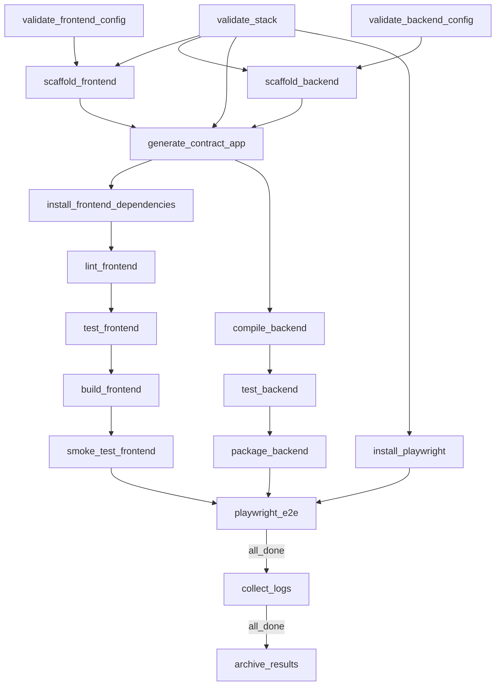

# Techniczny opis DAG-a `sdlc_fullstack`

## Zakres i status weryfikacji

Dokument opisuje [`dags/sdlc_fullstack.yaml`](../dags/sdlc_fullstack.yaml), konfiguracje Angular/Spring Boot, wywoływane skrypty oraz reużywalność przepływu.

Historyczny punkt odniesienia przed tą zmianą to commit `40b660a94d3788a0c10c1d029d5fa1a9152e8689` na branchu `feature/windows-cmd-runtime-sdlc-2026-09-26`: wtedy DAG miał 17 tasków, a run `sdlc_fullstack__manual_1790528551441446400` przeszedł na Windowsie. Aktualny DAG ma 18 tasków; jego nowa implementacja wymaga ponownego uruchomienia na Windowsie. Szczegóły pozostałych przepływów znajdują się w [indeksie opisów SDLC](SDLC_DAGS.md).

## 1. Cel i granice przepływu

`sdlc_fullstack` buduje dwa komponenty jednej aplikacji i sprawdza podstawową ścieżkę przeglądarkową:

1. waliduje konfigurację stosu, konfiguracje komponentów oraz operacje i schematy Item API w OpenAPI;
2. tworzy lub wykorzystuje istniejące workspace’y Angular i Spring Boot;
3. instaluje zależności frontendowe, uruchamia lint i testy jednostkowe Angular;
4. kompiluje, testuje jednostkowo i pakuje backend Spring Boot;
5. buduje produkcyjny frontend i sprawdza artefakt HTML;
6. instaluje Chromium/Playwright, uruchamia usługi, sprawdza ich dostępność i wykonuje E2E;
7. zatrzymuje usługi, zbiera logi oraz zapisuje manifest wyników.

DAG jest **orkiestratorem**, nie implementacją aplikacji. YAML określa kolejność, zależności, limity czasu i argumenty. Operacje wykonują skrypty z `scripts/sdlc/`, a wartości projektu i środowiska pochodzą z plików YAML.

Po scaffoldingu task `generate_contract_app` weryfikuje obsługiwany kontrakt Item API i generuje implementację Spring Boot oraz klienta/ekran Angular z operacjami list/create/read/update/delete. Playwright zachowuje osobny health check i dodatkowo wykonuje CRUD przez interfejs, sprawdzając odpowiedzi backendu oraz walidację 400/404. Walidator jest celowo ograniczony do operacji i schematów tego Item API; nie zastępuje ogólnego walidatora całej specyfikacji OpenAPI.

## 2. Parametry DAG-a

| Pole | Wartość | Znaczenie |
|---|---|---|
| `dag_id` | `sdlc_fullstack` | Identyfikator w Cronova |
| `schedule` | pusty | Run ręczny, bez harmonogramu |
| `start_date` | `2026-09-01` | Początkowa data logiczna |
| `catchup` | `false` | Brak nadrabiania pominiętych uruchomień |
| `max_active_runs` | `1` | Jeden aktywny run tego DAG-a |
| `default_retries` | `1` | Domyślnie jeden retry taska |
| liczba tasków | `18` | Wszystkie taski mają typ `shell` |

Na Windows Cronova uruchamia skrypty przez skonfigurowany Git Bash. Repozytorium uruchomieniowe przekazuje toolchain, między innymi przez `start.cmd`, `CRONOVA_BASH_PATH`, `CRONOVA_PYTHON`, `CRONOVA_NODE` i `CRONOVA_NPM`.

## 3. Graf zależności



Walidacje frontend/backend i instalacja Playwrighta mogą biec równolegle po swoich zależnościach. Scaffoldy Angular i Spring Boot są niezależne, a generator czeka na oba; dopiero potem komponenty przechodzą do instalacji/buildów/testów. E2E startuje, gdy istnieją gotowe artefakty obu komponentów i zainstalowany Playwright.

### Lista tasków

| Task | Skrypt wywoływany przez DAG | Rola i główny wynik |
|---|---|---|
| `validate_stack` | `scripts/sdlc/integration/validate.sh` | Weryfikuje plik konfiguracji Fullstack, wskazane pliki konfiguracyjne i OpenAPI, wymagane klucze oraz format URL-i usług. |
| `validate_frontend_config` | `scripts/sdlc/angular/validate.sh` | Wymaga `node` i `npm`, sprawdza markery `project`/`kind: angular` i zapisuje wersje Node/npm. |
| `validate_backend_config` | `scripts/sdlc/springboot/validate.sh` | Inicjalizuje Java/Maven, wymaga `java`, sprawdza markery Spring Boot i zapisuje diagnostykę runtime’u. |
| `scaffold_frontend` | `scripts/sdlc/angular/scaffold.sh` | Tworzy Angular CLI workspace, a następnie zapewnia konfigurację lint/test browser i lockfile; nie wykonuje właściwego `npm ci`. |
| `scaffold_backend` | `scripts/sdlc/springboot/scaffold.sh` | Pobiera ZIP z Spring Initializr na podstawie konfiguracji i rozpakowuje do workspace’u; wymaga `pom.xml`. |
| `generate_contract_app` | `scripts/sdlc/integration/generate-contract-app.sh` | Sprawdza operacje/schemat Item API i generuje kontroler, serwis oraz testy Spring Boot, serwis HTTP i UI Angular z kontraktu; konfiguruje CORS dla frontendu E2E. |
| `install_frontend_dependencies` | `scripts/sdlc/angular/install.sh` | Wykonuje `npm ci` na podstawie lockfile’a. |
| `lint_frontend` | `scripts/sdlc/angular/lint.sh` | Uruchamia projektowe `npm run lint`. |
| `test_frontend` | `scripts/sdlc/angular/test.sh` | Uruchamia `npm test -- --watch=false`. |
| `build_frontend` | `scripts/sdlc/angular/build.sh` | Wykonuje production build, kopiuje `index.html` i resztę dist do artefaktów, zapisuje SHA-256 i manifest. |
| `smoke_test_frontend` | `scripts/sdlc/angular/smoke.sh` | Sprawdza, czy `artifacts/angular/dist/browser/index.html` istnieje i zawiera znacznik `<html`; nie uruchamia serwera. |
| `compile_backend` | `scripts/sdlc/springboot/compile.sh` | Uruchamia `mvnw.cmd ... -DskipTests compile`. |
| `test_backend` | `scripts/sdlc/springboot/unit-test.sh` | Uruchamia `mvnw.cmd -B test`. |
| `package_backend` | `scripts/sdlc/springboot/package.sh` | Pakuje JAR Maven Wrapperem, kopiuje główny JAR, zapisuje sumę i manifest backendu. |
| `install_playwright` | `scripts/sdlc/playwright/install.sh` | Wymaga `package.json` i lockfile’a, wykonuje `npm ci` i `npx playwright install <browser>`. |
| `playwright_e2e` | `scripts/sdlc/integration/run-stack-e2e.sh` | W jednym tasku startuje backend/frontend, czeka na health/HTTP, uruchamia `scripts/sdlc/playwright/run.sh` i zatrzymuje usługi. |
| `collect_logs` | `scripts/sdlc/integration/collect-logs.sh` | Po zakończeniu E2E kopiuje dostępne logi usług do katalogu logów Fullstack. `all_done` pozwala wykonać task także po błędzie E2E. |
| `archive_results` | `scripts/sdlc/common/archive.sh` | Zapisuje `artifacts/fullstack/manifest.json` z uporządkowaną listą plików wynikowych; nie tworzy ZIP-a. Uruchamiany z `all_done`. |

## 4. Konfiguracje i przepływ danych

### `configs/sdlc-fullstack.yaml`

Konfiguracja integracyjna deklaruje:

- identyfikator stosu `item-platform` oraz ścieżki do konfiguracji Angular i Spring Boot;
- kontrakt `contracts/openapi.yaml`;
- zgodny z kontraktem backend Item API i klient Angular;
- położenie manifestów komponentów oraz artefaktów: frontend dist i JAR backendu;
- hosty, porty, endpoint health backendu, URL frontendu i profil Spring `e2e`;
- katalog testów Playwright, browser, URL-e bazowe, workers/retries oraz ustawienia trace/screenshot/video.

Wartości usług są konfigurowane: standardowo backend `127.0.0.1:18080`, frontend `127.0.0.1:4300`, health URL `/actuator/health`, timeout gotowości 90 sekund.

### Konfiguracje komponentów

- [`configs/sdlc-angular.yaml`](../configs/sdlc-angular.yaml): workspace `.workspaces/angular`, Angular CLI 20, aplikacja `item-portal`, output `dist/item-portal/browser`, produkcyjny build, API base URL i artefakty w `artifacts/angular`.
- [`configs/sdlc-springboot.yaml`](../configs/sdlc-springboot.yaml): workspace `.workspaces/springboot`, Java 25, Spring Boot 4.0.0, Maven Wrapper, pakiet `com.example.items`, profil `e2e`, artefakty w `artifacts/springboot`.

Konfiguracje komponentowe są źródłem ustawień własnych buildów. Konfiguracja Fullstack służy do walidacji całego stosu oraz połączenia gotowych komponentów w integracji.

### Przekazywanie danych

```text
OpenAPI contract + component configs -> generate_contract_app
  -> Angular HTTP service/UI + Spring Boot controller/service/tests
  -> Angular production dist + executable Spring JAR
  -> run-stack-e2e -> Playwright CRUD through the browser
```

Manifesty umożliwiają sprawdzenie, że wymagane artefakty istnieją przed startem usług. Komponenty zapisują logi i wyniki pod swoimi katalogami artefaktów, natomiast logi runtime usług i raporty przeglądarkowe należą do `artifacts/fullstack`.

## 5. Co robią skrypty integracyjne i Playwright

### Walidacja

`integration/validate.sh` korzysta z `bootstrap.sh` i `config-value.sh`. Wymaga Pythona, odczytuje wymagane wartości dwupoziomowego YAML, sprawdza istnienie wskazanych konfiguracji i uruchamia `generate_contract_app.py` w trybie walidacji. Walidator sprawdza oczekiwane ścieżki, metody, operationId, statusy, referencje do schematów i wymagane pola Item/ItemRequest. Następnie skrypt weryfikuje URL-e usług. To kontrola zgodności z implementowanym Item API, a nie pełna walidacja dowolnego OpenAPI 3.

Walidatory komponentowe sprawdzają podstawowe markery YAML i toolchain. Angular wymaga Node/npm. Spring Boot konfiguruje Java/Maven i zapisuje wersję Javy oraz diagnostykę runtime’u.

### Start i readiness usług

- `integration/start-backend.sh` wymaga skonfigurowanego JAR-a i manifestu backendu, uruchamia `java -jar` z hostem, portem i opcjonalnym profilem Spring, przekierowuje stdout/stderr do `runtime/backend.log` i zapisuje PID do `runtime/backend.pid`.
- `integration/start-frontend.sh` wymaga manifestu i `dist/index.html`; w katalogu dist uruchamia `npx --yes http-server` na skonfigurowanym hoście/porcie, zapisując log i PID.
- `integration/wait-services.sh` odpytuje `curl -fsS` najpierw o health URL backendu, potem o URL frontendu. Między próbami czeka 2 sekundy; po skonfigurowanym timeout kończy się kodem 50.

### Cykl życia w Windows Job Object

Cronova przypisuje proces taska do Windows Job Object skonfigurowanego z `JOB_OBJECT_LIMIT_KILL_ON_JOB_CLOSE`; po zakończeniu taska runner zamyka job, co kończy również procesy potomne. Dlatego nie wolno uruchamiać backendu i frontendu w osobnych taskach i oczekiwać, że przeżyją do następnego.

`integration/run-stack-e2e.sh` jest kompozytowym klockiem integracyjnym: przekazuje ten sam `--config`, `--workspace` i `--artifacts` do istniejących skryptów startu, readiness, Playwright i stopu. `trap ... EXIT` wykonuje `stop-services.sh` przed wyjściem z taska, zarówno po sukcesie, jak i po zwykłym błędzie skryptu. Dopiero potem Cronova zamyka Job Object. Przy twardym przerwaniu/timeout runner może zabić job bez wykonania trapu, ale Job Object kończy procesy usług; kolejne taski `all_done` nadal mogą zebrać pozostawione logi.

`integration/stop-services.sh` odczytuje pliki PID. Na Windows wywołuje `taskkill.exe /PID ... /T /F`; na systemie bez `taskkill.exe` używa `kill`. Następnie usuwa pliki PID.

### Playwright

`playwright/install.sh` wymaga `package.json` i `package-lock.json`, wykonuje `npm ci` oraz instaluje skonfigurowaną przeglądarkę.

`playwright/run.sh` wymaga zainstalowanych `node_modules`, ustawia z konfiguracji `FRONTEND_URL`, `API_URL`, browser, workers/retries oraz parametry raportów i uruchamia `npx playwright test`. Wyjście jest równolegle zapisywane do `artifacts/fullstack/logs/playwright.log`; konfiguracja Playwright generuje reporter list, JUnit i HTML w katalogu raportów.

`health.spec.ts` sprawdza dostępność strony. `items.spec.ts` korzysta z `API_URL`, wykonuje tworzenie, odczyt, aktualizację i usunięcie przez UI, sprawdza statusy odpowiedzi oraz waliduje odrzucenie pustej nazwy i odczyt usuniętego elementu. Test potwierdza więc połączenie Angular → Spring Boot, a nie tylko osobną dostępność procesów.

### Logi i manifest

`integration/collect-logs.sh` kopiuje istniejące `runtime/backend.log` i `runtime/frontend.log` do katalogu `logs`. Brak logu jest dopuszczalny, np. gdy start usług nie doszedł do skutku; skrypt raportuje liczbę skopiowanych logów.

`common/archive.sh` przechodzi rekurencyjnie po katalogu artefaktów, pomija pliki nazwane `manifest.json` i zapisuje pozostałe ścieżki względne w `artifacts/fullstack/manifest.json`. Nazwa „archive” oznacza tu katalogowanie, nie kompresję.

## 6. Artefakty i efekty uboczne

| Ścieżka | Zawartość / rola |
|---|---|
| `.workspaces/angular` | Wygenerowany lub ponownie użyty kod frontendowy |
| `.workspaces/springboot` | Wygenerowany lub ponownie użyty kod backendowy |
| `artifacts/angular/dist/browser` | Gotowy frontend, w tym `index.html` |
| `artifacts/angular/frontend-manifest.json` | Manifest komponentu frontend |
| `artifacts/angular/metadata/frontend-index.sha256` | Hash głównego HTML |
| `artifacts/springboot/package/item-service.jar` | Wykonywalny JAR backendu |
| `artifacts/springboot/package/item-service.jar.sha256` | Hash JAR-a |
| `artifacts/springboot/backend-manifest.json` | Manifest komponentu backend |
| `artifacts/fullstack/runtime/backend.log`, `frontend.log` | Logi uruchomionych usług |
| `artifacts/fullstack/logs/backend.log`, `frontend.log` | Kopie logów zebrane po E2E |
| `artifacts/fullstack/logs/playwright.log` | Log wykonania testów przeglądarkowych |
| `artifacts/fullstack/playwright/` | Raporty Playwright, m.in. JUnit/HTML |
| `artifacts/fullstack/manifest.json` | Indeks plików wynikowych |

Scaffold Angular pomija generowanie, jeśli istnieje `package.json`; scaffold Spring Boot pomija generowanie, jeśli istnieje `pom.xml`. DAG nie czyści automatycznie tych workspace’ów. Build Angular nadpisuje `artifacts/angular/dist/browser`; artefakty Spring Boot są kopiowane pod skonfigurowaną nazwę. Przed kolejnym runem trzeba zatem rozróżniać świeże wyniki od pozostałości wcześniejszego runu.

## 7. Czy to są reużywalne „klocki LEGO”?

### Werdykt

**Tak — DAG jest złożony z reużywalnych, konfigurowalnych skryptów, a nie z logiki hardkodowanej w YAML.** Klocki są jednak uniwersalne w granicach technologii albo kontraktu, nie dla dowolnego języka/stosu.

```text
DAG          = kolejność, zależności, timeouty, trigger rules
config       = projekt, ścieżki, hosty/porty, endpointy i parametry testu
bootstrap    = wspólne argumenty, Windows paths, workspace/artifacts i runtime
skrypt       = pojedyncza operacja Angular/Maven/integracji
manifest     = kontrakt artefaktów pomiędzy komponentami
```

| Klocek | Zakres reużywalności | Parametryzacja / ograniczenie |
|---|---|---|
| `common/bootstrap.sh` | Wysoka, wspólny interfejs SDLC | Konfiguruje ścieżki/runtime; nie jest parserem YAML |
| `common/config-value.sh` | Wspólny odczyt prostych wartości YAML | Tylko skalar w dwupoziomowej sekcji |
| `angular/{validate,scaffold,install,lint,test,build,smoke}.sh` | Wysoka w obrębie projektów Angular | Korzystają z `package.json`, npm i Angular CLI; nazwa/output z configu |
| `springboot/{validate,scaffold,compile,unit-test,package}.sh` | Wysoka w obrębie projektów Spring Boot/Maven Wrapper | Scaffold używa Spring Initializr i zestawu `web,validation,actuator`; compile/test/package wymagają `mvnw.cmd` |
| `integration/validate.sh`, `generate_contract_app.py` | Walidacja implementowanego Item API i generator kodu dla obu komponentów | Obsługuje jawnie bieżące ścieżki, metody i schematy Item; nie jest generatorem dla dowolnego OpenAPI |
| `integration/start-backend.sh` | Reużywalny launcher JAR Spring Boot | Artefakt, manifest, host/port/profil pochodzą z configu |
| `integration/start-frontend.sh` | Reużywalny serwer statycznego dist | Dist, manifest, host/port pochodzą z configu; wymaga `npx http-server` |
| `integration/wait-services.sh` | Ogólny readiness checker dwóch URL-i HTTP | Endpointy i timeout pochodzą z configu; wymaga `curl` |
| `integration/stop-services.sh` | Wspólny cleanup PID-ów | Windows używa `taskkill`; Unix fallback `kill` |
| `integration/run-stack-e2e.sh` | Kompozytor fullstack lifecycle w pojedynczym tasku | Łączy reużywalne klocki; uzasadniony ograniczeniem Job Object Windows |
| `playwright/{install,run}.sh` | Reużywalne dla projektów Playwright z lockfile | Directory/browser/URL/retry/report ustawiane w configu |
| `common/archive.sh`, `integration/collect-logs.sh` | Ogólne zbieranie wyników | Ścieżka artefaktów pochodzi z bootstrap/configu |

DAG nie powiela kodu Angulara, Springa ani Playwrighta w definicji YAML. Nazwy katalogów i właściwości domenowe są skoncentrowane w konfiguracjach. `run-stack-e2e.sh` jest nowym **klockiem kompozycyjnym**, a nie kopią implementacji usług: korzysta z istniejących skryptów start/wait/run/stop.

### Ograniczenia i miejsca wymagające ostrożności

1. `config-value.sh` obsługuje tylko prosty podzbiór YAML; walidatory stosu nie zastępują formalnej walidacji wszystkich konfiguracji.
2. Generator celowo obsługuje aktualny Item API i odrzuca niezgodny zestaw ścieżek/metod/schematów; rozszerzenie kontraktu wymaga równoczesnej zmiany generatora i testu E2E.
3. Test API E2E wymaga działającego backendu oraz prawidłowego `playwright.api_url`; bez uruchomienia DAG-a na docelowym Windowsie pozostaje do potwierdzenia zgodność środowiskowa (toolchain, profile i procesy).
4. Konfiguracja Angular deklaruje Node 22, ale skrypty walidują tylko obecność Node/npm, nie egzekwują dokładnego numeru wersji. Raport Windows z udanego testu wskazał Node 24.20.0.
5. Spring Boot scaffold jest zależny od zewnętrznego Spring Initializr i internetu; zestaw zależności generatora jest w skrypcie stały.
6. Angular scaffolding może uzupełniać lint/test dependencies i lockfile. W razie istniejącego `package.json` nie odtwarza aplikacji, ale może zaktualizować konfigurację tych narzędzi.
7. Ponieważ artefakty są trwałe pomiędzy runami, sama obecność pliku nie dowodzi, że wytworzył go najnowszy run. Należy korzystać z logów i czasu/manifestów wyników.

## 8. Wniosek

Fullstack DAG pozostaje deklaratywną kompozycją, a task `generate_contract_app` łączy kontrakt z rzeczywistą implementacją obu komponentów. Testy jednostkowe i Playwright obejmują CRUD, natomiast run na natywnym Windowsie nadal potwierdzi toolchain i semantykę Windows Job Object. Pozostałe DAG-i są zebrane w [indeksie SDLC](SDLC_DAGS.md).
