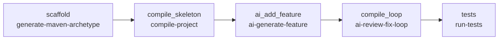

# Techniczny opis DAG-a `sdlc_maven_luhn`

## Zakres i status analizy

Dokument opisuje definicję [`dags/sdlc_maven_luhn.yaml`](../dags/sdlc_maven_luhn.yaml), prompt funkcji Luhn, skrypty wykonywane przez taski oraz ocenę reużywalności przepływu.

Analiza została wykonana na branchu `feature/windows-cmd-runtime-sdlc-2026-09-26`. Jest to **analiza statyczna kodu**, a nie raport wykonania na Windowsie. Test runtime'u Windows i pełny run DAG-a zostaną wykonane osobno przez agenta Windows na wskazanym commicie.

## 1. Cel przepływu

`sdlc_maven_luhn` jest kompozycyjnym przepływem Maven + AI dla małej funkcji biznesowej. Jego zadaniem jest:

1. wygenerować czysty projekt Java/Maven z archetypu `maven-archetype-quickstart`;
2. potwierdzić, że bazowy projekt kompiluje się na skonfigurowanym Java/Maven toolchainie;
3. przekazać prompt `prompts/luhn.txt` do providera AI i wygenerować implementację algorytmu Luhn oraz testy jednostkowe;
4. uruchomić pętlę kompilacji i warunkowej naprawy błędów przez AI;
5. uruchomić testy Maven.

DAG nie implementuje algorytmu Luhn bezpośrednio. Algorytm i testy mają zostać wygenerowane przez AI zgodnie z wersjonowanym promptem. YAML opisuje kolejność, zależności, timeouty i parametry wywołania reużywalnych skryptów.

## 2. Definicja i parametry wykonania

Plik źródłowy:

```text
dags/sdlc_maven_luhn.yaml
```

| Pole | Wartość | Znaczenie |
|---|---:|---|
| `dag_id` | `sdlc_maven_luhn` | Identyfikator DAG-a w Cronova |
| `schedule` | `0 2 * * *` | Codziennie o 02:00 UTC; brak jawnego `timezone` oznacza UTC |
| `start_date` | `2026-09-01` | Początkowa data harmonogramu |
| `catchup` | `false` | Brak nadrabiania pominiętych okresów |
| `max_active_runs` | `1` | Najwyżej jeden aktywny run tego DAG-a |
| `default_retries` | `0` | Brak automatycznego ponawiania tasków |

Każdy task ma `type: shell`. Cronova uruchamia komendy jako procesy systemowe, a na Windowsie wykonuje je przez skonfigurowany Git Bash. Komendy używają ścieżek względnych wobec katalogu repozytorium.

## 3. Graf zależności



Kolejność wykonania:

```text
scaffold
  -> compile_skeleton
  -> ai_add_feature
  -> compile_loop
  -> tests
```

Task downstream startuje dopiero po sukcesie swojego poprzednika. Timeouty:

| Task | Timeout | Rola |
|---|---:|---|
| `scaffold` | 300 s | Wygenerowanie projektu z archetypu Maven |
| `compile_skeleton` | 600 s | Kompilacja czystego projektu |
| `ai_add_feature` | 300 s | Jedno żądanie do AI i zapis funkcji |
| `compile_loop` | 900 s | Kompilacja i warunkowe poprawki AI |
| `tests` | 300 s | Uruchomienie testów Maven |

Timeouty są niezależnymi limitami tasków, a nie gwarantowanym łącznym czasem wykonania. Przy pierwszym błędzie taska kolejne zależne taski nie powinny wystartować.

## 4. Przepływ krok po kroku

### 4.1. `scaffold` — wygenerowanie projektu Maven

Wywołanie z DAG-a:

```bash
bash internal/scripts/generate-maven-archetype \
  -a maven-archetype-quickstart \
  -g com.example \
  -r luhn \
  -k com.example.luhn \
  -j 21 \
  -w workspaces/sdlc_maven_luhn \
  -p app \
  -C
```

Używany skrypt:

```text
internal/scripts/generate-maven-archetype
```

Parametry oznaczają:

| Parametr | Wartość | Znaczenie |
|---|---|---|
| `-a` | `maven-archetype-quickstart` | Archetyp generujący projekt Java/Maven |
| `-g` | `com.example` | `groupId` projektu |
| `-r` | `luhn` | `artifactId` projektu |
| `-k` | `com.example.luhn` | Pakiet Java |
| `-j` | `21` | Docelowa wersja kompilatora Java |
| `-w` | `workspaces/sdlc_maven_luhn` | Workspace |
| `-p` | `app` | Katalog projektu w workspace |
| `-C` | włączone | Usuń poprzedni katalog przed generowaniem |

Działanie skryptu:

1. ustawia repozytorium na podstawie lokalizacji skryptu;
2. ładuje `internal/scripts/common_toolchain.sh`;
3. ustawia katalog docelowy `workspaces/sdlc_maven_luhn/app`;
4. przy `-C` usuwa katalog docelowy przez `rm -rf`;
5. tworzy tymczasowy katalog `.archetype-out-<pid>` w workspace;
6. konfiguruje Java/Maven i wymaga `java` oraz `mvn`;
7. wykonuje `mvn -B archetype:generate` z `-DinteractiveMode=false`;
8. generuje projekt w tymczasowym katalogu przez `-DoutputDirectory`;
9. przenosi wygenerowany katalog `luhn` do `workspaces/sdlc_maven_luhn/app`;
10. usuwa katalog tymczasowy;
11. aktualizuje w `pom.xml` właściwości `maven.compiler.source`, `maven.compiler.target` lub `maven.compiler.release` do `21`; jeśli ich nie ma, dodaje blok `<properties>` przed `</project>`.

Archetyp dostarcza bazowo `App.java`, `AppTest.java` i `pom.xml`. Ten krok nie wywołuje AI i nie implementuje Luhna.

**Skutek destrukcyjny:** `-C` usuwa wcześniejszy `workspaces/sdlc_maven_luhn/app`. Przed testem trzeba sprawdzić, czy katalog nie zawiera danych wymagających zachowania.

### 4.2. `compile_skeleton` — kompilacja czystego projektu

Wywołanie:

```bash
bash internal/scripts/compile-project \
  -w workspaces/sdlc_maven_luhn \
  -p app
```

Używany skrypt:

```text
internal/scripts/compile-project
```

Działanie:

1. sprawdza `workspaces/sdlc_maven_luhn/app`;
2. tworzy wspólny cache Maven `.m2/repository` w repozytorium;
3. przechodzi do katalogu projektu;
4. ładuje `internal/scripts/common_toolchain.sh`;
5. wywołuje `setup_java_maven`;
6. zapisuje diagnostykę do `workspaces/sdlc_maven_luhn/app/toolchain-runtime.txt`;
7. wykonuje:

```text
mvn -B -Dmaven.repo.local=<repo> -DskipTests compile
```

Domyślnie testy są pomijane. Ten task jest bramką przed AI: potwierdza, że archetyp oraz podstawowy POM są poprawne.

`compile-project` używa systemowego `mvn`, nie `mvnw` ani `mvnw.cmd`. Maven musi być dostępny na `PATH` albo przez `CRONOVA_MAVEN_HOME`/`MAVEN_HOME`.

### 4.3. `ai_add_feature` — wygenerowanie funkcji Luhn

Wywołanie:

```bash
bash internal/scripts/ai-generate-feature \
  -f prompts/luhn.txt \
  -w workspaces/sdlc_maven_luhn \
  -p app \
  -k com.example.luhn \
  -r default \
  -y python
```

Używane pliki:

```text
internal/scripts/ai-generate-feature
internal/scripts/ai_generate_feature.py
prompts/luhn.txt
```

#### Prompt `prompts/luhn.txt`

Prompt wymaga od AI:

1. utworzenia klasy `Luhn` w pakiecie głównym;
2. dodania statycznej metody `isValid(String number)` zwracającej `boolean`;
3. implementacji algorytmu Luhn;
4. ignorowania spacji w wejściu;
5. odrzucenia znaków innych niż cyfry, długości `<= 1`, pustego wejścia i wejścia składającego się wyłącznie ze spacji;
6. użycia `Character.isDigit` do sprawdzania znaków;
7. utworzenia `LuhnTest` z testami poprawnych, niepoprawnych i brzegowych danych;
8. zachowania `App.java` i `AppTest.java` bez zmian;
9. unikania regexów `\\d` i `\\s`, aby nie wprowadzić problemów z escape’ami Java.

Prompt wymienia deterministyczne przypadki testowe, między innymi:

```text
""                         -> false
"1"                        -> false
"  "                       -> false
"1234a"                    -> false
"  4539 1488 0343 6467  "  -> true
```

#### Wrapper `ai-generate-feature`

Skrypt shellowy:

1. ładuje `common_toolchain.sh`;
2. rozwiązuje Pythona przez `find_python`;
3. rozwiązuje providera AI najpierw z `CRONOVA_AI_BASE_URL`/`CRONOVA_AI_MODEL`, a następnie z `data/cronova.db` z tabeli `ai_providers`;
4. wymaga promptu, adresu endpointu i modelu;
5. odczytuje istniejący `pom.xml`, `App.java` i `AppTest.java`;
6. buduje rozszerzony prompt zawierający wymagania z `prompts/luhn.txt` oraz stan projektu;
7. zapisuje prompt, request i response do `.tmp/`;
8. uruchamia `internal/scripts/ai_generate_feature.py`.

#### Implementacja Python `ai_generate_feature.py`

Skrypt Python:

1. buduje request chat-completions z `model`, wiadomościami system/user i `temperature: 0.2`;
2. wysyła HTTP POST do `AI_BASE_URL`;
3. dodaje nagłówek `Authorization: Bearer ...`, jeżeli token istnieje;
4. zapisuje surową odpowiedź;
5. odczytuje `choices[0].message.content`;
6. usuwa opcjonalne ogrodzenie Markdown ` ```json `;
7. parsuje zwrócony JSON;
8. jeśli istnieje klucz `pom_xml`, zapisuje go do `pom.xml`;
9. zapisuje każdy pozostały klucz jako ścieżkę względną względem katalogu projektu.

Oczekiwane rezultaty dla tego DAG-a to co najmniej:

```text
workspaces/sdlc_maven_luhn/app/src/main/java/com/example/luhn/Luhn.java
workspaces/sdlc_maven_luhn/app/src/test/java/com/example/luhn/LuhnTest.java
```

Skrypt nie kompiluje projektu po zapisaniu odpowiedzi. Następny task ma zweryfikować odpowiedź przez Maven.

### 4.4. `compile_loop` — kompilacja i warunkowa naprawa AI

Wywołanie z DAG-a:

```bash
bash internal/scripts/ai-review-fix-loop \
  -w workspaces/sdlc_maven_luhn \
  -p app \
  -k com.example.luhn \
  -m kimi-k2.7-code \
  -y python
```

Używane pliki:

```text
internal/scripts/ai-review-fix-loop
internal/scripts/ai/review_fix_v2.py
internal/scripts/common_toolchain.sh
```

Działanie wrappera:

1. rozwiązuje Pythona i providera AI;
2. ustawia Java/Maven przez `common_toolchain.sh`;
3. wykonuje maksymalnie trzy iteracje (`MAX_ITER=3`):
   - `mvn -B -Dmaven.repo.local=<repo> -DskipTests compile`;
   - przy sukcesie kończy task;
   - przy błędzie zapisuje `.tmp/compile.log`;
   - przekazuje AI ostatnie 80 linii logu, `pom.xml` oraz źródła Java;
   - zapisuje odpowiedź przez `review_fix_v2.py`;
4. po trzeciej nieudanej kompilacji kończy się błędem.

`-m kimi-k2.7-code` nadpisuje model użyty w tym tasku. Provider URL i token nadal pochodzą z konfiguracji runtime.

### Ważna granica obecnej reużywalności

`ai-review-fix-loop` jest współdzielonym klockiem technicznym, ale jego prompt w `internal/scripts/ai-review-fix-loop` zawiera tekst:

```text
Keep the Item CRUD functionality.
```

To założenie pochodzi z przepływu Spring Boot CRUD i nie pasuje do domeny Luhn. Jeżeli pierwsza kompilacja po AI przejdzie, ten prompt nie jest używany i nie wpływa na wynik. Jeżeli wystąpi błąd kompilacji, reviewer AI dostaje jednak kontekst CRUD `Item` zamiast jawnej instrukcji zachowania funkcji Luhn. Jest to ograniczenie i potencjalny problem jakościowy tego DAG-a, który powinien zostać rozwiązany później przez parametryzację promptu lub osobny neutralny kontrakt review/fix.

`review_fix_v2.py` oczekuje JSON-a z `pom_xml` oraz kluczami będącymi względnymi ścieżkami plików. Zapisuje odpowiedź do katalogu projektu. Nie ma obecnie dodatkowej walidacji, czy ścieżka zwrócona przez model pozostaje wewnątrz projektu.

### 4.5. `tests` — testy Maven

Wywołanie:

```bash
bash internal/scripts/run-tests \
  -w workspaces/sdlc_maven_luhn \
  -p app
```

Używany skrypt:

```text
internal/scripts/run-tests
```

Skrypt:

1. sprawdza istnienie projektu;
2. korzysta ze wspólnego `.m2/repository`;
3. ładuje `common_toolchain.sh`;
4. zapisuje `toolchain-runtime.txt`;
5. wykonuje:

```text
mvn -B -Dmaven.repo.local=<repo> test
```

Sukces oznacza, że testy wygenerowane lub pozostawione w projekcie przechodzą. Oczekiwane są co najmniej `AppTest` oraz `LuhnTest`. Agent Windows musi potwierdzić w logu liczbę uruchomionych testów i brak failures/errors.

## 5. Wspólne elementy i dane środowiskowe

### `common_toolchain.sh`

Wspólny helper `internal/scripts/common_toolchain.sh`:

- normalizuje ścieżki Windows przez `cygpath`;
- wykorzystuje `CRONOVA_WINDOWS_PATH` do przywrócenia systemowego Windows `PATH` w Git Bash;
- dodaje do `PATH` katalogi Pythona, Node i npm;
- ustawia `JAVA_HOME` i `MAVEN_HOME` z `CRONOVA_JAVA_HOME`/`CRONOVA_MAVEN_HOME` albo standardowych zmiennych;
- autodetekuje `python3` lub `python`;
- przy selektorze `-y python` preferuje konkretną ścieżkę `CRONOVA_PYTHON`;
- sprawdza `java` i `mvn`;
- zapisuje diagnostykę toolchainu.

W tym DAG-u helper jest używany przez `generate-maven-archetype`, `compile-project`, `ai-generate-feature`, `ai-review-fix-loop` i `run-tests`.

### Konfiguracja AI

DAG nie przechowuje tokena. Provider `default` jest rozwiązywany z:

1. `CRONOVA_AI_BASE_URL`, `CRONOVA_AI_MODEL` i opcjonalnie `CRONOVA_AI_TOKEN`;
2. `data/cronova.db`, tabela `ai_providers`, wpis domyślny albo provider wskazany przez `-r default`.

Task `ai_add_feature` używa modelu domyślnego providera. Task `compile_loop` jawnie wymusza model `kimi-k2.7-code`, ale nadal korzysta z URL-a i tokena skonfigurowanego dla providera.

### Workspace, cache i pliki tymczasowe

| Lokalizacja | Zawartość | Charakter |
|---|---|---|
| `workspaces/sdlc_maven_luhn/app` | Projekt Maven, kod Luhn i testy | wynik przepływu, katalog ignorowany przez Git |
| `workspaces/sdlc_maven_luhn/.archetype-out-<pid>` | tymczasowy output archetypu | powinien być usunięty po scaffoldingu |
| `.m2/repository` | cache artefaktów Maven | współdzielony, ignorowany przez Git |
| `.tmp/ai_feature_prompt.txt` | pełny prompt funkcji | tymczasowy |
| `.tmp/ai_feature_request.json` | request funkcji | tymczasowy, może zawierać dane promptu |
| `.tmp/ai_feature_response.json` | surowa odpowiedź funkcji | tymczasowy |
| `.tmp/compile.log` | ostatni log kompilacji pętli | tymczasowy |
| `.tmp/ai_review_prompt.txt` | prompt review/fix | tymczasowy |
| `.tmp/ai_review_request.json` | request review/fix | tymczasowy |
| `.tmp/ai_review.json` | odpowiedź review/fix | tymczasowy |
| `workspaces/sdlc_maven_luhn/app/toolchain-runtime.txt` | diagnostyka Java/Maven | wynik diagnostyczny |

`max_active_runs: 1` serializuje runy tego DAG-a, ale nie izoluje wspólnych `.tmp/`, `.m2/repository` ani zasobów od innych DAG-ów. Równoległe przepływy mogą wejść sobie w drogę, szczególnie przez stałe nazwy plików `.tmp/`.

## 6. Ocena reużywalności — model „klocków LEGO”

### Werdykt

**Tak, przepływ jest kompozycyjny i w większości złożony z reużywalnych klocków.** Nowy przepływ można zbudować przez zmianę YAML-a, promptu i parametrów workspace/package, bez dodawania logiki do runnera Cronova.

Podział odpowiedzialności jest zasadniczo poprawny:

```text
DAG      = kolejność, zależności, timeouty i parametry
prompt   = wymagania domenowe funkcji
skrypt   = jedna operacja SDLC
helper   = wspólna konfiguracja toolchainu
workspace = dane przekazywane pomiędzy krokami
```

### Macierz klocków

| Klocek | Odpowiedzialność | Reużywalność | Granica |
|---|---|---|---|
| `generate-maven-archetype` | Wygenerowanie projektu Java/Maven | Wysoka w obrębie archetypów Maven | Wymaga `mvn`, używa `sed` i założonego układu POM |
| `compile-project` | Maven compile z cache’em | Wysoka w obrębie Maven | Wymaga systemowego `mvn` |
| `ai-generate-feature` | Wygenerowanie dowolnej funkcji z pliku promptu | Wysoka koncepcyjnie | Kontrakt odpowiedzi AI to JSON ze ścieżkami plików |
| `ai_generate_feature.py` | Transport HTTP i zapis odpowiedzi funkcji | Średnia/wysoka | Zakłada chat-completions i `choices[0].message.content` |
| `ai-review-fix-loop` | Kompilacja, raport błędu i poprawki AI | Średnia | Prompt zawiera pozostałość założenia `Item CRUD` |
| `review_fix_v2.py` | Zapis `pom_xml` i plików Java z odpowiedzi AI | Średnia | Brak walidacji ścieżek z odpowiedzi modelu |
| `run-tests` | `mvn test` | Wysoka w obrębie Maven | Nie definiuje zakresu testów, tylko uruchamia istniejące |
| `common_toolchain.sh` | Java/Maven/Python/PATH, w tym Windows | Wysoka | Zależny od runtime'u hosta |
| `prompts/luhn.txt` | Deklaratywny kontrakt funkcji i testów Luhn | Wysoka jako prompt domenowy | Jest specyficzny dla algorytmu Luhn |

Ta sama biblioteka może składać różne przepływy:

```text
Maven + Luhn:
  generate-maven-archetype -> compile-project -> ai-generate-feature
  -> ai-review-fix-loop -> run-tests

Spring Boot z template'u:
  copy-template-to-workspace -> compile-project -> ai-generate-crud
  -> ai-review-fix-loop -> run-tests

Spring Boot ze Spring Initializr:
  fetch-springboot-project -> compile-project -> ai-generate-crud
  -> ai-review-fix-loop -> run-tests
```

### Ograniczenia i ryzyka

1. `ai-review-fix-loop` nie przyjmuje pliku promptu ani domenowego kontekstu review; jego prompt zawiera `Item CRUD`, co jest nieadekwatne dla Luhna.
2. Skrypt review/fix może zapisać ścieżki zwrócone przez model bez sprawdzenia, czy są bezpieczne i względne względem projektu.
3. `generate-maven-archetype` używa `sed` do modyfikacji POM-a, więc zakłada przewidywalny układ XML.
4. `generate-maven-archetype` i pozostałe klocki wymagają systemowego `mvn`, a nie Maven Wrappera.
5. `-C` destrukcyjnie usuwa workspace przed generowaniem.
6. Stałe nazwy `.tmp/` ograniczają bezpieczną równoległość między DAG-ami.
7. `run-tests` nie gwarantuje, że AI rzeczywiście utworzy `LuhnTest`; należy potwierdzić to w artefaktach i logu.
8. Model i provider są częściowo konfigurowane poza DAG-iem, więc wynik zależy od zewnętrznego endpointu AI.
9. `maven-archetype-quickstart` i zdalne repozytoria Maven wymagają sieci przy pierwszym użyciu cache’a.

Najważniejsza poprawka architektoniczna na przyszłość to uczynienie `ai-review-fix-loop` neutralnym domenowo przez przekazanie pliku promptu lub parametru instrukcji zachowania. Nie zmieniam tego w ramach samego opisu ani przed testem.

## 7. Wniosek końcowy

DAG spełnia model reużywalnych klocków z zastrzeżeniem dotyczącym review/fix:

- YAML składa operacje, a nie implementuje algorytm;
- scaffold, compile, AI feature, review/fix i tests są osobnymi CLI;
- prompt domenowy jest oddzielony od orchestracji;
- toolchain Windows jest wspólny dla kolejnych skryptów;
- ten sam ciąg może zostać użyty do innych funkcji Maven po zmianie promptu i parametrów.

Ocena brzmi: **kompozycja jest prawidłowa, ale jeden klocek nie jest jeszcze w pełni neutralny domenowo**. Przed uznaniem przepływu za zweryfikowany agent Windows powinien wykonać pełny run i potwierdzić przede wszystkim:

- poprawne wygenerowanie projektu archetypem;
- poprawne użycie Javy, Mavena i Pythona na Windowsie;
- istnienie `Luhn.java` i `LuhnTest.java`;
- kompilację po zmianach AI;
- wynik testów Maven oraz liczbę testów;
- czy `compile_loop` przeszedł bez potrzeby review/fix, czy użył problematycznej ścieżki naprawczej.
