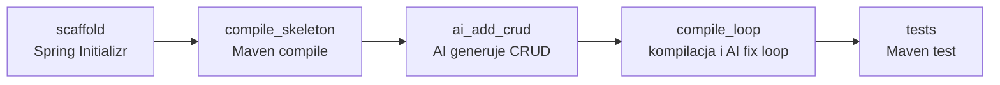

# Techniczny opis DAG-a `sdlc_springboot_startio`

## Zakres i źródła

Ten dokument opisuje definicję [`dags/sdlc_springboot_startio.yaml`](../dags/sdlc_springboot_startio.yaml) oraz skrypty, które są przez nią wywoływane. Jest to analiza kodu na branchu `feature/windows-cmd-runtime-sdlc-2026-09-26`; **nie jest to raport wykonania DAG-a na Windows**.

Ten DAG korzysta z biblioteki skryptów `internal/scripts/`. Nie korzysta z pliku `configs/sdlc-springboot.yaml` ani z nowszych wrapperów w `scripts/sdlc/springboot/` (te są używane przez `sdlc_springboot_rest`). Nazwa `startio` odnosi się tu do Spring Initializr (`start.spring.io`), z którego pobierany jest szkielet projektu.

## Cel i ustawienia wykonania

DAG tworzy nowy projekt Spring Boot/Maven, dodaje do niego prosty REST CRUD wygenerowany przez AI, próbuje automatycznie naprawić błędy kompilacji, a na końcu uruchamia testy Maven.

| Ustawienie | Wartość | Znaczenie |
|---|---|---|
| `dag_id` | `sdlc_springboot_startio` | Identyfikator w Cronova |
| `schedule` | `0 2 * * *` | Harmonogram cron: codziennie o 02:00 UTC; DAG nie ustawia `timezone`, a domyślnie Cronova używa UTC |
| `start_date` | `2026-09-01` | Początkowa data harmonogramu |
| `catchup` | `false` | Scheduler nie powinien nadrabiać wszystkich pominiętych terminów |
| `max_active_runs` | `1` | Maksymalnie jedno równoległe uruchomienie tego DAG-a |
| `default_retries` | `0` | Cronova nie ponawia automatycznie nieudanego taska |

W DAG-u jest pięć tasków w łańcuchu zależności. Błąd taska blokuje kolejne zależne kroki.



Timeouty tasków wynoszą odpowiednio 300, 600, 300, 900 i 300 sekund. Są to limity poszczególnych tasków, nie gwarantowany łączny czas wykonania.

## Przepływ krok po kroku

### 1. `scaffold` — pobranie szkieletu

**Wywołanie:**

```bash
bash internal/scripts/fetch-springboot-project \
  -t maven-project -l java -b 4.0.8 \
  -g com.example -a demo -n com.example.demo \
  -p jar -c properties -j 21 -d web \
  -w workspaces/springboot-startio -P app -C
```

**Co ma robić skrypt:** `internal/scripts/fetch-springboot-project` składa URL do `https://start.spring.io/starter.zip`, pobiera ZIP przez `curl` (lub `wget` jako fallback), a następnie rozpakowuje projekt do `workspaces/springboot-startio/app`. `-C` usuwa wcześniej istniejący katalog docelowy przed rozpakowaniem. Ustawienia generatora: Maven, Java, Spring Boot `4.0.8`, Java `21`, `jar`, konfiguracja `properties`, zależność `web`, grupa `com.example`, artefakt `demo`, pakiet `com.example.demo`.

**Ważna niezgodność wykryta w kodzie:** skrypt ustawia `PYTHON="${PYTHON:-$(find_python)}"`, ale w `internal/scripts/common_toolchain.sh` nie ma definicji `find_python`, a DAG nie przekazuje `-y` ani nie ustawia `PYTHON`. Skrypt ignoruje też `CRONOVA_PYTHON`, mimo że pozostałe skrypty AI obsługują tę zmienną. Przy typowym środowisku startowanym według `docs/WINDOWS_CMD_RUNTIME_TEST_2026-09-26.md` oznacza to, że `scaffold` najpewniej zakończy się błędem `find_python: command not found` zanim wykona żądanie HTTP. Sam fakt, że Python jest w `PATH` lub ustawiono `CRONOVA_PYTHON`, nie naprawia tego wywołania. To blocker do usunięcia przed pozytywnym testem end-to-end.

### 2. `compile_skeleton` — kompilacja czystego projektu

**Wywołanie:** `internal/scripts/compile-project -w workspaces/springboot-startio -p app`.

Skrypt sprawdza istnienie katalogu projektu, tworzy współdzielone repozytorium Maven `.m2/repository`, przechodzi do projektu i ładuje `internal/scripts/common_toolchain.sh`. Helper scala środowiskowe ścieżki Windows (`CRONOVA_WINDOWS_PATH`), ustawia `JAVA_HOME`/`MAVEN_HOME` z `CRONOVA_*` lub standardowych zmiennych i dodaje katalogi `bin` do `PATH`. Następnie wykonywane jest `mvn -B -Dmaven.repo.local=<repo> -DskipTests compile` — kompilacja bez uruchamiania testów.

Skrypt zapisuje diagnostykę Javy/Mavena do `toolchain-runtime.txt` w katalogu wygenerowanego projektu. Używa polecenia `mvn`, a nie Maven Wrappera (`mvnw`), więc Maven musi być dostępny jako narzędzie w systemie.

### 3. `ai_add_crud` — dodanie CRUD przez AI

**Wywołanie:** `internal/scripts/ai-generate-crud -w workspaces/springboot-startio -p app -k com.example.demo -r default -y python`.

Skrypt `internal/scripts/ai-generate-crud`:

1. odczytuje `pom.xml` i klasę `DemoApplication.java` z pakietu `com.example.demo`;
2. rozwiązuje URL, model i token dostawcy AI z `data/cronova.db` (rekord providera `default`) albo z `CRONOVA_AI_BASE_URL`, `CRONOVA_AI_MODEL` i opcjonalnie `CRONOVA_AI_TOKEN`;
3. zapisuje prompt i request/response JSON do `.tmp/`;
4. przekazuje prompt do `internal/scripts/ai/add_crud.py`, który wysyła HTTP POST w formacie zgodnym z chat-completions (model, wiadomości system/user, `temperature: 0.2`);
5. oczekuje JSON-a z `pom_xml`, `Item_java` i `ItemController_java`, po czym zapisuje zmiany w `pom.xml` i tworzy klasy `model/Item.java` oraz `api/ItemController.java`.

Prompt wymaga zależności web i validation, klasy `Item` z polami `Long id` i `String name`, oraz kontrolera z endpointami `GET /items`, `POST /items`, `GET /items/{id}` i `DELETE /items/{id}`. Magazyn danych ma być prostą mapą `Map<Long, Item>` w kontrolerze; walidacja ma używać `jakarta.validation`.

Ten krok **nie tworzy testów CRUD** i nie uruchamia kompilacji. Sukces oznacza, że helper zapisał pliki z odpowiedzi AI; ich poprawność jest sprawdzana przez następny krok.

### 4. `compile_loop` — kompilacja i naprawa przez AI

**Wywołanie:** `internal/scripts/ai-review-fix-loop -w workspaces/springboot-startio -p app -k com.example.demo -r default -y python`.

Skrypt ustawia toolchain przez `common_toolchain.sh`, a następnie wykonuje do trzech prób `mvn ... -DskipTests compile` (wartość domyślna `MAX_ITER=3`). Po nieudanej kompilacji — maksymalnie po pierwszych dwóch próbach, bo trzecia jest ostatnia — buduje prompt z `pom.xml`, plikami Java w `src/main/java` i ostatnimi 80 liniami logu kompilacji. `internal/scripts/ai/review_fix_v2.py` wysyła request do skonfigurowanego providera, parsuje JSON i zapisuje `pom_xml` oraz wskazane przez model pliki projektu.

Krok kończy się sukcesem po pierwszej poprawnej kompilacji albo błędem po wyczerpaniu prób. AI jest wywoływane warunkowo, tylko jeśli kompilacja nie przejdzie.

### 5. `tests` — testy Maven

**Wywołanie:** `internal/scripts/run-tests -w workspaces/springboot-startio -p app`.

Skrypt ładuje ten sam helper toolchain, zapisuje `toolchain-runtime.txt`, a następnie wykonuje `mvn -B -Dmaven.repo.local=<repo> test`. Nie pakuje artefaktu i nie publikuje JAR-a; sprawdza jedynie wynik celu Maven `test`.

## Dane, konfiguracja i efekty uboczne

- **Projekt:** `workspaces/springboot-startio/app` (katalog `workspaces/` jest ignorowany przez Git).
- **Cache Maven:** `.m2/repository` (współdzielony pomiędzy przebiegami DAG-ów; ignorowany przez Git).
- **Pliki tymczasowe:** `.tmp/` (ignorowany przez Git), m.in. ZIP ze Spring Initializr, prompty i odpowiedzi AI oraz `compile.log`.
- **Konfiguracja AI:** `data/cronova.db` lub zmienne `CRONOVA_AI_*`; sekret tokenu nie jest częścią definicji DAG-a.
- **Toolchain Windows:** Cronova uruchomiony przez `start.cmd` przekazuje `CRONOVA_WINDOWS_PATH`, `CRONOVA_BASH_PATH` oraz ustawienia Java/Maven zgodnie z Windows test planem. `common_toolchain.sh` konwertuje ścieżki przez `cygpath` w Git Bash.

Kilka skryptów zapisuje do stałych nazw plików w `.tmp/` (`springboot-project.zip`, `ai_prompt.txt`, `ai_request.json`, `ai_response.json`, `compile.log`, `ai_review_prompt.txt`, itd.). `max_active_runs: 1` chroni przed dwoma równoległymi przebiegami **tego DAG-a**, ale nie przed równoległym użyciem tych samych plików tymczasowych przez inne DAG-i. W razie równoległych workflowów może dojść do kolizji.

## Czy to są reużywalne „klocki LEGO”?

**Na poziomie kompozycji — tak.** DAG składa się z pięciu osobnych skryptów CLI, które otrzymują workspace/projekt/pakiet przez argumenty; orchestration (kolejność, zależności, timeouty) pozostaje w YAML. Nie ma dedykowanego `workflows/sdlc_springboot_startio/` ani logiki biznesowej wpiętej bezpośrednio w runner Cronova. Te same klocki są już używane w `dags/sdlc_springboot.yaml`, gdzie zmienia się źródło szkieletu (template zamiast Spring Initializr) i katalog workspace. Dokumentacja `internal/scripts/README.md` pokazuje też ich kompozycję w innych przepływach.

| Klocek | Reużywalna odpowiedzialność | Parametry różnicujące |
|---|---|---|
| `fetch-springboot-project` | Wygenerowanie projektu ze Spring Initializr | typ, język, wersje, zależności, workspace i projekt |
| `compile-project` | Maven goal dla projektu | workspace, projekt, goal, uruchomienie/pominięcie testów |
| `ai-generate-crud` | Dodanie CRUD na podstawie istniejącego projektu/promptu | workspace, projekt, package, provider/model/Python |
| `ai-review-fix-loop` | Iteracyjna naprawa kompilacji | workspace, projekt, package, limit prób, provider/model/Python |
| `run-tests` | Uruchomienie testów Maven | workspace i projekt |
| `common_toolchain.sh` | Wspólna konfiguracja Java/Maven/PATH dla skryptów kompilujących | zmienne środowiskowe toolchain |
| `internal/scripts/ai/*.py` | Transport requestów AI i zapis odpowiedzi do projektu | projekt, prompt, provider/model/token |

**Jednak klocki nie są jeszcze w pełni niezależne ani gotowe do przenoszenia bez warunków.** Wykryte ograniczenia:

1. **Blocker `find_python`:** krok `scaffold` odwołuje się do nieistniejącej funkcji i nie respektuje `CRONOVA_PYTHON`; trzeba go poprawić (np. użyć wspólnego, działającego autodetektera albo jawnie przekazać obsługiwany interpreter) przed testem DAG-a.
2. **Zależność od repozytorium i uruchomienia z jego katalogu:** komendy DAG-a są względne (`internal/scripts/...`, `workspaces/...`), więc wymagają właściwego katalogu roboczego Cronova. Skrypty zakładają też dostęp do `curl`/`wget`, `unzip`, `python`, Maven, Java i sieci.
3. **Współdzielone nazwy plików tymczasowych:** stałe pliki w `.tmp/` mogą kolidować między jednocześnie działającymi DAG-ami.
4. **Dwa modele toolchain:** skrypty `compile-project`, `ai-review-fix-loop` i `run-tests` konfigurują Java/Maven helperem; `fetch-springboot-project` i skrypty AI mają inną ścieżkę konfiguracji Pythona. Przekazanie `-y python` do kroków AI nie naprawia kroku `scaffold`.
5. **Różne rodziny SDLC w repo:** `sdlc_springboot_startio` korzysta z `internal/scripts/`; `sdlc_springboot_rest` korzysta z osobnej rodziny wrapperów `scripts/sdlc/springboot/` oraz wersjonowanej konfiguracji YAML. Nie należy traktować ich jako tego samego kontraktu tylko dlatego, że oba budują Spring Boot.
6. **Wytwory są modyfikowalne/destrukcyjne:** `-C` w pierwszym kroku usuwa projekt docelowy przy każdym uruchomieniu. To jest zamierzone dla powtarzalnego scaffoldu, ale warto pamiętać, że lokalne zmiany w `workspaces/springboot-startio/app` nie są zachowywane.

Wniosek: **architektura przepływu jest kompozycyjna, ale bieżąca implementacja nie przechodzi jeszcze statycznej kontroli gotowości do testu end-to-end na Windows z powodu kroku `find_python`.** Po poprawce można testować klocki sekwencyjnie oraz ścieżkę pełnego DAG-a. Ten dokument nie wprowadza tej poprawki ani nie deklaruje, że test Windows został wykonany.
