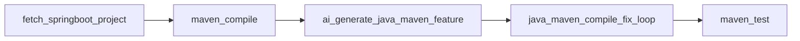

# Techniczny opis DAG-a `sdlc_springboot_startio`

## Zakres i źródła

Ten dokument opisuje definicję [`dags/sdlc_springboot_startio.yaml`](../dags/sdlc_springboot_startio.yaml) oraz skrypty PowerShell, które są przez nią wywoływane. Jest to analiza kodu, **nie raport wykonania DAG-a**.

Instrukcja runtime testu po migracji PowerShell-native: [`WINDOWS_SPRINGBOOT_STARTIO_NATIVE_TEST_2026-10-02.md`](WINDOWS_SPRINGBOOT_STARTIO_NATIVE_TEST_2026-10-02.md).

Ten DAG korzysta z biblioteki skryptów `internal/scripts/`. Nie korzysta z `configs/sdlc-springboot.yaml` ani ze skryptów `springboot-*-from-config.ps1` (te są używane przez `sdlc_springboot_rest`). Nazwa `startio` odnosi się do Spring Initializr (`start.spring.io`), z którego pobierany jest szkielet projektu.

## Cel i ustawienia wykonania

DAG pobiera szkielet Spring Boot, kompiluje go, dodaje przez AI prosty REST CRUD, uruchamia pętlę `test-compile` → naprawa AI i na końcu testy Maven.

| Pole | Wartość |
|---|---|
| `dag_id` | `sdlc_springboot_startio` |
| `schedule` | `0 2 * * *` |
| `start_date` | `2026-09-01` |
| `catchup` | `false` |
| `max_active_runs` | `1` |
| `default_retries` | nie ustawione |

Wszystkie taski mają `type: powershell` i nie ustawiają timeoutów.


```mermaid
flowchart LR
  A[fetch_springboot_project] --> B[maven_compile]
  B --> C[ai_generate_java_maven_feature]
  C --> D[java_maven_compile_fix_loop]
  D --> E[maven_test]
```

## Refaktoring Windows-native

Każdy task wywołuje bezpośrednio jeden skrypt `.ps1` operatorem `&`. Ścieżki narzędzi pochodzą z `CRONOVA_JAVA_HOME`/`JAVA_HOME`, `CRONOVA_MAVEN_HOME`/`MAVEN_HOME`, `CRONOVA_PYTHON` oraz `PATH` (patrz [`internal/scripts/common/toolchain.ps1`](../internal/scripts/common/toolchain.ps1)).

## Przepływ krok po kroku

### 1. `fetch_springboot_project` — pobranie szkieletu

```powershell
& .\internal\scripts\fetch-springboot-project.ps1 -t maven-project -l java -b 4.0.8 -g com.example -a demo -n com.example.demo -Packaging jar -c properties -j 21 -d web -w workspaces/springboot-startio -Project app -Clean
```

Skrypt [`fetch-springboot-project.ps1`](../internal/scripts/fetch-springboot-project.ps1):

1. buduje URL `https://start.spring.io/starter.zip?type=...&language=...&bootVersion=...&groupId=...&artifactId=...&name=<artifact>&packageName=<-n>&packaging=...&configFormat=...&javaVersion=...&dependencies=...` (wartości kodowane URL; `name` jest brane z `-a`);
2. pobiera ZIP do `.tmp\springboot-project.zip` przez `curl.exe` (lub `wget.exe`), szukając go na `PATH` lub w `CRONOVA_WINDOWS_PATH`;
3. przy `-Clean` usuwa `workspaces/springboot-startio/app`;
4. rozpakowuje archiwum przez `Expand-Archive`.

Błąd pobierania kończy skrypt kodem wyjścia downloadera.

### 2. `maven_compile` — kompilacja czystego projektu

```powershell
& .\internal\scripts\maven-compile.ps1 -w workspaces/springboot-startio -p app
```

Wykonuje `mvn -B -Dmaven.repo.local=<repo>\.m2\repository -DskipTests compile` (Maven z `CRONOVA_MAVEN_HOME`/`MAVEN_HOME`, nie Maven Wrapper) i zapisuje `app\toolchain-runtime.txt`.

### 3. `ai_generate_java_maven_feature` — dodanie CRUD przez AI

```powershell
& .\internal\scripts\ai-java-mvn-generate-feature.ps1 -f prompts/springboot_crud.txt -w workspaces/springboot-startio -p app -k com.example.demo -r default -m gpt-5.3-codex -y python
```

[`ai-java-mvn-generate-feature.ps1`](../internal/scripts/ai-java-mvn-generate-feature.ps1) łączy prompt [`prompts/springboot_crud.txt`](../prompts/springboot_crud.txt) z regułami generatora i `pom.xml`, a następnie uruchamia [`ai_generate_feature.py`](../internal/scripts/ai_generate_feature.py), który wywołuje providera AI i zapisuje zwrócone pliki (opcjonalnie nowy `pom.xml`). Provider: `-r default` → `Resolve-AiProvider` z [`common/ai-provider.ps1`](../internal/scripts/common/ai-provider.ps1) (zmienne `CRONOVA_AI_BASE_URL`/`CRONOVA_AI_MODEL`/`CRONOVA_AI_TOKEN` albo domyślny rekord `ai_providers` w `CRONOVA_DB`, domyślnie `data\cronova.db`).

### 4. `java_maven_compile_fix_loop` — kompilacja i naprawa przez AI

```powershell
& .\internal\scripts\java-maven-compile-fix-loop.ps1 -LoopWorkspace workspaces/springboot-startio -LoopProject app -LoopPackage com.example.demo -LoopProvider default -LoopModel gpt-5.3-codex -LoopPython python
```

Do 3 iteracji `mvn -B -DskipTests test-compile`. Po błędzie (poza ostatnią iteracją) wysyła `pom.xml`, ostatnie 80 linii logu i źródła do reviewera przez [`ai-review-java-maven-errors.ps1`](../internal/scripts/ai-review-java-maven-errors.ps1) → `internal/scripts/ai/review_fix_v2.py`. Błąd w ostatniej iteracji kończy task wyjątkiem.

### 5. `maven_test` — testy Maven

```powershell
& .\internal\scripts\maven-test.ps1 -w workspaces/springboot-startio -p app
```

Wykonuje `mvn -B -Dmaven.repo.local=... test`.

## Dane, konfiguracja i efekty uboczne

| Lokalizacja | Zawartość |
|---|---|
| `workspaces/springboot-startio/app` | projekt (czyszczony w każdym runie przez `-Clean`) |
| `.tmp/springboot-project.zip` | pobrane archiwum |
| `.tmp/ai_feature_*`, `.tmp/ai_review*`, `.tmp/compile.log` | prompty, żądania, odpowiedzi AI i log kompilacji |
| `.m2/repository` | lokalny cache Maven w repozytorium |

Wymagany jest dostęp do `start.spring.io`, repozytoriów Maven i providera AI.

## Czy to są reużywalne „klocki LEGO”?

**Tak.** DAG różni się od [`sdlc_springboot_template_crud`](SDLC_SPRINGBOOT_TECHNICAL.md) wyłącznie pierwszym taskiem (Spring Initializr zamiast lokalnego template’u) i ścieżką workspace. Kolejne cztery klocki (`maven-compile.ps1`, `ai-java-mvn-generate-feature.ps1`, `java-maven-compile-fix-loop.ps1`, `maven-test.ps1`) są wspólne z tamtym DAG-iem oraz z `sdlc_maven_luhn`.

Ograniczenia:

1. Wynik AI jest niedeterministyczny; pętla naprawia tylko błędy kompilacji.
2. Prompt reviewera jest zaszyty w `java-maven-compile-fix-loop.ps1`.
3. Pliki w `.tmp/` są współdzielone z innymi DAG-ami używającymi tych skryptów.
4. Wersja Boot `4.0.8` i zależność `web` są ustawione w DAG-u; zmiana wymaga edycji komendy taska.
