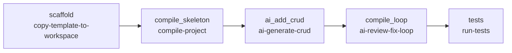

# Techniczny opis DAG-a `sdlc_springboot`

## Zakres i status analizy

Dokument opisuje definicję [`dags/sdlc_springboot.yaml`](../dags/sdlc_springboot.yaml), skrypty wywoływane przez ten DAG oraz ich kontrakty wejścia/wyjścia. Analiza została wykonana na branchu `feature/windows-cmd-runtime-sdlc-2026-09-26`.

To jest **analiza statyczna kodu**, a nie raport wykonania. DAG nie został uruchomiony w tym sandboxie na Windowsie. Weryfikacja runtime'u Windows, Git Bash, Javy, Mavena, Pythona i konfiguracji providera AI pozostaje zadaniem agenta działającego na Windowsie.

## 1. Cel przepływu

`sdlc_springboot` tworzy lokalny projekt Spring Boot z wersjonowanego template'u, sprawdza jego kompilowalność, dodaje prosty REST CRUD przez skonfigurowanego providera AI, a następnie uruchamia pętlę kompilacji i automatycznej naprawy. Na końcu wykonuje testy Maven.

Przepływ realizuje następujące cele:

1. odtworzenie czystego projektu z `templates/springboot-simple`;
2. kompilacja bazowego szkieletu przed modyfikacją przez AI;
3. wygenerowanie klas `Item` i `ItemController` oraz uzupełnienie `pom.xml`;
4. maksymalnie trzy iteracje: kompilacja, raport błędu do AI i zapis poprawek;
5. uruchomienie testów Maven po zakończeniu pętli.

DAG nie zawiera implementacji tych operacji. YAML opisuje wyłącznie kolejność, zależności, timeouty i parametry wywołań biblioteki `internal/scripts/`.

## 2. Definicja i parametry wykonania

Plik źródłowy:

```text
dags/sdlc_springboot.yaml
```

| Pole | Wartość | Znaczenie |
|---|---:|---|
| `dag_id` | `sdlc_springboot` | Identyfikator DAG-a w Cronova |
| `schedule` | `0 2 * * *` | Uruchomienie codziennie o 02:00 UTC, ponieważ DAG nie definiuje `timezone` |
| `start_date` | `2026-09-01` | Początkowa data harmonogramu |
| `catchup` | `false` | Brak nadrabiania pominiętych okresów |
| `max_active_runs` | `1` | Najwyżej jeden aktywny run tego DAG-a |
| `default_retries` | `0` | Brak automatycznego retry tasków |

Każdy task ma `type: shell`, więc Cronova uruchamia polecenie jako proces systemowy. Na Windowsie oznacza to wykonanie przez skonfigurowany runtime Cronova/Git Bash. Wszystkie ścieżki w komendach DAG-a są względne wobec katalogu repozytorium, z którego Cronova wykonuje taski.

## 3. Graf zależności



Dokładna sekwencja jest liniowa:

```text
scaffold
  -> compile_skeleton
  -> ai_add_crud
  -> compile_loop
  -> tests
```

Task downstream nie może wystartować, dopóki jego poprzednik nie zakończy się sukcesem. Timeouty per task wynoszą:

| Task | Timeout | Rola |
|---|---:|---|
| `scaffold` | 120 s | Skopiowanie lokalnego template'u |
| `compile_skeleton` | 300 s | Kompilacja czystego projektu |
| `ai_add_crud` | 300 s | Jedno żądanie do providera AI i zapis kodu |
| `compile_loop` | 900 s | Kompilacja oraz warunkowe poprawki AI |
| `tests` | 300 s | Testy Maven |

Suma timeoutów nie jest gwarantowanym czasem wykonania DAG-a. Jest to pięć niezależnych limitów prób wykonania.

## 4. Przepływ krok po kroku

### 4.1. `scaffold` — odtworzenie projektu z template'u

Wywołanie z DAG-a:

```bash
bash internal/scripts/copy-template-to-workspace \
  -t springboot-simple \
  -w workspaces/springboot \
  -p app \
  -c
```

Używany skrypt:

```text
internal/scripts/copy-template-to-workspace
```

Działanie:

1. wyznacza katalog repozytorium na podstawie położenia własnego pliku;
2. wymaga katalogu `templates/springboot-simple`;
3. ustawia katalog docelowy `workspaces/springboot/app`;
4. dzięki `-c` usuwa istniejący katalog docelowy przez `rm -rf`;
5. tworzy katalog i kopiuje całą zawartość template'u.

Template zawiera obecnie:

- `pom.xml` z Spring Boot `3.3.5`;
- Java `21`;
- zależność `spring-boot-starter-web`;
- zależność testową `spring-boot-starter-test`;
- `DemoApplication.java`;
- test kontekstu `DemoApplicationTests`.

Ten krok nie wymaga Javy, Mavena ani Pythona. Jest operacją na plikach. Jest **destrukcyjny względem `workspaces/springboot/app`**, dlatego nie należy uruchamiać go na katalogu zawierającym lokalne zmiany, których nie można odtworzyć.

### 4.2. `compile_skeleton` — kompilacja czystego projektu

Wywołanie:

```bash
bash internal/scripts/compile-project \
  -w workspaces/springboot \
  -p app
```

Używany skrypt:

```text
internal/scripts/compile-project
```

Działanie:

1. sprawdza istnienie `workspaces/springboot/app`;
2. tworzy wspólny cache Maven w `.m2/repository`;
3. przechodzi do katalogu projektu;
4. ładuje `internal/scripts/common_toolchain.sh`;
5. wywołuje `setup_java_maven`, które konfiguruje Java/Maven i sprawdza `java` oraz `mvn`;
6. zapisuje diagnostykę do `workspaces/springboot/app/toolchain-runtime.txt`;
7. wykonuje:

```text
mvn -B -Dmaven.repo.local=<repo> -DskipTests compile
```

Domyślnie testy są pomijane. Ten krok jest bramką: zanim AI zmodyfikuje projekt, potwierdza, że bazowy template jest kompilowalny i że toolchain działa.

Istotne rozróżnienie: `compile-project` używa systemowego polecenia `mvn`, a nie `mvnw`/`mvnw.cmd`. Maven musi więc być dostępny przez konfigurację runtime'u lub `PATH`.

### 4.3. `ai_add_crud` — generowanie CRUD

Wywołanie:

```bash
bash internal/scripts/ai-generate-crud \
  -w workspaces/springboot \
  -p app \
  -k com.example.demo \
  -r default \
  -y python
```

Używane pliki:

```text
internal/scripts/ai-generate-crud
internal/scripts/ai/add_crud.py
```

Skrypt shellowy:

1. ładuje `common_toolchain.sh` i rozwiązuje interpreter przez `find_python`;
2. odczytuje konfigurację providera AI — najpierw z `CRONOVA_AI_BASE_URL`/`CRONOVA_AI_MODEL`, a następnie z `data/cronova.db` z tabeli `ai_providers`;
3. wymaga adresu endpointu i modelu; token jest opcjonalny;
4. sprawdza projekt i odczytuje `pom.xml` oraz `DemoApplication.java`;
5. tworzy prompt wymagający:
   - zależności web i validation;
   - `Item` z polami `Long id` i `String name`;
   - `ItemController` z endpointami `GET /items`, `POST /items`, `GET /items/{id}` i `DELETE /items/{id}`;
   - magazynu w pamięci `Map<Long, Item>`;
   - `jakarta.validation`, a nie `javax.validation`;
6. zapisuje prompt, request i response do `.tmp/`;
7. wywołuje skrypt Python `add_crud.py`.

`add_crud.py` wysyła HTTP POST w formacie chat-completions z polami `model`, `messages` i `temperature: 0.2`. Następnie oczekuje JSON-a z kluczami `pom_xml`, `Item_java` i `ItemController_java`, opcjonalnie usuwa ogrodzenie Markdown i zapisuje:

```text
workspaces/springboot/app/pom.xml
workspaces/springboot/app/src/main/java/com/example/demo/model/Item.java
workspaces/springboot/app/src/main/java/com/example/demo/api/ItemController.java
```

Ten task nie kompiluje zmian i nie tworzy testów CRUD. Weryfikacja poprawności następuje dopiero w `compile_loop` i `tests`.

### 4.4. `compile_loop` — kompilacja i warunkowa naprawa przez AI

Wywołanie:

```bash
bash internal/scripts/ai-review-fix-loop \
  -w workspaces/springboot \
  -p app \
  -k com.example.demo \
  -r default \
  -y python
```

Używane pliki:

```text
internal/scripts/ai-review-fix-loop
internal/scripts/ai/review_fix_v2.py
```

Działanie:

1. rozwiązuje Pythona i konfigurację providera tak samo jak `ai-generate-crud`;
2. konfiguruje Java/Maven przez `common_toolchain.sh`;
3. wykonuje maksymalnie trzy iteracje (`MAX_ITER=3`):
   - `mvn -B -Dmaven.repo.local=<repo> -DskipTests compile`;
   - przy sukcesie kończy task sukcesem;
   - przy błędzie zapisuje log w `.tmp/compile.log`;
   - przekazuje do AI ostatnie 80 linii logu, `pom.xml` oraz źródła Java;
   - zapisuje odpowiedź AI przez `review_fix_v2.py`;
   - przechodzi do następnej iteracji;
4. po trzeciej nieudanej kompilacji kończy się błędem.

`review_fix_v2.py` wysyła prompt do tego samego typu endpointu AI. Oczekuje JSON-a z `pom_xml` oraz względnymi ścieżkami plików Java, które należy zmienić. Zapisuje `pom.xml` i każdy zwrócony plik do katalogu projektu.

AI jest wywoływane tylko po nieudanej kompilacji. Jeśli kod wygenerowany w `ai_add_crud` kompiluje się od razu, pętla nie wykonuje dodatkowego requestu AI.

### 4.5. `tests` — testy Maven

Wywołanie:

```bash
bash internal/scripts/run-tests \
  -w workspaces/springboot \
  -p app
```

Używany skrypt:

```text
internal/scripts/run-tests
```

Skrypt:

1. sprawdza katalog projektu;
2. korzysta z tego samego `.m2/repository`;
3. ładuje `common_toolchain.sh`;
4. zapisuje `toolchain-runtime.txt`;
5. uruchamia:

```text
mvn -B -Dmaven.repo.local=<repo> test
```

Wynik taska jest oparty na kodzie wyjścia Mavena. Bazowy template zawiera test `contextLoads`; sam DAG nie dodaje testów endpointów CRUD, więc przejście tego kroku nie jest pełnym testem funkcjonalnym REST API.

## 5. Wspólne elementy i dane środowiskowe

### `common_toolchain.sh`

Plik `internal/scripts/common_toolchain.sh` jest współdzielonym helperem toolchainu. Odpowiada za:

- normalizację ścieżek Windows przez `cygpath`;
- obsługę `CRONOVA_WINDOWS_PATH`;
- dodawanie katalogów wykonywalnych Pythona, Node i npm do `PATH`;
- ustawienie `JAVA_HOME` i `MAVEN_HOME` z `CRONOVA_JAVA_HOME`/`CRONOVA_MAVEN_HOME` lub standardowych zmiennych;
- dodanie katalogów `bin` do `PATH`;
- autodetekcję Pythona jako `python3` albo `python`;
- preferowanie jawnie skonfigurowanego `CRONOVA_PYTHON` przy ogólnym selektorze `-y python`;
- walidację dostępności `java` i `mvn`;
- zapis diagnostyki wersji i ścieżek do `toolchain-runtime.txt`.

W tym DAG-u helper jest używany przez `compile-project`, `ai-generate-crud`, `ai-review-fix-loop` i `run-tests`. `copy-template-to-workspace` nie potrzebuje toolchainu.

### Konfiguracja AI

DAG nie zawiera tokena ani adresu providera. Provider `default` jest rozwiązywany w runtime z:

1. `CRONOVA_AI_BASE_URL`, `CRONOVA_AI_MODEL` i opcjonalnie `CRONOVA_AI_TOKEN`;
2. `data/cronova.db`, z tabeli `ai_providers` i wpisu domyślnego lub wskazanego przez `-r`.

`-y python` w definicji DAG-a jest selektorem ogólnym. Wspólny resolver preferuje konkretną ścieżkę z `CRONOVA_PYTHON`, jeśli jest ustawiona, co ma znaczenie w Git Bash na Windowsie.

### Katalogi robocze i efekty uboczne

| Lokalizacja | Zawartość | Śledzenie przez Git |
|---|---|---|
| `workspaces/springboot/app` | projekt wygenerowany i modyfikowany przez DAG | ignorowana |
| `.m2/repository` | współdzielony cache zależności Maven | ignorowany |
| `.tmp/ai_prompt.txt` | prompt generatora CRUD | ignorowany |
| `.tmp/ai_request.json` | request generatora CRUD | ignorowany |
| `.tmp/ai_response.json` | surowa odpowiedź generatora CRUD | ignorowany |
| `.tmp/compile.log` | ostatni log kompilacji pętli | ignorowany |
| `.tmp/ai_review_prompt.txt` | prompt review/fix | ignorowany |
| `.tmp/ai_review_request.json` | request review/fix | ignorowany |
| `.tmp/ai_review.json` | surowa odpowiedź review/fix | ignorowany |
| `workspaces/springboot/app/toolchain-runtime.txt` | diagnostyka Java/Maven | w workspace, poza repozytorium |

`max_active_runs: 1` chroni przed równoległymi runami tego DAG-a, ale nie izoluje wspólnych nazw w `.tmp/` od innych DAG-ów używających tej samej biblioteki. Równoległe przepływy mogą nadpisać prompty i logi.

## 6. Ocena reużywalności — model „klocków LEGO”

### Werdykt

**Tak — przepływ jest złożony z reużywalnych klocków na poziomie kompozycji.** Nowy DAG składa się z istniejących skryptów CLI i zmienia głównie parametry oraz zależności w YAML. Nie ma dedykowanego katalogu `workflows/sdlc_springboot/`, a logika wykonawcza nie jest zaszyta w Cronova runnerze.

Najważniejszy podział odpowiedzialności jest poprawny:

```text
DAG      = kolejność, zależności, timeouty i parametry
skrypt   = jedna operacja SDLC
helper   = wspólna konfiguracja środowiska
workspace = wejście i wynik kolejnych operacji
config   = konfiguracja runtime/providera poza DAG-iem
```

### Macierz klocków

| Klocek | Odpowiedzialność | Reużywalność | Granica |
|---|---|---|---|
| `copy-template-to-workspace` | Kopiowanie dowolnego katalogu z `templates/` | Wysoka | Wymaga istnienia template'u i opcjonalnie usuwa cel |
| `compile-project` | Kompilacja projektu Maven | Wysoka w obrębie Maven | Wymaga systemowego `mvn`, nie używa wrappera |
| `ai-generate-crud` | Dodanie standardowego CRUD Spring Boot | Średnia | Prompt i nazwy klas są wyspecjalizowane dla `Item` |
| `ai-review-fix-loop` | Kompilacja i naprawa błędów przez AI | Średnia/wysoka | Założenia o projekcie Java/Maven i formacie odpowiedzi AI |
| `run-tests` | Uruchomienie `mvn test` | Wysoka w obrębie Maven | Nie definiuje ani nie wykonuje testów endpointów |
| `common_toolchain.sh` | Java/Maven/Python/PATH, w tym Windows/Git Bash | Wysoka | Zależny od poprawnego runtime'u hosta |
| `internal/scripts/ai/add_crud.py` | HTTP request i zapis odpowiedzi CRUD | Średnia | Kontrakt `choices[0].message.content` i konkretny JSON |
| `internal/scripts/ai/review_fix_v2.py` | HTTP request i zapis plików zwróconych przez AI | Średnia | Zakłada poprawne względne ścieżki w odpowiedzi AI |

Ta sama rodzina klocków jest już komponowana w innych przepływach:

```text
sdlc_springboot:
  copy-template-to-workspace -> compile-project -> ai-generate-crud
  -> ai-review-fix-loop -> run-tests

sdlc_springboot_startio:
  fetch-springboot-project -> compile-project -> ai-generate-crud
  -> ai-review-fix-loop -> run-tests

sdlc_maven_luhn:
  generate-maven-archetype -> compile-project -> ai-generate-feature
  -> ai-review-fix-loop -> run-tests
```

W `sdlc_springboot` jedynym istotnym elementem specyficznym dla tej kompozycji jest wybór lokalnego template'u oraz parametry pakietu `com.example.demo`; same narzędzia są współdzielone.

### Ograniczenia reużywalności

1. `ai-generate-crud` wymusza konkretny model danych `Item`, nazwy plików i endpointy, więc nie jest generycznym generatorem dowolnej domeny.
2. Skrypty AI wymagają providera zgodnego z używanym formatem chat-completions oraz odpowiedzi JSON o określonym kontrakcie.
3. `review_fix_v2.py` zapisuje ścieżki zwrócone przez model; kontrakt powinien zakładać, że są to bezpieczne ścieżki względne wewnątrz projektu.
4. `compile-project` i `run-tests` wymagają systemowego `mvn`; nie przełączają się na Maven Wrapper.
5. Wszystkie taski zakładają uruchomienie z katalogu repozytorium, bo komendy DAG-a używają względnych ścieżek.
6. Stałe nazwy plików w `.tmp/` ograniczają bezpieczną równoległość między różnymi DAG-ami.
7. `-c` w scaffoldingu jest destrukcyjne i usuwa poprzedni projekt przed kopiowaniem.
8. Test końcowy sprawdza testy Maven obecne w projekcie, ale nie zapewnia testu kontraktu REST CRUD.
9. `max_active_runs: 1` serializuje tylko ten DAG, nie wszystkie przepływy używające wspólnego workspace'u, cache'u lub `.tmp/`.

Są to ograniczenia zakresu klocków, a nie naruszenie modelu kompozycji. Można je zmniejszać przez parametryzację istniejących skryptów, bez przenoszenia logiki do YAML-a.

## 7. Różnica względem opisanych DAG-ów

`sdlc_springboot` nie jest tym samym przepływem co opisane wcześniej:

- `sdlc_springboot_rest` używa `scripts/sdlc/springboot/*`, konfiguracji `configs/sdlc-springboot.yaml`, walidacji OpenAPI i pakowania artefaktu JAR;
- `sdlc_springboot_startio` używa `fetch-springboot-project` i pobiera szkielet ze Spring Initializr;
- `sdlc_springboot` używa lokalnego, wersjonowanego `templates/springboot-simple`, nie używa konfiguracji `configs/sdlc-springboot.yaml`, nie waliduje OpenAPI i nie publikuje artefaktu JAR.

Wspólne są przede wszystkim klocki `compile-project`, `ai-generate-crud`, `ai-review-fix-loop` i `run-tests`.

## 8. Wniosek

DAG spełnia założenie reużywalnych klocków LEGO:

- definicja YAML składa, a nie implementuje operacje;
- taski korzystają bezpośrednio ze współdzielonych CLI;
- różnica źródła projektu jest wymienna (`copy-template-to-workspace` kontra `fetch-springboot-project`);
- wspólny helper izoluje konfigurację toolchainu od poszczególnych skryptów;
- workspace jest przekazywany pomiędzy krokami jako kontrakt danych.

Ocena nie oznacza pełnej uniwersalności każdego skryptu. Klocki są reużywalne w określonej domenie: Spring Boot/Maven/AI code generation. Przed uznaniem przepływu za zweryfikowany należy wykonać na Windowsie test runtime'u oraz pełny run DAG-a, szczególnie dla:

- poprawnego uruchamiania `bash` i skryptów z katalogu repozytorium;
- rozwiązywania `CRONOVA_JAVA_HOME`, `CRONOVA_MAVEN_HOME` i `CRONOVA_PYTHON`;
- dostępności `java`, `mvn`, `python` i sieci do endpointu AI;
- czyszczenia i odtworzenia `workspaces/springboot/app`;
- przejścia kompilacji bazowej, generowania CRUD, pętli napraw oraz testów Maven.
