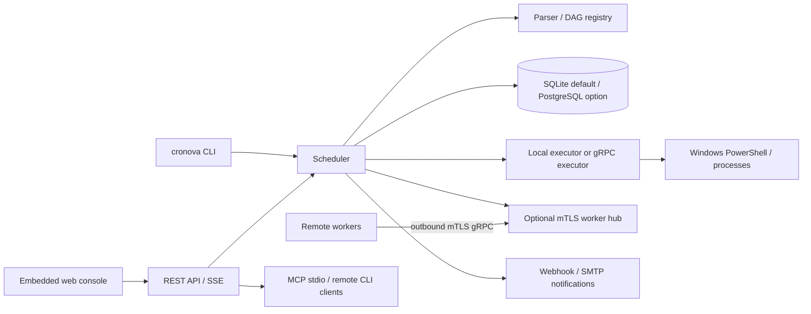

# Cronova — dokumentacja techniczna (Windows)

> Dokument opisuje stan kodu branchu `feature/windows-cmd-runtime-sdlc-2026-09-26`, commit `ec62092aaed0e855989c51e1e7da41c0cbe63de0` (HEAD odczytany 2026-10-10). Jest to opis konkretnego checkoutu, nie obietnica zgodności z innymi branchami ani przyszłymi wydaniami. Szczegóły oznaczone **niezweryfikowane runtime** wynikają z analizy statycznej; środowisko audytu było Linux x86_64 bez Go i PowerShell.

## 1. Zakres i przeznaczenie

Cronova jest samodzielnie hostowanym schedulerem workflowów DAG napisanym w Go. Repozytorium jest nastawione na Windows amd64 i workflowy PowerShell-first. Główne elementy to scheduler/API/konsola (`cronova.exe`), opcjonalny oddzielny executor (`cronova-executor.exe`), trwały store, katalog definicji YAML oraz skrypty operacyjne. Zadania mają dostęp do uprawnień konta procesu; aplikacja **nie jest sandboxem kodu**.

Ten branch zawiera również workflowy SDLC (Angular, Spring Boot/Maven i integracyjny Fullstack), konfiguracje YAML oraz skrypty w `internal/scripts/` i `scripts/sdlc/`. Są one przykładowymi workflowami zależnymi od narzędzi i usług zewnętrznych, nie gwarantowaną częścią runtime samego schedulera.

## 2. Architektura i komponenty



| Komponent | Odpowiedzialność i implementacja |
|---|---|
| CLI/server | `cmd/cronova/main.go` wybiera komendę, ładuje konfigurację i uruchamia serwer lub operację lokalną/zdalną. |
| Scheduler | `internal/scheduler/`: wczytywanie i walidacja DAG-ów, wyzwalacze, planowanie, retry, timeouty, pule, zależności, stan runów, recovery i notyfikacje. Pętla domyślnie tyka co 2 s. |
| Parser/model | `internal/scheduler/parser/`, `internal/model/`: YAML, graf acykliczny, typy danych i przejścia stanów. Nieznane pola są błędem (`KnownFields`). |
| Store | `internal/store/store.go`; implementacje SQLite (`internal/store/sqlite/`) i PostgreSQL (`internal/store/postgres/`). SQLite jest domyślne. Wybór PostgreSQL następuje, gdy `-db`/konfiguracja zaczyna się od `postgres://` lub `postgresql://`. |
| Executor | `internal/executor/`: uruchamianie, logi, wynik, timeout/cancel, state/recovery. `runner_windows.go` startuje `powershell.exe` i grupuje procesy Windows Job Objects. |
| HTTP/API | `internal/api/`: REST, auth, tokeny, rate limit, readiness, SSE, projekty/workers, OpenAPI generowane przez kod. |
| UI | `internal/web/` i `internal/web/static/`: SPA osadzona w binarce; `CRONOVA_WEB_DIR` to override developerski. |
| MCP/remote CLI | `internal/mcp/`, `cmd/cronova/mcp.go`: MCP przez stdio udostępnia katalog narzędzi oparty na API; remote CLI wywołuje REST z bearer tokenem. |
| Workers | `internal/worker/`, `internal/workerhub/`: dial-in gRPC, mTLS, rejestracja tokenem jednorazowym, routing według group/labels i strumieniowanie logów. |
| SDLC helpers | DAG-i `dags/`, konfiguracje `configs/`, skrypty `internal/scripts/`, `scripts/sdlc/`, uruchomieniowe entrypointy `scripts/windows/`. |

### 2.1 Cykl przepływu danych

1. Serwer ustala ustawienia: defaults → plik YAML → zmienne `CRONOVA_*` → jawne flags CLI (najwyższy priorytet).
2. Store wykonuje migracje schematu. Scheduler przejmuje lease, rejestruje pliki `.yaml`/`.yml` z katalogu DAG-ów i waliduje je. Błędny plik jest raportowany i pomijany; nie blokuje pozostałych poprawnych definicji. Opcjonalny `reload` ponownie skanuje katalog.
3. Tick sprawdza harmonogramy, catchup, eventy i zależności; tworzy runy z logiczną datą oraz snapshotem definicji. Unikalność DAG + logical date chroni przed powtórzeniem okresu.
4. Gotowe taski są wybierane z uwzględnieniem stanów upstream, trigger rules, aktywności DAG, priorytetu, globalnych limitów i puli.
5. Scheduler rozwiązuje szablony/parametry/variables/connections i wysyła specyfikację do executor. `powershell`/`jar` są wykonywane natywnie przez PowerShell; typy `python`, `sql`, `http` obsługuje runner/operator; `subdag` tworzy potomny run.
6. stdout/stderr trafiają do logu taska, stan/exit code do store; zdarzenia SSE aktualizują konsolę. Retry, timeout, finalizacja i zależności są obsługiwane przez scheduler.

Run zachowuje snapshot DAG-a. Zmiana definicji wpływa na następne runy; jawne ponowienie może zastosować aktualną definicję. To nie daje gwarancji exactly-once dla skutków ubocznych po stronie systemów zewnętrznych — projektuj taski idempotentnie.

## 3. Struktura repozytorium

| Ścieżka | Zawartość |
|---|---|
| `cmd/cronova/` | binarka scheduler/CLI oraz komendy serwisu, auth, API, MCP, update itp. |
| `cmd/cronova-executor/` | oddzielny Windows executor i host usługi. |
| `internal/api/`, `auth/`, `client/`, `web/` | API, uwierzytelnianie, klient, interfejs webowy. |
| `internal/scheduler/`, `model/`, `operator/`, `executor/` | silnik workflowów, model stanów, operatory, runtime. |
| `internal/store/{sqlite,postgres}/` | migracje i persystencja. |
| `internal/worker/`, `workerhub/`, `mcp/`, `secrets/`, `certs/`, `fsperm/` | rozszerzenia wykonawcze, integracyjne i bezpieczeństwa. |
| `dags/` | przykładowe i SDLC workflowy YAML. |
| `configs/`, `prompts/`, `templates/`, `contracts/` | konfiguracje przykładów SDLC, prompty, scaffold i kontrakt (uwaga poniżej). |
| `internal/scripts/`, `scripts/sdlc/`, `scripts/windows/` | helpery PowerShell/Python i testy Windows. |
| `deploy/` | instalatory/wrappery PowerShell i wskazówki pakietu. |
| `docs/` | dokumentacja użytkowa, techniczna, referencje i raporty historyczne. |
| `internal/docs/docs/` | lustro dokumentów osadzane w binarce; canonical source to `docs/` plus README. Synchronizuje `internal/scripts/sync-embedded-docs.ps1`. |
| `proto/`, `buf.yaml`, `buf.gen.yaml` | definicje gRPC i wygenerowane bindingi. |
| `e2e/playwright/` | testy UI Playwright dla health/items. |
| `scripts/package.ps1`, `scripts/release.ps1` | budowanie dystrybucji i bramka release. |

Repo ma 499 plików śledzonych w checkoutcie i około 175 plików Go (83 testowe), 77 skryptów PowerShell i 24 pliki YAML/YML — zliczenia z `git ls-files` na opisywanym HEAD, włączając testy i wewnętrzne dokumenty. Plików binarnych/vendorów nie należy interpretować jako API.

## 4. Konfiguracja serwera

Źródła: `cmd/cronova/config.go`, `cmd/cronova/main.go`, `cronova.yaml.example`, `cronova init`. Konfiguracja `serve` obsługuje nieznane klucze YAML jako błąd. Brak domyślnego `cronova.yaml` jest akceptowany; jawnie podany, nieistniejący plik kończy start błędem.

### 4.1 Ustawienia i defaulty

| YAML | Zmienna środowiskowa | Wartość domyślna w kodzie / znaczenie |
|---|---|---|
| `db` | `CRONOVA_DB` | `data/cronova.db`; ścieżka SQLite, DSN PostgreSQL rozpoznawany po prefiksie URL. |
| `dags` | `CRONOVA_DAGS` | `dags`. |
| `logs` | `CRONOVA_LOGS` | `logs`. |
| `projects` | `CRONOVA_PROJECTS` | `~/.cronova/projects` użytkownika usługi, jeśli dostępny home. |
| `workspaces` | `CRONOVA_WORKSPACES` | katalog roboczy per deployment w temp, wyprowadzony z absolutnej ścieżki DB; ustaw wspólną lokalizację jeśli osobny executor ma współdzielony FS. |
| `tick` | `CRONOVA_TICK` | `2s`; musi być dodatnim duration. |
| `reload` | `CRONOVA_RELOAD` | `0` (wyłączone). Ponowne skanowanie YAML przy dodatnim interval. |
| `executor` | `CRONOVA_EXECUTOR` | pusty = executor in-process; instalacja usługi ustawia endpoint loopback TCP; zdalny TCP wymaga mTLS. |
| `http` | `CRONOVA_HTTP` | `127.0.0.1:8090`; pusty wyłącza UI/API. |
| `allow_unauthenticated_remote` | `CRONOVA_ALLOW_UNAUTHENTICATED_REMOTE` | `false`; niebezpieczny wyjątek dla bindu non-loopback bez auth. |
| `retention` | `CRONOVA_RETENTION` | `2160h` (90 dni); `0` zachowuje runy/logi bez końca. |
| `audit_retention` | `CRONOVA_AUDIT_RETENTION` | `8760h` (365 dni); `0` wyłącza czyszczenie audytu. |
| `max_queued_runs_global` | `CRONOVA_MAX_QUEUED_RUNS_GLOBAL` | `10000`. |
| `max_active_runs_global` | `CRONOVA_MAX_ACTIVE_RUNS_GLOBAL` | `1000`. |
| `max_concurrent_tasks` | `CRONOVA_MAX_CONCURRENT_TASKS` | `64`. |
| `key_file` | `CRONOVA_KEY_FILE` | `cronova.key`; generowany dla szyfrowania haseł connection; `none` wyłącza szyfrowanie. |
| `worker_listen` | `CRONOVA_WORKER_LISTEN` | pusty = hub wyłączony. mTLS gRPC listener np. `:9091`. |
| `worker_advertise` | `CRONOVA_WORKER_ADVERTISE` | adres reklamowany workerowi; potrzebny m.in. za NAT/LB. |
| `worker_join_tokens` | `CRONOVA_WORKER_JOIN_TOKENS` | tokeny jednorazowe, w env rozdzielone przecinkami; używaj bezpiecznego secret store. |
| `notify.url/format/group` | `CRONOVA_NOTIFY_URL/FORMAT/GROUP` | instancyjny cel powiadomień. Format: `raw`, `slack`, `feishu`, `dingtalk`, `email` wg konfiguracji. |
| `smtp.host/port/username/password/from/allow_plaintext` | odpowiednie `CRONOVA_SMTP_*` | relay poczty; domyślny port w implementacji 587. Hasło nie powinno być wpisywane do repo. |
| `log.level/format` | `CRONOVA_LOG_LEVEL/FORMAT` | poziom `debug|info|warn|error`, format `text|json`. |
| `auth.enabled/session_ttl/secure_cookie/admin_user/trusted_proxies` | `CRONOVA_AUTH`, `CRONOVA_SESSION_TTL`, `CRONOVA_SECURE_COOKIE`, `CRONOVA_ADMIN_USER`, `CRONOVA_TRUSTED_PROXIES` | `session_ttl` 24h; cookie secure zależne od konfiguracji HTTPS/proxy. Lista proxy w env to CSV. |

`CRONOVA_ADMIN_PASSWORD` oraz `auth.admin_password` są obsługiwane jako legacy/bootstrap override w kodzie. `cronova init` nie zapisuje jawnego hasła do config/env; preferuj init i zarządzanie kontami, nie trwałą wartość w YAML.

Ustawienia SMTP i liczby env są parsowane ostrożnie: nieprawidłowe wartości części pól są ignorowane i pozostawiają dotychczasowy default. Nie zakładaj, że błędnie wpisany boolean/port został zastosowany.

### 4.2 Flagi serve

`cronova serve -config <path> -db <path> -dags <dir> -logs <dir> -projects <dir> -workspaces <dir> -tick 2s -reload 10s -executor <address> -http 127.0.0.1:8090 -auth -standby -retention 2160h -audit-retention 8760h -max-queued-runs 10000 -max-active-runs 1000 -max-concurrent-tasks 64`.

`-allow-unauthenticated-remote` jest jawnie oznaczone jako **DANGEROUS**. Nie stosuj go do publicznej sieci. Przy auth wyłączonym serwer odmawia bindu non-loopback, chyba że wybrano niebezpieczny wyjątek. Default config samego `serve` ma auth wyłączone; `cronova init` dla nowej instalacji konfiguruje auth włączone. Nie myl tych ścieżek.

### 4.3 Konfiguracja zadań i runtime paths

`CRONOVA_PYTHON`, `CRONOVA_NODE`, `CRONOVA_NPM`, `CRONOVA_JAVA_HOME`, `CRONOVA_MAVEN_HOME`, `JAVA_HOME`, `MAVEN_HOME`, `CRONOVA_WINDOWS_PATH` dotyczą środowiska procesów tasków/skryptów i wykrywania toolchainu, a nie schematu serwera powyżej. `scripts/windows/app.ps1` uruchamia detektor i dziedziczy znalezione ścieżki w child process. Instalator usług działa jako `LocalSystem`; jego PATH nie jest środowiskiem interaktywnego użytkownika. Narzędzia trzeba zainstalować osobno i po zmianie ścieżek ponowić instalację/konfigurację.

## 5. Zależności

### Kompilacja Go

Moduł wymaga **Go 1.26.5** (`go.mod`). Zależności bezpośrednie: `modernc.org/sqlite` (pure-Go SQLite), `github.com/jackc/pgx/v5` (PostgreSQL), `github.com/go-sql-driver/mysql`, `github.com/robfig/cron/v3`, `golang.org/x/sys`, `google.golang.org/grpc`, `google.golang.org/protobuf`, `gopkg.in/yaml.v3`. Dokładne wersje są w `go.mod` i `go.sum`. Build dystrybucyjny ustawia `CGO_ENABLED=0`, `GOOS=windows`, `GOARCH=amd64`.

### Runtime zależny od użycia

- Windows 10/11 lub Windows Server amd64 dla ścieżki wspieranej w repo; Windows PowerShell `powershell.exe` dla command tasks i skryptów operacyjnych.
- Python, Java/JRE/JDK, Maven, Node/npm, Git, klienty zewnętrzne — tylko jeśli wywołują je konkretne taski; installer/detector nie zastępuje instalacji wszystkich zależności projektu.
- Playwright i npm w testach Fullstack; Spring Initializr/network w odpowiednim DAG-u; dostęp do AI provider i jego konfiguracja dla generowania kodu.
- Go toolchain do pracy developerskiej i `scripts/package.ps1`; `buf` oraz `protoc-gen-go[-grpc]` do regeneracji proto.
- Testy E2E wykorzystują Playwright (`e2e/playwright/package.json`).

`Dockerfile`/`docker-compose.yml` są osobną, istniejącą ścieżką kontenerową Linux; nie należy utożsamiać jej z natywnym, wspieranym Windows ZIP/SCM deploymentem. Weryfikacja produkcyjna kontenera dla tego branchu nie była wykonywana w ramach dokumentacji.

## 6. Uruchamianie, build, test i package

### Developerski start na Windows

`app.cmd` deleguje do `scripts/windows/app.ps1`. W katalogu checkoutu, PowerShell:

```powershell
.\app.cmd start
.\scripts\windows\app.ps1 status
.\scripts\windows\app.ps1 stop
```

`start` buduje `cronova.exe` z aktualnego checkoutu, wykrywa toolchain, zatrzymuje procesy z tego repo (po ścieżce binarki), tworzy katalogi i uruchamia `serve -config cronova.yaml -auth=true` na `127.0.0.1:<Port>`. Nie uruchamia oddzielnego executor service. `start-dev` usuwa `.tmp\dev-cronova.db` i startuje z `-auth=false`; używaj wyłącznie w bezpiecznym lokalnym kontekście. `stop` zatrzymuje procesy repo z użyciem `Stop-Process -Force`; nie jest równoważne graceful service stop. `restart` także wymusza zatrzymanie i przebudowuje. README/AGENT zaleca `scripts/windows/app.ps1 start` dla rzeczywistego lokalnego SDLC runtime, a nie `start-dev`.

W repo znajdują się dwa różne launchery: `app.cmd` obsługuje ten wrapper, a główny root `start.cmd` jest innym entrypointem historyczno/runtime’owym; nie zakładaj ich zamienności.

### Build i testy

```powershell
go build -o cronova.exe ./cmd/cronova
go test ./...
go test -race ./...
go vet ./...
go mod verify
```

Pełny zestaw projektowy (wymaga Windows PowerShell, Go oraz wymaganych narzędzi):

```powershell
.\scripts\windows\check-all.ps1
.\scripts\windows\check-all.ps1 -Full
.\scripts\windows\check-all.ps1 -Package
```

Domyślny check uruchamia formatowanie, `go mod verify`, kontrolę lustra dokumentów, świeżości AI Wiki, `go vet`, `go test ./...`, testy Python i wybrane testy PowerShell/helperów. `-Full` dodaje `go test -race ./...` i `govulncheck`; `-Package` buduje ZIP i waliduje referencje DAG. Oddzielne skrypty: `scripts/windows/test-dags.ps1`, `test-powershell-only-runtime.ps1`, `test-powershell-scripts.ps1`, `test-service-helpers.ps1`, `test-services.ps1`, `test-package-smoke.ps1`. Test `test-services.ps1` wymaga podwyższonych praw/Windows.

`go build -o cronova.exe ./cmd/cronova` buduje samą komendę; `scripts/package.ps1` tworzy kompletny package, nie to samo co pojedynczy build:

```powershell
.\scripts\package.ps1 [-Version 1.2.3] [-Output dist]
```

Powstają `dist\cronova_windows_amd64.zip` i `dist\SHA256SUMS`. `scripts/release.ps1 [-Version ...]` uruchamia check-all oraz package smoke; nie publikuje automatycznie release na GitHub. Plik `SHA256SUMS` musi być publikowany obok ZIP, aby `cronova update` mógł zweryfikować pobranie. Nie ma skonfigurowanego workflow hosted CI w `.github/` — `check-all.ps1` jest lokalną bramką.

### Usługi / instalacja / aktualizacja

Pakiet odbiorcy ma `setup.cmd` w korzeniu ZIP. `deploy/setup.ps1` wybiera usługę Windows (UAC/admin) lub tryb per-user; przy braku admina/odmowie UAC instaluje pod `%LOCALAPPDATA%` i uruchamia po zalogowaniu. Ścieżka usług instaluje `CronovaExecutor` oraz `Cronova` w SCM; domyślne pliki danych w `%ProgramData%\Cronova`. Usługi działają jako `LocalSystem`, executor ma oddzielny cykl życia. Szczegóły i ścieżki zmian: [Deployment](DEPLOY.md), [README instalatora](../deploy/README-INSTALL.md).

Dostępne wrappery: `deploy/install.ps1`, `reinstall.ps1`, `setup.cmd`, `setup.ps1`, `uninstall.ps1`, `update.ps1`. Lifecycle service wymaga elevation. `cronova update` pobiera Windows ZIP i SHA256 z GitHub, podmienia pliki binarne i próbuje rollback w razie błędu; update restartuje usługi i może przerwać uruchomione zadania. `uninstall` zachowuje dane domyślnie; `-Purge` jest destrukcyjne. Nie uruchomiono tych poleceń podczas audytu.

### Dokumentacja

Źródłem stron jest `docs/`. Synchronizacja kopii osadzonej w binarce:

```powershell
.\internal\scripts\sync-embedded-docs.ps1
.\internal\scripts\sync-embedded-docs.ps1 -Check
```

MkDocs konfiguracja `mkdocs.yml`; komentarz na górze wymienia `make docs-serve`/`make docs-build`, ale w repo nie znaleziono Makefile. MkDocs i pluginy nie były obecne w audytowym sandboxie. Dlatego nie deklarujemy, że dokumentacja site build przeszła.

## 7. API, protokoły i integracje

### REST/console

UI i API współdzielą listener HTTP `http` (domyślnie loopback port 8090). Dynamiczny OpenAPI obsługiwany przez `internal/api/openapi.go` i udostępniany przez serwer (`/openapi.json` oraz Redoc `/docs`). Funkcjonalne grupy endpointów implementowane w `internal/api/` obejmują: health/readiness; auth/sessions/users; DAG CRUD/validate/version/graph; trigger/backfill/events/hook; runs/task instances/logs/SSE/cancel/retry/mark/pause; pools; variables/connections/alert groups; projekty; tokeny/audit; workers/join/drain; metryki/proxy/AI Wiki.

Błędy JSON zwykle mają `{ "error": "..." }`; statusy obejmują m.in. 400 dla walidacji, 401/403 dla auth/roli, 404, 409 dla konfliktu stanu i 429 dla ograniczeń kolejek/rate limit (sprawdź `Retry-After` w odpowiednim przypadku). Szczegóły endpointów i schemas runtime odczytuj z `/openapi.json` aktualnego procesu. Request JSON jest limitowany w handlerach; spec implementacji/testów jest źródłem prawdy.

**Uwaga: `contracts/openapi.yaml` nie jest kontraktem REST Cronova** — jego nagłówek `Item API`, ścieżki `/api/items` i schemat `Item` są scaffoldem/testowym przykładem. Nie używaj go jako klienta API Cronova ani jako zastępstwa `/openapi.json`.

### MCP i CLI zdalne

`cronova mcp` komunikuje się przez stdio (JSON-RPC/MCP); narzędzia mapują się na dozwolony katalog operacji REST, więc autoryzacja jest kontrolowana przez API i token. `-read-only` ogranicza katalog do odczytu. Remote CLI przyjmuje `-server`, `-token` i `-o json` oraz/lub środowiskowe `CRONOVA_SERVER`, `CRONOVA_TOKEN`. Token plaintext jest wyświetlany przy utworzeniu; przechowuj go jako sekret i odtwórz po utracie.

### Worker/executor gRPC

Zarządzana instalacja Windows lokalnie łączy scheduler z osobnym executorem po loopback, domyślnie TCP `127.0.0.1:19090`; nie wystawiaj lokalnego endpointu publicznie. Zdalny executor/worker wymaga mTLS. Worker otwiera połączenie wychodzące do hubu, rejestruje się krótkotrwałym jednorazowym tokenem i routuje się przez `worker_group`; nie wymaga publicznego listenera po stronie workera. Katalogi projektów/workspace muszą być współdzielone, jeśli te funkcje używane są przez osobne procesy/hosty; brak wspólnego FS jest ograniczeniem.

### Powiadomienia i inne integracje

DAG może emitować webhooki w formatach raw/Slack/Feishu/DingTalk lub e-mail przez `mailto:` + skonfigurowany SMTP. Dla grup alertowych rozdziela kanały `notify.group`. Zadania HTTP mogą wywoływać endpointy, `sql` obsługuje odpowiednie sterowniki/connection, Python i Java uruchamiają runtime hosta. SDLC może pobierać scaffold z Spring Initializr, korzystać z Maven/Node/Playwright i AI providerów. Ich dostępność, billing, limity i poświadczenia są zewnętrzne i nie wynikają z samej obecności YAML.

## 8. Bezpieczeństwo i granice zaufania

- **Sieć:** domyślnie bind loopback; auth należy włączyć przed ekspozycją w sieci. Reverse proxy musi być jawnie skonfigurowany w `auth.trusted_proxies`; używaj HTTPS i `secure_cookie` za TLS. Niebezpieczny `allow_unauthenticated_remote` nie jest mechanizmem zabezpieczającym.
- **Uprawnienia:** zadanie wykonuje dowolny kod w kontekście konta schedulera/executora. Instalacja service jako `LocalSystem` daje szerokie uprawnienia; oceń własne konto/usługowe ograniczenia i dostęp do plików przed wdrożeniem. W trybie user procesy działają z prawami użytkownika zalogowanego.
- **Auth:** implementacja używa hashowania haseł PBKDF2-HMAC-SHA256, sesji losowych i cookies HttpOnly; API ma role i tokeny. Role i zakresy weryfikuj w aktualnych endpointach; nie traktuj tokenu jako izolacji tenantowej. Użytkownicy, tokeny i sesje przechowywane są w bazie.
- **Poświadczenia:** connection passwords są szyfrowane AES-256-GCM kluczem key file; brak/utrata klucza uniemożliwia odszyfrowanie historycznych wartości. `key_file: none` oznacza brak szyfrowania w spoczynku. Backup DB musi chronić również klucz. Nie umieszczaj sekretów w DAG YAML, parametrach, logach, `cronova.yaml` ani `cronova.env.example`.
- **Logs/projects:** stdout/stderr mogą zawierać PII/credential; redakcja nie jest uniwersalnym DLP. Project upload uruchamia zawartość jako kod; waliduj źródło i dostęp do katalogów. Logi mają limity rozmiaru; retention może usuwać historię.
- **HTTP tasks/SSRF:** task HTTP i komendy mają uprawnienia autora DAG i mogą uzyskać dostęp do zasobów sieciowych osiągalnych z hosta. Nie traktuj systemu jako izolacji przed niezaufanymi autorami.
- **Workers:** mTLS i join token ograniczają dołączenie; chroń CA/certyfikaty/state dir. Worker widzi dane zadań routowanych do jego grupy.
- **MCP/tokens:** twórz token o minimalnej roli, ograniczaj lifetime i usuń po użyciu. Tryb `-read-only` ogranicza katalog narzędzi, ale nie zastępuje tokena read-only.
- **Updater/supply chain:** weryfikuj pakiet i checksumy; `cronova update` wymaga dostępnej, zgodnej sumy. Nie odczytuj ani nie publikuj sekretów z plików lokalnych.

## 9. Błędy, limity i troubleshooting

| Objaw | Przyczyna/diagnoza | Działanie |
|---|---|---|
| `refusing unauthenticated non-loopback HTTP bind` | Listener poza loopback bez włączonego auth. | Włącz `auth.enabled`/`-auth` lub ogranicz bind do `127.0.0.1`; nie używaj niebezpiecznego wyjątku w sieci. |
| Config `unknown field`/decode | Literówka lub klucz spoza schematu `Config`. | Porównaj z `cronova.yaml.example`; `KnownFields` odrzuca nieznane ustawienia. |
| DAG nie pojawia się / błędny YAML | Loader pomija niepoprawny plik i loguje problem. | Sprawdź log procesu, id, wymagane pola, typ, zależności/cykl. Włącz `reload` lub zrestartuj zgodnie z deployment. |
| DAG/task type `shell` rejected | Aktualny Windows parser/runtime odrzuca `shell`; runner akceptuje `powershell`, `jar`, `python`, `sql`, `http` (oraz `subdag` po stronie schedulera). | Zmień na `type: powershell`; nie polegaj na Bash/cmd POSIX. |
| Zadanie `python`/`java`/`npm` nie startuje | Runtime nie jest w PATH konta usługi. | Sprawdź `CRONOVA_PYTHON`, `JAVA_HOME`, `MAVEN_HOME`, `CRONOVA_NODE`, `CRONOVA_NPM`, `CRONOVA_WINDOWS_PATH` oraz konto usługi; uruchom detektor/reinstalator po zmianie narzędzi. |
| Port zajęty | Inny listener na porcie HTTP/Fullstack test service. | Zmień `-Port` instalatora / `-http` lub porty testowej konfiguracji; nie uruchamiaj drugiego serwera na tym samym porcie. |
| Executor niedostępny / readiness failed | Executor nie działa, endpoint/transport błędny albo niezgodne certyfikaty mTLS. | `cronova status`, Windows Services, `/readyz`, sprawdź config `executor`, firewall/endpoint i certyfikaty. |
| Worker offline / task czeka | Brak aktywnego worker w wybranej grupie albo join token/certyfikat/advertise błędne. | Sprawdź Workers w UI/CLI, labels `group`, listener/advertise, firewall i state dir; nie zakładaj, że retry nie powtórzy efektów. |
| Update kończy się checksum error | Brak lub niezgodny `SHA256SUMS`. | Pobierz release ZIP i jego checksum z tego samego zaufanego wydania; nie wyłączaj weryfikacji. |
| Task zatrzymany po `stop`/update | Restart może przerywać executor/task; zachowanie zależy od kontrolowanego restartu i native Windows Job Objects. | Użyj lifecycle `cronova restart` (restartuje scheduler, pozostawia executor), a przed update utrzymuj backup i sprawdź status po restarcie. Hard-kill wymaga walidacji Windows. |
| Logi urwane/niepełne | Limity log sink/API i retencja, task może kontynuować po osiągnięciu limitu. | Sprawdź plik log i state, zmniejsz verbosity; nie wypisuj sekretów w logu. |
| Fullstack / Playwright niegotowy | Brak npm/Node/Maven/JDK, endpoint readiness, zajęty port albo cykl życia procesu. | Uruchamiaj zgodnie z pełnym DAG/skryptami; `playwright_e2e` jest kompozytowy celowo, bo Job Object może zamknąć potomne serwisy przy końcu taska. |
| Nie da się zalogować po setup | Hasło wygenerowane jednorazowo na końcu setup lub login bootstrap mismatch. | Sprawdź zapisane hasło; skorzystaj z komendy `cronova users passwd`/ponownego setupu zgodnie z trybem i dostępem lokalnym. Nie ujawniaj hasła w logach. |

## 10. Ograniczenia i jawne niepewności

1. Repo deklaruje Windows amd64 jako wspierany system. `Dockerfile`/Compose są oddzielną ścieżką; nie zweryfikowano ich zgodności z Windows-only założeniami.
2. Brak hosted CI; obecność testu nie dowodzi jego wyniku na tym commicie. Sandbox audytowy nie ma `go`, `pwsh` ani `powershell`, więc nie wykonano build/test/package/runtime Windows.
3. Pełny runtime Windows (SCM, ACL, Job Objects, descendant processes, clean install/recovery) wymaga testów natywnych, których nie zastąpi Linux cross-compile.
4. Starszy raport `docs/WINDOWS_CMD_RUNTIME_TEST_2026-09-26.md` opisuje Git Bash/`CRONOVA_BASH_PATH`, ale aktualny `internal/executor/runner_windows.go`, parser DAG i późniejszy `test-powershell-only-runtime.ps1` wskazują PowerShell-only. Traktuj raport Bash/CMD jako historyczny, nie jako instrukcję dla tego HEAD.
5. `README.pl.md`, część ogólnych dokumentów i historycznych notatek mogą nie odzwierciedlać szczegółów aktualnej gałęzi. W razie konfliktu rozstrzygające są kod, testy branchu oraz aktualne pliki konfiguracyjne.
6. `contracts/openapi.yaml` opisuje przykładowe `Item API`, a nie API scheduler. Aktualny opis OpenAPI pobieraj z uruchomionego serwera.
7. Tracked `cronova.yaml` może zawierać lokalne ustawienia projektu; niniejsza dokumentacja nie kopiuje jego zawartości. Wdrożenie powinno wykorzystywać `cronova.yaml.example` i secret storage, a nie commitować credentiali.
8. Zewnętrzne dostępności/versiony AI, Spring Initializr, Maven Central/npm/Playwright i endpointów powiadomień zależą od sieci i providerów, nie są potwierdzane przez zapis konfiguracji.
9. Krytyczne operacje process containment, odporności na hard-kill, równoczesności i migracji baz wymagają oddzielnych testów natywnych/operacyjnych; opis architektury nie jest deklaracją SLA ani exactly-once.
10. Historia dostępna lokalnie: HEAD i ostatnie commity zapisano przy audycie; nie weryfikowano zewnętrznego CI, wydań ani historii upstream poza dostępnym klonem.

## 11. Źródła implementacji do przeglądu

`cmd/cronova/{main,config,init,service_windows,update,workers,mcp}.go`; `cmd/cronova-executor/`; `internal/{scheduler,executor,api,auth,client,operator,store,worker,workerhub,mcp,secrets,certs,web}/`; `internal/scheduler/parser/`; `internal/scripts/sync-embedded-docs.ps1`; `scripts/windows/{app,check-all,test-powershell-only-runtime,test-dags,test-services}.ps1`; `scripts/{package,release}.ps1`; `deploy/`; `go.mod`; `cronova.yaml.example`; `dags/`; `configs/`; `docs/DEPLOY.md`; `docs/DAG_REFERENCE.pl.md`.
