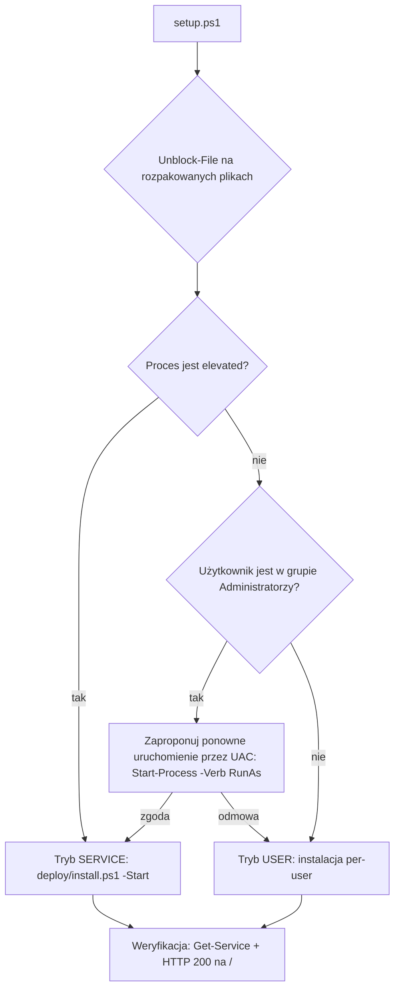

# Plan: dystrybucja Cronova jako ZIP dla innego developera (Windows)

Status: **DRAFT** — nic nie zostało jeszcze zakodowane.

## Cel

1. Autor uruchamia **jeden skrypt** → projekt jest przebudowany, przetestowany (smoke) i spakowany do `.zip`.
2. Odbiorca rozpakowuje `.zip` i uruchamia **jeden skrypt**, który sam wybiera tryb:
   - **jest admin** → instalacja jako usługi Windows (`Cronova`, `CronovaExecutor`),
   - **brak admina** → instalacja per-user bez usług, z autostartem po zalogowaniu.

## Stan obecny (co już mamy)

| Element | Plik | Uwagi |
|---|---|---|
| Budowa + ZIP | `scripts/package.ps1` | buduje oba `.exe`, kopiuje deploy/dags/configs/internal/scripts, tworzy `dist/cronova_windows_amd64.zip` + SHA256 |
| Smoke test paczki | `scripts/windows/test-package-smoke.ps1` | sprawdza listę plików w ZIP |
| Instalacja usług | `deploy/install.ps1` → `internal/scripts/cronova-install-from-source.ps1` | wymaga admina; obsługuje katalog z `.exe` lub ZIP |
| Reinstall / uninstall / update | `deploy/reinstall.ps1`, `deploy/uninstall.ps1`, `deploy/update.ps1` | wymagają admina |
| Tryb bez usług | `scripts/windows/app.ps1` (`start/stop/status`) | uruchamia `cronova.exe` z katalogu repo, bez admina |

Braki:
- `package.ps1` **nie pakuje** `deploy/reinstall.ps1` ani `scripts/windows/app.ps1`.
- Brak jednego „wejściowego” skryptu dla odbiorcy (`setup.ps1`), który rozpoznaje uprawnienia.
- Brak trybu per-user z autostartem i bez portów/ścieżek wymagających admina.
- Brak instrukcji dla odbiorcy wewnątrz ZIP (`README-INSTALL.md`).
- Pliki z internetu/maila mają Mark-of-the-Web → PowerShell blokuje skrypty (`ExecutionPolicy`).

## Strona autora: `scripts/release.ps1` (nowy, cienki wrapper)

Kroki:
1. Sprawdź toolchain (`go`), czysty `git status` (ostrzeżenie, nie blokada).
2. `go vet` + `go test ./...` (opcja `-SkipTests`).
3. Wywołaj `scripts/package.ps1` (już buduje oba `.exe` z `-ldflags version`).
4. Uruchom `scripts/windows/test-package-smoke.ps1` na wyniku.
5. Wypisz: ścieżkę ZIP, wersję (`VERSION`), SHA256 do przekazania odbiorcy.

Zmiany w `package.ps1`:
- dołożyć `deploy/reinstall.ps1`, `deploy/setup.ps1` (nowy), `scripts/windows/app.ps1`, `scripts/windows/detect-toolchain.ps1`, `README-INSTALL.md`, `deploy/cronova.env.example`;
- dopisać je do listy w `test-package-smoke.ps1`.

## Strona odbiorcy: `setup.ps1` w katalogu głównym ZIP (nowy)

```text
setup.ps1 [-Mode auto|service|user] [-InstallDir ...] [-Port 8090] [-AdminUser admin] [-AdminPassword ...]
```

Logika `-Mode auto` (domyślnie):



Uruchamianie bez zmiany polityki systemowej:
`powershell -ExecutionPolicy Bypass -File .\setup.ps1` (lub `setup.cmd`, który robi dokładnie to — dwuklik).

### Tryb SERVICE (admin)
- bez zmian: `deploy/install.ps1` → `C:\Program Files\Cronova`, dane w `C:\ProgramData\Cronova`, usługi z recovery (restart po 60 s).

### Tryb USER (brak admina) — propozycja
| Aspekt | Rozwiązanie |
|---|---|
| Binaria | `%LOCALAPPDATA%\Programs\Cronova` |
| Dane / logi / DB | `%LOCALAPPDATA%\Cronova` (`data`, `logs`, `dags`, `state`) |
| Uruchomienie | `cronova-executor.exe` + `cronova.exe serve` jako procesy użytkownika (ukryte okno) — ten sam kod co w konsoli; host usługi wykrywa brak SCM (`svc.IsWindowsService()==false`) |
| Autostart | **Task Scheduler**: `Register-ScheduledTask` z triggerem `AtLogOn` dla bieżącego użytkownika (`-RunLevel Limited`) — nie wymaga admina. Fallback: skrót w `shell:startup` gdy polityka blokuje Task Scheduler |
| Restart po awarii | ustawienia zadania: `RestartCount`/`RestartInterval` (odpowiednik recovery usług) |
| Port | `127.0.0.1:8090`; jeśli zajęty → komunikat + opcja `-Port` (bez zabijania obcych procesów, w odróżnieniu od `-FreePort` w trybie admin) |
| Firewall | nasłuch tylko na `127.0.0.1` → brak promptu zapory i brak potrzeby reguły |
| Sterowanie | `cronova-user.ps1 start|stop|status|uninstall` (rozszerzenie `scripts/windows/app.ps1` o ścieżki per-user i zadanie harmonogramu) |
| Odinstalowanie | usuń zadanie + katalogi w `%LOCALAPPDATA%` (z opcją zachowania danych) |

Ograniczenia trybu USER (do opisania w README):
- działa tylko po zalogowaniu użytkownika (nie po starcie maszyny),
- zadania DAG wykonują się z uprawnieniami użytkownika, nie `LocalSystem`,
- brak dostępu z innych maszyn (tylko localhost).

### Wspólne dla obu trybów
- `Unblock-File` na całym katalogu (Mark-of-the-Web z ZIP).
- Sprawdzenie wymaganych narzędzi dla DAG-ów (`detect-toolchain.ps1`: Java/Maven/Node/Python) — tylko ostrzeżenia.
- Ustawienie konta admin Cronova (`users add`/`passwd`) — hasło z parametru albo wygenerowane i wypisane raz.
- Końcowa weryfikacja: proces/usługa działa + `HTTP 200` na `http://127.0.0.1:<port>/`.
- Przejście USER → SERVICE: `setup.ps1 -Mode service` jako admin migruje `%LOCALAPPDATA%\Cronova\data` do `ProgramData` (opcjonalnie).

## Bezpieczeństwo
- Nie pakować `data/`, `.tmp/`, `logs/`, `*.db`, sekretów (`cronova.env`) — tylko `cronova.env.example`.
- Nie używać domyślnego hasła `admin123` w paczce dla innej osoby — wymagać `-AdminPassword` lub generować.
- SHA256 przekazywany osobnym kanałem; opcjonalnie podpis Authenticode `.exe`/`.ps1` w przyszłości.

## Plan prac (kolejność)
1. `package.ps1` + smoke: dołożenie brakujących plików.
2. `setup.ps1` + `setup.cmd`: detekcja uprawnień, `Unblock-File`, routing do trybu.
3. Tryb USER: instalator per-user, Task Scheduler, `cronova-user.ps1`, uninstall.
4. `README-INSTALL.md` w ZIP (krótko: dwuklik `setup.cmd`, co się dzieje z/bez admina).
5. `scripts/release.ps1` po stronie autora.
6. Testy: czysta maszyna/VM — (a) konto admin, (b) konto standardowe, (c) ZIP pobrany z internetu (MOTW), (d) zajęty port, (e) ponowna instalacja/aktualizacja, (f) uninstall obu trybów.
7. Aktualizacja `docs/DEPLOY.md` i `internal/scripts/README.md`.

## Otwarte pytania
- Czy tryb USER ma być pełnoprawny, czy tylko „dev/demo”?
- Czy paczka ma zawierać źródła (`go.mod`, `cmd/`) do przebudowy u odbiorcy, czy tylko binaria?
- Czy wymagany jest podpis kodu (SmartScreen/AppLocker w firmie odbiorcy)?
